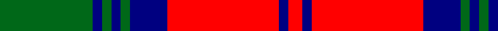

In pattern [GBGBGBRBR](/patterns/gbgbgbrbr/).

This was sourced from register-of-tartans.  It is a [9 stripes tartan](/stripes/stripes9/).

Original link https://www.tartanregister.gov.uk/tartanDetails.aspx?ref=2115

## Register references

External register numbers recorded for this tartan.

- Scottish Register of Tartans: [2115](https://www.tartanregister.gov.uk/tartanDetails.aspx?ref=2115)
- Scottish Tartans Authority (ITI): 704
- Scottish Tartans World Register: 704

## Thread count
G/40 DB4 G4 DB4 G4 DB16 R48 DB4 R/6

## Palette
Each colour and its ΔE from the base-6 reference it is a variant of.

| Colour | Shade | Base | ΔE (OKLab) |
|---|---|---|---|
| DB | <code style="background-color:#000080;">#000080</code> `#000080` | B <code style="background-color:#2A418A;">#2A418A</code> | 0.14 |
| G | <code style="background-color:#006818;">#006818</code> `#006818` | G <code style="background-color:#006100;">#006100</code> | 0.02 |
| R | <code style="background-color:#FF0000;">#FF0000</code> `#FF0000` | R <code style="background-color:#CC0000;">#CC0000</code> | 0.11 |

## Nearest tartans

The nearest existing variants by ΔTartan distance.

1. [Turnberry, Manx Snaefell](/setts/s8/r22b2r2b2r2b15w17b3~b401000-r906030-we0e0e0~x2/) — ΔT 0.75
1. [Kildonan Brown (Fashion)](/setts/s9/g22b3g3b3g3b9w28b3w6~b441800-g604000-wc0c0c0~x2/) — ΔT 0.94
1. [Lindsay Red](/setts/s9/g20b2g2b2g2b8r24b2r3~b000064-g004c00-rc80000/) — ΔT 0.98
1. [Turnberry Manx Snaefell Family Tartan Tartan Number: 1749. Earliest known date: 1981 A coincidence. See products available Copyright © Blair Urquhart, Comrie, 2015](/setts/s8/y22b2y2b2y2b15w17b3~b441800-we0e0e0-ya08858~x2/) — ΔT 1.15
1. [Wcwm 9285 4906-1](/setts/s11/k12y4k4y4k4y10k4y3k8r24y2~k101010-r880000-yb8b8b8~x2/) — ΔT 1.17
1. [Unidentified Specimen #2](/setts/s10/w1g1r1g14r1b6r11g1r1w1~b2c4084-g005020-rdc0000-we0e0e0~x4/) — ΔT 1.17
1. [Braemar or Blair Atholl](/setts/s8/b2w2k6b3k2r14k1r1~b441800-k101010-ra07c58-wffffff~x4/) — ΔT 1.22
1. [Fraser Gathering, Red](/setts/s9/r2b12r2g11r4b5g2r24w2~b000050-g008000-rc00000-we0e0e0~x2/) — ΔT 1.24
1. [City of Armadale](/setts/s10/k21g2k2g2k3g15r29g2r2g4~g006818-k101010-rc80000~x2/) — ΔT 1.24
1. [Wilson's No.005](/setts/s10/g5r4g17w5r32w5g17r4g5wa2~g044028-rc80000-w00fcfc-wafcfcfc~x2/) — ΔT 1.26

## Neighbour map

Every grey dot is one of 15726 variants placed by the first two principal components of the ΔTartan feature space (44% of its variance). Red is this tartan; blue dots are its nearest — click one to open its page.

<svg viewBox="0 0 640 380" role="img" style="max-width:100%;height:auto;border:1px solid #e0e0e0;border-radius:4px;display:block" xmlns="http://www.w3.org/2000/svg"><image href="/nn/cloud.v1.png" width="640" height="380"/><a href="/setts/s8/r22b2r2b2r2b15w17b3~b401000-r906030-we0e0e0~x2/"><circle cx="223.9" cy="179.8" r="4" fill="#3465a4"><title>Turnberry, Manx Snaefell</title></circle></a><a href="/setts/s9/g22b3g3b3g3b9w28b3w6~b441800-g604000-wc0c0c0~x2/"><circle cx="234.0" cy="182.7" r="4" fill="#3465a4"><title>Kildonan Brown (Fashion)</title></circle></a><a href="/setts/s9/g20b2g2b2g2b8r24b2r3~b000064-g004c00-rc80000/"><circle cx="272.7" cy="178.2" r="4" fill="#3465a4"><title>Lindsay Red</title></circle></a><a href="/setts/s8/y22b2y2b2y2b15w17b3~b441800-we0e0e0-ya08858~x2/"><circle cx="220.9" cy="179.0" r="4" fill="#3465a4"><title>Turnberry Manx Snaefell Family Tartan Tartan Number: 1749. Earliest known date: 1981 A coincidence. See products available Copyright © Blair Urquhart, Comrie, 2015</title></circle></a><a href="/setts/s11/k12y4k4y4k4y10k4y3k8r24y2~k101010-r880000-yb8b8b8~x2/"><circle cx="214.8" cy="178.1" r="4" fill="#3465a4"><title>Wcwm 9285 4906-1</title></circle></a><a href="/setts/s10/w1g1r1g14r1b6r11g1r1w1~b2c4084-g005020-rdc0000-we0e0e0~x4/"><circle cx="258.4" cy="142.3" r="4" fill="#3465a4"><title>Unidentified Specimen #2</title></circle></a><a href="/setts/s8/b2w2k6b3k2r14k1r1~b441800-k101010-ra07c58-wffffff~x4/"><circle cx="254.5" cy="157.5" r="4" fill="#3465a4"><title>Braemar or Blair Atholl</title></circle></a><a href="/setts/s9/r2b12r2g11r4b5g2r24w2~b000050-g008000-rc00000-we0e0e0~x2/"><circle cx="261.8" cy="162.0" r="4" fill="#3465a4"><title>Fraser Gathering, Red</title></circle></a><a href="/setts/s10/k21g2k2g2k3g15r29g2r2g4~g006818-k101010-rc80000~x2/"><circle cx="259.9" cy="165.2" r="4" fill="#3465a4"><title>City of Armadale</title></circle></a><a href="/setts/s10/g5r4g17w5r32w5g17r4g5wa2~g044028-rc80000-w00fcfc-wafcfcfc~x2/"><circle cx="260.1" cy="151.7" r="4" fill="#3465a4"><title>Wilson's No.005</title></circle></a><circle cx="252.3" cy="165.0" r="5" fill="#c00000"/></svg>

ID: /setts/s9/g20b2g2b2g2b8r24b2r3~b000080-g006818-rff0000~x2/
