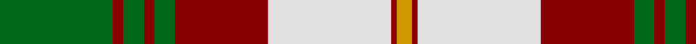

This page is one **sett** — a single exact thread-count. It belongs to the [tartan](/tartans/g22r2g4r2g4r18w24r1lo3/)
(the same proportion at any scale), whose colour order is pattern [GRGRGRWRY](/stripes/grgrgrwry/).

Sourced from register-of-tartans.  It is a [9 stripe tartan](/stripes/stripes9/).

Original link https://www.tartanregister.gov.uk/tartanDetails.aspx?ref=3390

## Also known as

This cloth is also recorded under:

- Prince Edward Island, Dress (Distric

2 attestations — the source records this cloth was collapsed from (oldest owns this page)

<ul>
<li>01/01/1994 — Prince Edward Island, Dress (register-of-tartans, <a href="https://www.tartanregister.gov.uk/tartanDetails.aspx?ref=3390">record</a>)</li>
<li>pre 1994 — Prince Edward Island, Dress (Distric (tartans-authority, <a href="http://www.tartansauthority.com/tartan-ferret/display/5475/">record</a>)</li>
</ul>

## Register references

External register numbers recorded for this tartan.

- Scottish Register of Tartans: [3390](https://www.tartanregister.gov.uk/tartanDetails.aspx?ref=3390)
- Scottish Tartans Authority (ITI): 5475

## Thread count
G/44 DR4 G8 DR4 G8 DR36 LN48 DR2 DY/6

## Palette

Palette: <strong>Tartan Register</strong> <small style="color:#888">(3 of 4 colours)</small>
<table><thead><tr><th>Colour</th><th>Threads</th><th>Shade</th><th>Base</th><th>OKLCh</th></tr></thead><tbody><tr><td>G/</td><td style="text-align:right;font-variant-numeric:tabular-nums">44</td><td><code style="background-color:#006818;">#006818</code> <small style="color:#888">#006818</small></td><td>G <code style="background-color:#006100;">#006100</code></td><td><small style="color:#888">oklch(45.0% 0.142 145.0)</small></td></tr><tr><td>DR</td><td style="text-align:right;font-variant-numeric:tabular-nums">4</td><td><code style="background-color:#880000;">#880000</code> <small style="color:#888">#880000</small></td><td>R <code style="background-color:#CC0000;">#CC0000</code></td><td><small style="color:#888">oklch(39.4% 0.162 29.2)</small></td></tr><tr><td>G</td><td style="text-align:right;font-variant-numeric:tabular-nums">8</td><td><code style="background-color:#006818;">#006818</code> <small style="color:#888">#006818</small></td><td>G <code style="background-color:#006100;">#006100</code></td><td><small style="color:#888">oklch(45.0% 0.142 145.0)</small></td></tr><tr><td>DR</td><td style="text-align:right;font-variant-numeric:tabular-nums">4</td><td><code style="background-color:#880000;">#880000</code> <small style="color:#888">#880000</small></td><td>R <code style="background-color:#CC0000;">#CC0000</code></td><td><small style="color:#888">oklch(39.4% 0.162 29.2)</small></td></tr><tr><td>G</td><td style="text-align:right;font-variant-numeric:tabular-nums">8</td><td><code style="background-color:#006818;">#006818</code> <small style="color:#888">#006818</small></td><td>G <code style="background-color:#006100;">#006100</code></td><td><small style="color:#888">oklch(45.0% 0.142 145.0)</small></td></tr><tr><td>DR</td><td style="text-align:right;font-variant-numeric:tabular-nums">36</td><td><code style="background-color:#880000;">#880000</code> <small style="color:#888">#880000</small></td><td>R <code style="background-color:#CC0000;">#CC0000</code></td><td><small style="color:#888">oklch(39.4% 0.162 29.2)</small></td></tr><tr><td>LN</td><td style="text-align:right;font-variant-numeric:tabular-nums">48</td><td><code style="background-color:#E0E0E0;">#E0E0E0</code> <small style="color:#888">#E0E0E0</small></td><td>W <code style="background-color:#F7F7F7;">#F7F7F7</code></td><td><small style="color:#888">oklch(90.7% 0.000 89.9)</small></td></tr><tr><td>DR</td><td style="text-align:right;font-variant-numeric:tabular-nums">2</td><td><code style="background-color:#880000;">#880000</code> <small style="color:#888">#880000</small></td><td>R <code style="background-color:#CC0000;">#CC0000</code></td><td><small style="color:#888">oklch(39.4% 0.162 29.2)</small></td></tr><tr><td>DY/</td><td style="text-align:right;font-variant-numeric:tabular-nums">6</td><td><code style="background-color:#D09800;">#D09800</code> <small style="color:#888">#D09800</small></td><td>Y <code style="background-color:#F2BF00;">#F2BF00</code></td><td><small style="color:#888">oklch(71.4% 0.147 82.1)</small></td></tr></tbody></table>

## Nearest tartans

The nearest existing variants by ΔTartan distance, with this tartan at the top so the swatches line up against it.

ΔTartan

Tartan

Sett

—

<a href="/ttd/edit/#slug=g22r2g4r2g4r18w24r1lo3~x2">Prince Edward Island, Dress</a> <a class="nn-out" href="/setts/s9/g22r2g4r2g4r18w24r1lo3~x2/" title="open its dictionary page">↗</a>

0.68

<a href="/ttd/edit/#slug=g3r12g12lo5r1w25g2r1~x2">Dogwood Trade Tartan Tartan Number: 913. Earliest known date: 1968 The registered tartan of the Dinwiddie Clan. Dinwiddies are normally associated with the Maxwells, but Lord Lyon stated, in 1988, that Dinwiddies were a sept of no other clan. See products available Copyright © Blair Urquhart, Comrie, 2015</a> <a class="nn-out" href="/setts/s8/g3r12g12lo5r1w25g2r1~x2/" title="open its dictionary page">↗</a>

0.68

<a href="/ttd/edit/#slug=g3r12g12o5r1w25g2r1~x2">Dogwood</a> <a class="nn-out" href="/setts/s8/g3r12g12o5r1w25g2r1~x2/" title="open its dictionary page">↗</a>

0.91

<a href="/ttd/edit/#slug=dg4do10dg10o6do1w26dg2do1~x4">Dogwood</a> <a class="nn-out" href="/setts/s8/dg4do10dg10o6do1w26dg2do1~x4/" title="open its dictionary page">↗</a>

0.94

<a href="/ttd/edit/#slug=r4g5w2g5r4g14r10w30k1r2g4~x2">Scott, dress</a> <a class="nn-out" href="/setts/s11/r4g5w2g5r4g14r10w30k1r2g4~x2/" title="open its dictionary page">↗</a>

0.97

<a href="/ttd/edit/#slug=r6g3w22r5w5k9g16r4k1r4~x2">MacDuff, dress</a> <a class="nn-out" href="/setts/s10/r6g3w22r5w5k9g16r4k1r4~x2/" title="open its dictionary page">↗</a>

0.97

<a href="/ttd/edit/#slug=g2dy10g11ly4dy1w18g2dy1~x2">Aviemore Check</a> <a class="nn-out" href="/setts/s8/g2dy10g11ly4dy1w18g2dy1~x2/" title="open its dictionary page">↗</a>

1.01

<a href="/ttd/edit/#slug=dg4dr14dg14o6dr1w30dg2dr1~x2">British Columbia #2</a> <a class="nn-out" href="/setts/s8/dg4dr14dg14o6dr1w30dg2dr1~x2/" title="open its dictionary page">↗</a>

1.07

<a href="/ttd/edit/#slug=do2lo2do15lo1w10loi15lo2loi2~x2">Bannockbane Orange Stripes</a> <a class="nn-out" href="/setts/s8/do2lo2do15lo1w10loi15lo2loi2~x2/" title="open its dictionary page">↗</a>

1.11

<a href="/ttd/edit/#slug=r6dg3w22r5w5k9dg16r4k1r4~x2">MacDuff Dress #3</a> <a class="nn-out" href="/setts/s10/r6dg3w22r5w5k9dg16r4k1r4~x2/" title="open its dictionary page">↗</a>

1.14

<a href="/ttd/edit/#slug=r24k2g8k2r8k1g24lb6k2r14lb18k4~x2">Grant - 1714 (Piper) (Portrait)</a> <a class="nn-out" href="/setts/s12/r24k2g8k2r8k1g24lb6k2r14lb18k4~x2/" title="open its dictionary page">↗</a>

## Neighbour map

Every grey dot is one of 14359 variants placed by the first two principal components of the ΔTartan feature space (44% of its variance). Red is this tartan; blue dots are its nearest — click one to open its page.

<svg viewBox="0 0 640 380" role="img" style="max-width:100%;height:auto;border:1px solid #e0e0e0;border-radius:4px;display:block" xmlns="http://www.w3.org/2000/svg"><image href="/nn/cloud.v1.png" width="640" height="380"/><a href="/setts/s8/g3r12g12lo5r1w25g2r1~x2/"><circle cx="222.2" cy="125.2" r="4" fill="#3465a4"><title>Dogwood Trade Tartan Tartan Number: 913. Earliest known date: 1968 The registered tartan of the Dinwiddie Clan. Dinwiddies are normally associated with the Maxwells, but Lord Lyon stated, in 1988, that Dinwiddies were a sept of no other clan. See products available Copyright © Blair Urquhart, Comrie, 2015</title></circle></a><a href="/setts/s8/g3r12g12o5r1w25g2r1~x2/"><circle cx="222.0" cy="125.5" r="4" fill="#3465a4"><title>Dogwood</title></circle></a><a href="/setts/s8/dg4do10dg10o6do1w26dg2do1~x4/"><circle cx="216.7" cy="118.7" r="4" fill="#3465a4"><title>Dogwood</title></circle></a><a href="/setts/s11/r4g5w2g5r4g14r10w30k1r2g4~x2/"><circle cx="234.3" cy="101.5" r="4" fill="#3465a4"><title>Scott, dress</title></circle></a><a href="/setts/s10/r6g3w22r5w5k9g16r4k1r4~x2/"><circle cx="159.5" cy="128.6" r="4" fill="#3465a4"><title>MacDuff, dress</title></circle></a><a href="/setts/s8/g2dy10g11ly4dy1w18g2dy1~x2/"><circle cx="187.2" cy="147.4" r="4" fill="#3465a4"><title>Aviemore Check</title></circle></a><a href="/setts/s8/dg4dr14dg14o6dr1w30dg2dr1~x2/"><circle cx="214.5" cy="111.5" r="4" fill="#3465a4"><title>British Columbia #2</title></circle></a><a href="/setts/s8/do2lo2do15lo1w10loi15lo2loi2~x2/"><circle cx="184.8" cy="151.9" r="4" fill="#3465a4"><title>Bannockbane Orange Stripes</title></circle></a><a href="/setts/s10/r6dg3w22r5w5k9dg16r4k1r4~x2/"><circle cx="166.6" cy="129.3" r="4" fill="#3465a4"><title>MacDuff Dress #3</title></circle></a><a href="/setts/s12/r24k2g8k2r8k1g24lb6k2r14lb18k4~x2/"><circle cx="214.1" cy="129.0" r="4" fill="#3465a4"><title>Grant - 1714 (Piper) (Portrait)</title></circle></a><circle cx="213.4" cy="127.5" r="5" fill="#c00000"/></svg>

ID: /setts/s9/g22r2g4r2g4r18w24r1lo3~x2/
