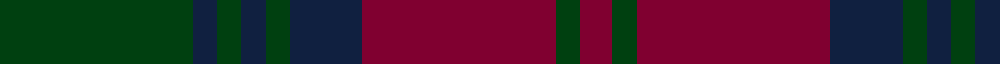

In pattern [GBGBGBRGR](/patterns/gbgbgbrgr/).

This was sourced from weddslist.  It is a [9 stripes tartan](/stripes/stripes9/).

Original link http://www.weddslist.com/cgi-bin/tartans/pg.pl?source=sts

## Thread count
DG/48 DB6 DG6 DB6 DG6 DB18 DR48 DG6 DR/8

## Palette
Each colour and its ΔE from the base-6 reference it is a variant of.

| Colour | Shade | Base | ΔE (OKLab) |
|---|---|---|---|
| DB | <code style="background-color:#102040;">#102040</code> `#102040` | B <code style="background-color:#2A418A;">#2A418A</code> | 0.16 |
| DG | <code style="background-color:#004010;">#004010</code> `#004010` | G <code style="background-color:#006100;">#006100</code> | 0.11 |
| DR | <code style="background-color:#800030;">#800030</code> `#800030` | R <code style="background-color:#CC0000;">#CC0000</code> | 0.17 |

## Nearest tartans

The nearest existing variants by ΔTartan distance.

1. [Lindsay (Chisholm Red)](/setts/s9/g24b3g3b3g3b9r24g3r4x2~b141e46-g003c14-r7c0034/) — ΔT 0.29
1. [Lindsay](/setts/s9/g20b2g2b2g2b8ba24b2ba3x2~b000052-ba59110d-g11450d/) — ΔT 0.83
1. [Lindsay](/setts/s9/g20b2g2b2g2b8ba24b2ba3~b000052-ba59110d-g11450d/) — ΔT 0.83
1. [Carlow, County](/setts/s9/b20g2b2g2b2g8k24g2k3x2~b4c0000-g006818-k101010/) — ΔT 1.06
1. [Dewar, Christian (Personal)](/setts/s9/b16r2b2r2b2r6g13y2g3x2~b1c1c50-g003820-r880000-ybc8c00/) — ΔT 1.21
1. [Lawlis/Lawless](/setts/s9/b10g1b1g1b1g2r12g1r2x4~b202060-g003820-r880000/) — ΔT 1.31
1. [Lindsay](/setts/s9/g20b2g2b2g2b8r24b2r3x2~b000050-g003000-r800000/) — ΔT 1.31
1. [Chindecella Gorse (Kemete Heil)](/setts/s8/r9b4r4b4r24g19b19g4x2~b241b1e-g4f4232-r8c6627/) — ΔT 1.41
1. [Lindsay Clan Tartan Tartan Number: 704. Earliest known date: 1842 The Lindsay tartan is often first recognised by its colour, which is unusual as the precise shade of tartan colours is normally left to the discretion of the weaver. The sett is similar to Stewart of Athol, but for the black, rendered in Lindsay as dark blue. The name Lindsay first appeared in the Borders of Scotland in the 12th century. Border Clan tartans were not generally named until the publication of the romantic fiction known as the Vestiarium Scoticum. (1842). See products available Copyright © Blair Urquhart, Comrie, 2015](/setts/s9/g20b2g2b2g2b8r24b2r3x2~b202060-g003820-r980044/) — ΔT 1.41
1. [Lindsay MINI Design Tartan Tartan Number: 7111. Earliest known date: Dupion Silk. Display Purposes Only. Reduced Copy of 704 Lindsay. See products available Copyright © Blair Urquhart, Comrie, 2015](/setts/s9/g20b2g2b2g2b8r24b2r3~b202060-g003820-r980044/) — ΔT 1.41

## Neighbour map

Every grey dot is one of 15726 variants placed by the first two principal components of the ΔTartan feature space (44% of its variance). Red is this tartan; blue dots are its nearest — click one to open its page.

<svg viewBox="0 0 640 380" role="img" style="max-width:100%;height:auto;border:1px solid #e0e0e0;border-radius:4px;display:block" xmlns="http://www.w3.org/2000/svg"><image href="/nn/cloud.v1.png" width="640" height="380"/><a href="/setts/s9/g24b3g3b3g3b9r24g3r4x2~b141e46-g003c14-r7c0034/"><circle cx="340.6" cy="241.7" r="4" fill="#3465a4"><title>Lindsay (Chisholm Red)</title></circle></a><a href="/setts/s9/g20b2g2b2g2b8ba24b2ba3x2~b000052-ba59110d-g11450d/"><circle cx="349.3" cy="220.7" r="4" fill="#3465a4"><title>Lindsay</title></circle></a><a href="/setts/s9/g20b2g2b2g2b8ba24b2ba3~b000052-ba59110d-g11450d/"><circle cx="349.3" cy="220.7" r="4" fill="#3465a4"><title>Lindsay</title></circle></a><a href="/setts/s9/b20g2b2g2b2g8k24g2k3x2~b4c0000-g006818-k101010/"><circle cx="338.8" cy="216.4" r="4" fill="#3465a4"><title>Carlow, County</title></circle></a><a href="/setts/s9/b16r2b2r2b2r6g13y2g3x2~b1c1c50-g003820-r880000-ybc8c00/"><circle cx="280.1" cy="221.9" r="4" fill="#3465a4"><title>Dewar, Christian (Personal)</title></circle></a><a href="/setts/s9/b10g1b1g1b1g2r12g1r2x4~b202060-g003820-r880000/"><circle cx="369.4" cy="207.0" r="4" fill="#3465a4"><title>Lawlis/Lawless</title></circle></a><a href="/setts/s9/g20b2g2b2g2b8r24b2r3x2~b000050-g003000-r800000/"><circle cx="322.7" cy="205.6" r="4" fill="#3465a4"><title>Lindsay</title></circle></a><a href="/setts/s8/r9b4r4b4r24g19b19g4x2~b241b1e-g4f4232-r8c6627/"><circle cx="280.2" cy="267.0" r="4" fill="#3465a4"><title>Chindecella Gorse (Kemete Heil)</title></circle></a><a href="/setts/s9/g20b2g2b2g2b8r24b2r3x2~b202060-g003820-r980044/"><circle cx="330.2" cy="203.6" r="4" fill="#3465a4"><title>Lindsay Clan Tartan Tartan Number: 704. Earliest known date: 1842 The Lindsay tartan is often first recognised by its colour, which is unusual as the precise shade of tartan colours is normally left to the discretion of the weaver. The sett is similar to Stewart of Athol, but for the black, rendered in Lindsay as dark blue. The name Lindsay first appeared in the Borders of Scotland in the 12th century. Border Clan tartans were not generally named until the publication of the romantic fiction known as the Vestiarium Scoticum. (1842). See products available Copyright © Blair Urquhart, Comrie, 2015</title></circle></a><a href="/setts/s9/g20b2g2b2g2b8r24b2r3~b202060-g003820-r980044/"><circle cx="330.2" cy="203.6" r="4" fill="#3465a4"><title>Lindsay MINI Design Tartan Tartan Number: 7111. Earliest known date: Dupion Silk. Display Purposes Only. Reduced Copy of 704 Lindsay. See products available Copyright © Blair Urquhart, Comrie, 2015</title></circle></a><circle cx="335.0" cy="239.2" r="5" fill="#c00000"/></svg>

ID: /setts/s9/g24b3g3b3g3b9r24g3r4x2~b102040-g004010-r800030/
