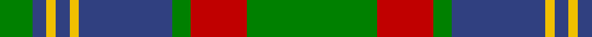

In pattern [GBYBYBGRG](/patterns/gbybybgrg/).

This was sourced from weddslist.  It is a [9 stripes tartan](/stripes/stripes9/).

Original link http://www.weddslist.com/cgi-bin/tartans/pg.pl?source=sts

## Thread count
G/14 B6 Y4 B6 Y4 B40 G8 R24 G/56

## Palette
Each colour and its ΔE from the base-6 reference it is a variant of.

| Colour | Shade | Base | ΔE (OKLab) |
|---|---|---|---|
| B | <code style="background-color:#304080;">#304080</code> `#304080` | B <code style="background-color:#2A418A;">#2A418A</code> | 0.02 |
| G | <code style="background-color:#008000;">#008000</code> `#008000` | G <code style="background-color:#006100;">#006100</code> | 0.10 |
| R | <code style="background-color:#C00000;">#C00000</code> `#C00000` | R <code style="background-color:#CC0000;">#CC0000</code> | 0.03 |
| Y | <code style="background-color:#F0C000;">#F0C000</code> `#F0C000` | Y <code style="background-color:#F2BF00;">#F2BF00</code> | 0.00 |

## Nearest tartans

The nearest existing variants by ΔTartan distance.

1. [Cape Breton University](/setts/s10/b4r17b4g4b2g4b4g27b4y4x2~b202060-g006818-re86000-yfccc00/) — ΔT 0.83
1. [New Mexico](/setts/s8/r1g16b2g10b22y4r2y1x2~b304080-g008000-rc00000-yf0c000/) — ΔT 0.94
1. [Unidentified Plaid 6](/setts/s10/r4b3r32ba30r4g32r3g32r3g3x2~b5480b0-ba304080-g008000-rc00000/) — ΔT 0.96
1. [Georgia, State of](/setts/s8/g36k2g2k2g3k12b10r20x2~b5c8ca8-g006818-k101010-rc8002c/) — ΔT 1.00
1. [Georgia District Tartan Tartan Number: 794. Earliest known date: 1982 The tartan commemorates the founding of the State of Georgia and combines elements in the design associated with its historic past. General Oglethorpe commanded the Highland Independant Company of Foot which, in 1746, wore the Black Watch tartan. Captain John 'Mohr' MacIntosh is remembered in the MacIntosh red. Georgia tartan is much in evidence at the annual Stone Mountain Highland Games held in Atlanta, Georgias capital. See products available Copyright © Blair Urquhart, Comrie, 2015](/setts/s8/g36k2g2k2g3k12b10r20x2~b5c8ca8-g006818-k101010-rc80000/) — ΔT 1.00
1. [MacOrrell](/setts/s9/b5y2b17g14w1g1w1g4y2x2~b304080-g008000-we0e0e0-yf0c000/) — ΔT 1.03
1. [John Telfar, Dunbar hunting](/setts/s7/g5k2g28k10r26b4g4x2~b304080-g008000-k000000-r806050/) — ΔT 1.04
1. [Ayrton 1979 No. 2 (Personal)](/setts/s8/b5k1g3k1b3k1g10r3x2~b1474b4-g006818-k101010-rc80000/) — ΔT 1.04
1. [Dunedin Chapter (Corporate)](/setts/s10/b39g3b3g20k3g20k3g3k20r3x2~b5c8ca8-g006818-k101010-rc80000/) — ΔT 1.05
1. [Crantock Trade Tartan Tartan Number: 707. Earliest known date: pre 2003 'Poached by Clan Laird from a Yorkshire mill and marketed as 'Crantock''(sic) (Scottish Tartans Society archives.) See products available Copyright © Blair Urquhart, Comrie, 2015](/setts/s8/g24b3g3b3g3b7ga20r3x2~b780078-g289c18-ga003820-rc80000/) — ΔT 1.07

## Neighbour map

Every grey dot is one of 15726 variants placed by the first two principal components of the ΔTartan feature space (44% of its variance). Red is this tartan; blue dots are its nearest — click one to open its page.

<svg viewBox="0 0 640 380" role="img" style="max-width:100%;height:auto;border:1px solid #e0e0e0;border-radius:4px;display:block" xmlns="http://www.w3.org/2000/svg"><image href="/nn/cloud.v1.png" width="640" height="380"/><a href="/setts/s10/b4r17b4g4b2g4b4g27b4y4x2~b202060-g006818-re86000-yfccc00/"><circle cx="249.2" cy="159.2" r="4" fill="#3465a4"><title>Cape Breton University</title></circle></a><a href="/setts/s8/r1g16b2g10b22y4r2y1x2~b304080-g008000-rc00000-yf0c000/"><circle cx="286.8" cy="162.3" r="4" fill="#3465a4"><title>New Mexico</title></circle></a><a href="/setts/s10/r4b3r32ba30r4g32r3g32r3g3x2~b5480b0-ba304080-g008000-rc00000/"><circle cx="259.5" cy="181.0" r="4" fill="#3465a4"><title>Unidentified Plaid 6</title></circle></a><a href="/setts/s8/g36k2g2k2g3k12b10r20x2~b5c8ca8-g006818-k101010-rc8002c/"><circle cx="271.5" cy="164.3" r="4" fill="#3465a4"><title>Georgia, State of</title></circle></a><a href="/setts/s8/g36k2g2k2g3k12b10r20x2~b5c8ca8-g006818-k101010-rc80000/"><circle cx="272.5" cy="164.8" r="4" fill="#3465a4"><title>Georgia District Tartan Tartan Number: 794. Earliest known date: 1982 The tartan commemorates the founding of the State of Georgia and combines elements in the design associated with its historic past. General Oglethorpe commanded the Highland Independant Company of Foot which, in 1746, wore the Black Watch tartan. Captain John 'Mohr' MacIntosh is remembered in the MacIntosh red. Georgia tartan is much in evidence at the annual Stone Mountain Highland Games held in Atlanta, Georgias capital. See products available Copyright © Blair Urquhart, Comrie, 2015</title></circle></a><a href="/setts/s9/b5y2b17g14w1g1w1g4y2x2~b304080-g008000-we0e0e0-yf0c000/"><circle cx="279.3" cy="159.7" r="4" fill="#3465a4"><title>MacOrrell</title></circle></a><a href="/setts/s7/g5k2g28k10r26b4g4x2~b304080-g008000-k000000-r806050/"><circle cx="250.7" cy="190.2" r="4" fill="#3465a4"><title>John Telfar, Dunbar hunting</title></circle></a><a href="/setts/s8/b5k1g3k1b3k1g10r3x2~b1474b4-g006818-k101010-rc80000/"><circle cx="255.9" cy="211.0" r="4" fill="#3465a4"><title>Ayrton 1979 No. 2 (Personal)</title></circle></a><a href="/setts/s10/b39g3b3g20k3g20k3g3k20r3x2~b5c8ca8-g006818-k101010-rc80000/"><circle cx="228.2" cy="173.3" r="4" fill="#3465a4"><title>Dunedin Chapter (Corporate)</title></circle></a><a href="/setts/s8/g24b3g3b3g3b7ga20r3x2~b780078-g289c18-ga003820-rc80000/"><circle cx="224.7" cy="195.3" r="4" fill="#3465a4"><title>Crantock Trade Tartan Tartan Number: 707. Earliest known date: pre 2003 'Poached by Clan Laird from a Yorkshire mill and marketed as 'Crantock''(sic) (Scottish Tartans Society archives.) See products available Copyright © Blair Urquhart, Comrie, 2015</title></circle></a><circle cx="272.0" cy="175.9" r="5" fill="#c00000"/></svg>

ID: /setts/s9/g28r12g4b20y2b3y2b3g7x2~b304080-g008000-rc00000-yf0c000/
