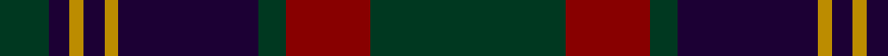

In pattern [GKYKYKGRG](/patterns/gkykykgrg/).

This was sourced from tartans-authority.  It is a [9 stripes tartan](/stripes/stripes9/).

Original link http://www.tartansauthority.com/tartan-ferret/display/2253/

## Thread count
DG/14 DB6 DY4 DB6 DY4 DB40 DG8 DR24 DG/56

## Palette
Each colour and its ΔE from the base-6 reference it is a variant of.

| Colour | Shade | Base | ΔE (OKLab) |
|---|---|---|---|
| DB | <code style="background-color:#1C0034;">#1C0034</code> `#1C0034` | K <code style="background-color:#000000;">#000000</code> | 0.21 |
| DG | <code style="background-color:#003820;">#003820</code> `#003820` | G <code style="background-color:#006100;">#006100</code> | 0.15 |
| DR | <code style="background-color:#880000;">#880000</code> `#880000` | R <code style="background-color:#CC0000;">#CC0000</code> | 0.15 |
| DY | <code style="background-color:#BC8C00;">#BC8C00</code> `#BC8C00` | Y <code style="background-color:#F2BF00;">#F2BF00</code> | 0.16 |

## Nearest tartans

The nearest existing variants by ΔTartan distance.

1. [Brown of the Southeast (Personal)](/setts/s8/b12g2b4g2b4k33g13r4x2~b505c64-g4c5420-k101010-rc80000/) — ΔT 0.73
1. [Gammell Family Tartan Tartan Number: 597. Earliest known date: 1965 Designed (probably by David Thomas and Arthur Mackie of Strathmore Woollen Co) for the Hill family of Angus as a personal tartan. Tommy Gemmell (6.3.05) said "The tartan was designed using the largest Government sett by Mrs Hill's mother - a Mrs Gammell - who was a handweaver." See products available Copyright © Blair Urquhart, Comrie, 2015](/setts/s8/b32ba3b3ba3b3ba10g24r3x2~b202060-ba441800-g006818-r901c38/) — ΔT 0.97
1. [Cork Irish County Tartan Tartan Number: 2253. Earliest known date: 1996 One of a series of Irish District tartans designed by Polly Wittering of the House of Edgar, with colours reminiscent of the Country with soft warm colours dominating. See products available Copyright © Blair Urquhart, Comrie, 2015](/setts/s9/g28r12g4b20y2b3y2b3g7x2~b141c50-g3c6838-r8c0020-yc48800/) — ΔT 1.05
1. [Rannoch Moor (Fashion)](/setts/s8/r3g12r12r5g2b30r2g2x2~b1c1c50-g005410-ra80000/) — ΔT 1.10
1. [Scottish Monuments (Corporate)](/setts/s9/b3r2b2r3b20ba8k2ba6k3x2~b14283c-ba5c5c5c-k101010-r888888/) — ΔT 1.15
1. [Diana Princess of Wales](/setts/s9/g5r1ra4b2ra20g12b16ra4r1x2~b000048-g004028-rb43c50-ra780028/) — ΔT 1.16
1. [Hume or Home](/setts/s9/b3g3b20r2k2r2k20g3k3x2~b2c4084-g005020-k101010-rdc0000/) — ΔT 1.17
1. [Guthrie Family Tartan Tartan Number: 1085. Earliest known date: pre 2003 From the Barony of Guthrie in Angus, the name is also said to derive from Guthrum, a Scandinavian prince. Sir David Guthrie was King's Treasurer in the fifteenth century and built Guthrie Castle near Friockheim, Angus, in 1468. See products available Copyright © Blair Urquhart, Comrie, 2015](/setts/s9/k1g8k9r1k1r1k9b8r1x6~b2c2c80-g006818-k101010-rc80000/) — ΔT 1.17
1. [Durie](/setts/s9/k12r1k1r1k1r4g12y1g2x4~g003000-k000030-r800000-yf0c000/) — ΔT 1.18
1. [Mica, Green (Fashion)](/setts/s8/g6r2g12k4b14k1g3y2x2~b3c3c64-g505028-k000000-r640000-yc89800/) — ΔT 1.24

## Neighbour map

Every grey dot is one of 15726 variants placed by the first two principal components of the ΔTartan feature space (44% of its variance). Red is this tartan; blue dots are its nearest — click one to open its page.

<svg viewBox="0 0 640 380" role="img" style="max-width:100%;height:auto;border:1px solid #e0e0e0;border-radius:4px;display:block" xmlns="http://www.w3.org/2000/svg"><image href="/nn/cloud.v1.png" width="640" height="380"/><a href="/setts/s8/b12g2b4g2b4k33g13r4x2~b505c64-g4c5420-k101010-rc80000/"><circle cx="301.7" cy="185.1" r="4" fill="#3465a4"><title>Brown of the Southeast (Personal)</title></circle></a><a href="/setts/s8/b32ba3b3ba3b3ba10g24r3x2~b202060-ba441800-g006818-r901c38/"><circle cx="313.0" cy="209.1" r="4" fill="#3465a4"><title>Gammell Family Tartan Tartan Number: 597. Earliest known date: 1965 Designed (probably by David Thomas and Arthur Mackie of Strathmore Woollen Co) for the Hill family of Angus as a personal tartan. Tommy Gemmell (6.3.05) said &quot;The tartan was designed using the largest Government sett by Mrs Hill's mother - a Mrs Gammell - who was a handweaver.&quot; See products available Copyright © Blair Urquhart, Comrie, 2015</title></circle></a><a href="/setts/s9/g28r12g4b20y2b3y2b3g7x2~b141c50-g3c6838-r8c0020-yc48800/"><circle cx="301.7" cy="188.0" r="4" fill="#3465a4"><title>Cork Irish County Tartan Tartan Number: 2253. Earliest known date: 1996 One of a series of Irish District tartans designed by Polly Wittering of the House of Edgar, with colours reminiscent of the Country with soft warm colours dominating. See products available Copyright © Blair Urquhart, Comrie, 2015</title></circle></a><a href="/setts/s8/r3g12r12r5g2b30r2g2x2~b1c1c50-g005410-ra80000/"><circle cx="287.5" cy="180.7" r="4" fill="#3465a4"><title>Rannoch Moor (Fashion)</title></circle></a><a href="/setts/s9/b3r2b2r3b20ba8k2ba6k3x2~b14283c-ba5c5c5c-k101010-r888888/"><circle cx="326.5" cy="211.3" r="4" fill="#3465a4"><title>Scottish Monuments (Corporate)</title></circle></a><a href="/setts/s9/g5r1ra4b2ra20g12b16ra4r1x2~b000048-g004028-rb43c50-ra780028/"><circle cx="307.8" cy="184.7" r="4" fill="#3465a4"><title>Diana Princess of Wales</title></circle></a><a href="/setts/s9/b3g3b20r2k2r2k20g3k3x2~b2c4084-g005020-k101010-rdc0000/"><circle cx="285.9" cy="194.4" r="4" fill="#3465a4"><title>Hume or Home</title></circle></a><a href="/setts/s9/k1g8k9r1k1r1k9b8r1x6~b2c2c80-g006818-k101010-rc80000/"><circle cx="276.4" cy="213.1" r="4" fill="#3465a4"><title>Guthrie Family Tartan Tartan Number: 1085. Earliest known date: pre 2003 From the Barony of Guthrie in Angus, the name is also said to derive from Guthrum, a Scandinavian prince. Sir David Guthrie was King's Treasurer in the fifteenth century and built Guthrie Castle near Friockheim, Angus, in 1468. See products available Copyright © Blair Urquhart, Comrie, 2015</title></circle></a><a href="/setts/s9/k12r1k1r1k1r4g12y1g2x4~g003000-k000030-r800000-yf0c000/"><circle cx="272.7" cy="187.1" r="4" fill="#3465a4"><title>Durie</title></circle></a><a href="/setts/s8/g6r2g12k4b14k1g3y2x2~b3c3c64-g505028-k000000-r640000-yc89800/"><circle cx="272.6" cy="189.3" r="4" fill="#3465a4"><title>Mica, Green (Fashion)</title></circle></a><circle cx="317.0" cy="196.9" r="5" fill="#c00000"/></svg>

ID: /setts/s9/g28r12g4k20y2k3y2k3g7x2~g003820-k1c0034-r880000-ybc8c00/
