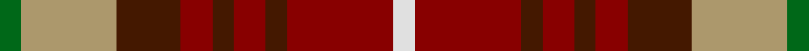

In pattern [GYBRBRBRW](/stripes/gybrbrbrw/).

This was sourced from tartans-authority.  It is a [9 stripe tartan](/stripes/stripes9/).

Original link http://www.tartansauthority.com/tartan-ferret/display/10273/

## Thread count
G/8 LT36 DRa24 DR12 DRa8 DR12 DRa8 DR40 LN/8

## Palette
Each colour and the base-6 reference it is a variant of.

| Colour | Shade | Base |
|---|---|---|
| DR | <code style="background-color:#880000;">#880000</code> `oklch(39.4% 0.162 29.2)` <small>#880000</small> | R <code style="background-color:#CC0000;">#CC0000</code> |
| DRa | <code style="background-color:#441800;">#441800</code> `oklch(27.3% 0.076 46.3)` <small>#441800</small> | B <code style="background-color:#2A418A;">#2A418A</code> |
| G | <code style="background-color:#006818;">#006818</code> `oklch(45.0% 0.142 145.0)` <small>#006818</small> | G <code style="background-color:#006100;">#006100</code> |
| LN | <code style="background-color:#E0E0E0;">#E0E0E0</code> `oklch(90.7% 0.000 89.9)` <small>#E0E0E0</small> | W <code style="background-color:#F7F7F7;">#F7F7F7</code> |
| LT | <code style="background-color:#AC986C;">#AC986C</code> `oklch(68.7% 0.064 86.2)` <small>#AC986C</small> | Y <code style="background-color:#F2BF00;">#F2BF00</code> |

## Nearest tartans

The nearest existing variants by ΔTartan distance.

1. [Craigmoor (Fashion)](/setts/s8/k1r7k2r1k2do1g3ly1~x4/) — ΔT 1.12
1. [Tinkler, Andrew (Stobart Group)](/setts/s9/g2ly9dy6o3dy2o3dy2o10w2~x4/) — ΔT 1.14
1. [Davis](/setts/s8/k3ly2k3r8k8r8dg2r3~x4/) — ΔT 1.17
1. [MacKintosh-Geddes (Personal?)](/setts/s7/dp2r4g12r3dp6r10w2~x2/) — ΔT 1.26
1. [Montrose (Graham)](/setts/s9/y1k1r8dg8k6y4r8k1y1~x8/) — ΔT 1.26
1. [Mars Family Tartan Tartan Number: 3817. Earliest known date: March 2002 Based on the Hay Clan tartan, red/green, with the yellow stripes of the Hay Clan Tartan encompassing dark blue to signify service to the Royal Family and Corps of Royal Engineers. The white stripe of the Hay Clan tartan to the side superimposed over black signifying Highland Regimental Military service. See products available Copyright © Blair Urquhart, Comrie, 2015](/setts/s11/r16g16r8k8lo3k3db3k3lo3r14w3~x2/) — ΔT 1.27
1. [Maple Leaf](/setts/s12/dg19r3dg3r15lo13r15dg3r3dg19ly6lo6dy6~x2/) — ΔT 1.29
1. [Caledonia No 3](/setts/s9/r13t3r13g12ly2dp9t9r13dp2~x2/) — ΔT 1.30
1. [Unidentified Plaid 16](/setts/s13/ly18r18dg30r12db55r42dg6r18dg6r42g44r12dg12/) — ΔT 1.32
1. [Roscommon, County](/setts/s10/r5ly3r19do6ly5do6dg12db5dg12db3~x2/) — ΔT 1.33

## Neighbour map

Every grey dot is one of 14299 variants placed by the first two principal components of the ΔTartan feature space (44% of its variance). Red is this tartan; blue dots are its nearest — click one to open its page.

<svg viewBox="0 0 640 380" role="img" style="max-width:100%;height:auto;border:1px solid #e0e0e0;border-radius:4px;display:block" xmlns="http://www.w3.org/2000/svg"><image href="/nn/cloud.v1.png" width="640" height="380"/><a href="/setts/s8/k1r7k2r1k2do1g3ly1~x4/"><circle cx="191.4" cy="178.8" r="4" fill="#3465a4"><title>Craigmoor (Fashion)</title></circle></a><a href="/setts/s9/g2ly9dy6o3dy2o3dy2o10w2~x4/"><circle cx="163.5" cy="210.6" r="4" fill="#3465a4"><title>Tinkler, Andrew (Stobart Group)</title></circle></a><a href="/setts/s8/k3ly2k3r8k8r8dg2r3~x4/"><circle cx="125.0" cy="230.8" r="4" fill="#3465a4"><title>Davis</title></circle></a><a href="/setts/s7/dp2r4g12r3dp6r10w2~x2/"><circle cx="201.3" cy="222.3" r="4" fill="#3465a4"><title>MacKintosh-Geddes (Personal?)</title></circle></a><a href="/setts/s9/y1k1r8dg8k6y4r8k1y1~x8/"><circle cx="192.3" cy="199.0" r="4" fill="#3465a4"><title>Montrose (Graham)</title></circle></a><a href="/setts/s11/r16g16r8k8lo3k3db3k3lo3r14w3~x2/"><circle cx="164.2" cy="180.4" r="4" fill="#3465a4"><title>Mars Family Tartan Tartan Number: 3817. Earliest known date: March 2002 Based on the Hay Clan tartan, red/green, with the yellow stripes of the Hay Clan Tartan encompassing dark blue to signify service to the Royal Family and Corps of Royal Engineers. The white stripe of the Hay Clan tartan to the side superimposed over black signifying Highland Regimental Military service. See products available Copyright © Blair Urquhart, Comrie, 2015</title></circle></a><a href="/setts/s12/dg19r3dg3r15lo13r15dg3r3dg19ly6lo6dy6~x2/"><circle cx="161.9" cy="200.9" r="4" fill="#3465a4"><title>Maple Leaf</title></circle></a><a href="/setts/s9/r13t3r13g12ly2dp9t9r13dp2~x2/"><circle cx="199.4" cy="209.4" r="4" fill="#3465a4"><title>Caledonia No 3</title></circle></a><a href="/setts/s13/ly18r18dg30r12db55r42dg6r18dg6r42g44r12dg12/"><circle cx="177.7" cy="172.2" r="4" fill="#3465a4"><title>Unidentified Plaid 16</title></circle></a><a href="/setts/s10/r5ly3r19do6ly5do6dg12db5dg12db3~x2/"><circle cx="116.9" cy="208.2" r="4" fill="#3465a4"><title>Roscommon, County</title></circle></a><circle cx="159.6" cy="205.4" r="5" fill="#c00000"/></svg>

ID: /setts/s9/g2lo9do6r3do2r3do2r10w2~x4/
