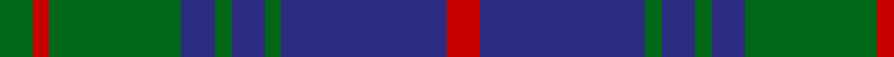

In pattern [GRGBGBGBR](/patterns/grgbgbgbr/).

This was sourced from tartans-authority.  It is a [9 stripes tartan](/stripes/stripes9/).

Original link http://www.tartansauthority.com/tartan-ferret/display/7345/

## Attestations

This cloth appears in 2 source records; the oldest owns this page.

- 1999 — Brown, Barnaby (Personal) (tartans-authority, [record](http://www.tartansauthority.com/tartan-ferret/display/7345/))
- undated — Barnaby Brown Pibroch (Personal) (register-of-tartans, [record](https://www.tartanregister.gov.uk/tartanDetails.aspx?ref=5460))

## Register references

External register numbers recorded for this tartan.

- Scottish Register of Tartans: [5460](https://www.tartanregister.gov.uk/tartanDetails.aspx?ref=5460)
- Scottish Tartans Authority (ITI): 7345

## Thread count
G/8 R4 G32 DB8 G4 DB8 G4 DB40 R/8

## Palette
Each colour and its ΔE from the base-6 reference it is a variant of.

| Colour | Shade | Base | ΔE (OKLab) |
|---|---|---|---|
| DB | <code style="background-color:#2C2C80;">#2C2C80</code> `#2C2C80` | B <code style="background-color:#2A418A;">#2A418A</code> | 0.06 |
| G | <code style="background-color:#006818;">#006818</code> `#006818` | G <code style="background-color:#006100;">#006100</code> | 0.02 |
| R | <code style="background-color:#C80000;">#C80000</code> `#C80000` | R <code style="background-color:#CC0000;">#CC0000</code> | 0.01 |

## Nearest tartans

The nearest existing variants by ΔTartan distance.

1. [Brown, Barnaby (Personal)](/setts/s9/g2r1g8b2g1b2g1b10r2~b202060-g006818-rc8002c~x4/) — ΔT 0.36
1. [Inkster](/setts/s10/b6g2b2g3b10ga25b10g3b2g2~b1c0070-g604000-ga006818~x2/) — ΔT 0.80
1. [Stewart of Appin Htg (error)](/setts/s10/g8r3g3r5g26b7ba3b28r3b6~b2c2c80-ba5c8ca8-g006818-rc80000~x2/) — ΔT 1.01
1. [Manx Centenary District Tartan Tartan Number: 129. Earliest known date: pre 1992 Sample presented by Dr. D.G. Teall See products available Copyright © Blair Urquhart, Comrie, 2015](/setts/s9/b22g3b3g3b3g9r28g3r6~b2c2c80-g006818-r888888~x2/) — ΔT 1.04
1. [Robertson of Struan 1816](/setts/s7/r3b1r1b11g10r2b2~b202060-g006818-rc80000~x4/) — ΔT 1.11
1. [Barnaby Brown Pibroch](/setts/s9/g2r1g8b2g1b2g1b10r2~b000050-g004010-rc00020~x4/) — ΔT 1.11
1. [Rowan (Name)](/setts/s10/b1k1b8k2y1g12y1b8k1b1~b2c2c80-g006818-k101010-yd09800~x4/) — ΔT 1.12
1. [Rowan Family Tartan Tartan Number: 2067. Earliest known date: 1990 Designed for Mr Robert Rowan. See products available Copyright © Blair Urquhart, Comrie, 2015](/setts/s9/b1k1b8y1g12y1b8k1b1~b2c2c80-g006818-k101010-ye8c000~x2/) — ΔT 1.19
1. [Robertson of Struan](/setts/s7/r6b2r2b21g20r4g4~b2c4084-g005020-rdc0000~x2/) — ΔT 1.21
1. [Letham Personal Tartan Tartan Number: 6718. Earliest known date: pre 2005 Jimmy said, in his recording application, "To allow my family to wear a single tartan" See products available Copyright © Blair Urquhart, Comrie, 2015](/setts/s8/g40k20b10k4b7g13k4b4~b2c2c80-g006428-k101010~x2/) — ΔT 1.21

## Neighbour map

Every grey dot is one of 15726 variants placed by the first two principal components of the ΔTartan feature space (44% of its variance). Red is this tartan; blue dots are its nearest — click one to open its page.

<svg viewBox="0 0 640 380" role="img" style="max-width:100%;height:auto;border:1px solid #e0e0e0;border-radius:4px;display:block" xmlns="http://www.w3.org/2000/svg"><image href="/nn/cloud.v1.png" width="640" height="380"/><a href="/setts/s9/g2r1g8b2g1b2g1b10r2~b202060-g006818-rc8002c~x4/"><circle cx="316.8" cy="216.6" r="4" fill="#3465a4"><title>Brown, Barnaby (Personal)</title></circle></a><a href="/setts/s10/b6g2b2g3b10ga25b10g3b2g2~b1c0070-g604000-ga006818~x2/"><circle cx="310.5" cy="201.5" r="4" fill="#3465a4"><title>Inkster</title></circle></a><a href="/setts/s10/g8r3g3r5g26b7ba3b28r3b6~b2c2c80-ba5c8ca8-g006818-rc80000~x2/"><circle cx="268.7" cy="194.3" r="4" fill="#3465a4"><title>Stewart of Appin Htg (error)</title></circle></a><a href="/setts/s9/b22g3b3g3b3g9r28g3r6~b2c2c80-g006818-r888888~x2/"><circle cx="276.1" cy="210.9" r="4" fill="#3465a4"><title>Manx Centenary District Tartan Tartan Number: 129. Earliest known date: pre 1992 Sample presented by Dr. D.G. Teall See products available Copyright © Blair Urquhart, Comrie, 2015</title></circle></a><a href="/setts/s7/r3b1r1b11g10r2b2~b202060-g006818-rc80000~x4/"><circle cx="293.1" cy="218.1" r="4" fill="#3465a4"><title>Robertson of Struan 1816</title></circle></a><a href="/setts/s9/g2r1g8b2g1b2g1b10r2~b000050-g004010-rc00020~x4/"><circle cx="324.9" cy="225.3" r="4" fill="#3465a4"><title>Barnaby Brown Pibroch</title></circle></a><a href="/setts/s10/b1k1b8k2y1g12y1b8k1b1~b2c2c80-g006818-k101010-yd09800~x4/"><circle cx="297.3" cy="181.3" r="4" fill="#3465a4"><title>Rowan (Name)</title></circle></a><a href="/setts/s9/b1k1b8y1g12y1b8k1b1~b2c2c80-g006818-k101010-ye8c000~x2/"><circle cx="311.8" cy="183.7" r="4" fill="#3465a4"><title>Rowan Family Tartan Tartan Number: 2067. Earliest known date: 1990 Designed for Mr Robert Rowan. See products available Copyright © Blair Urquhart, Comrie, 2015</title></circle></a><a href="/setts/s7/r6b2r2b21g20r4g4~b2c4084-g005020-rdc0000~x2/"><circle cx="282.4" cy="225.2" r="4" fill="#3465a4"><title>Robertson of Struan</title></circle></a><a href="/setts/s8/g40k20b10k4b7g13k4b4~b2c2c80-g006428-k101010~x2/"><circle cx="328.4" cy="237.3" r="4" fill="#3465a4"><title>Letham Personal Tartan Tartan Number: 6718. Earliest known date: pre 2005 Jimmy said, in his recording application, &quot;To allow my family to wear a single tartan&quot; See products available Copyright © Blair Urquhart, Comrie, 2015</title></circle></a><circle cx="319.7" cy="216.9" r="5" fill="#c00000"/></svg>

ID: /setts/s9/g2r1g8b2g1b2g1b10r2~b2c2c80-g006818-rc80000~x4/
