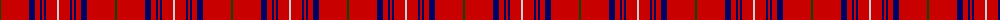

In pattern [GRBRBRBRW](/patterns/grbrbrbrw/).

This was sourced from weddslist.  It is a [9 stripes tartan](/stripes/stripes9/).

Original link http://www.weddslist.com/cgi-bin/tartans/pg.pl?source=rb

## Thread count
G/2 R28 DB6 R5 DB2 R2 DB2 R11 N/2

## Palette
Each colour and its ΔE from the base-6 reference it is a variant of.

| Colour | Shade | Base | ΔE (OKLab) |
|---|---|---|---|
| DB | <code style="background-color:#000064;">#000064</code> `#000064` | B <code style="background-color:#2C4084;">#2C4084</code> | 0.17 |
| G | <code style="background-color:#004C00;">#004C00</code> `#004C00` | G <code style="background-color:#006400;">#006400</code> | 0.08 |
| N | <code style="background-color:#D0D0D0;">#D0D0D0</code> `#D0D0D0` | W <code style="background-color:#F4F4F0;">#F4F4F0</code> | 0.11 |
| R | <code style="background-color:#C80000;">#C80000</code> `#C80000` | R <code style="background-color:#C80000;">#C80000</code> | 0.00 |

## Nearest tartans

The nearest existing variants by ΔTartan distance.

1. [Rose](/setts/s9/g8r64b18r12b4r6b4r24w6-b2c2c80-g006818-rc80000-wfcfcfc/) — ΔT 0.78
1. [Rose](/setts/s9/g4r56b12r10b4r4b4r22y4-b000052-g11450d-raa0000-yaaaaaa/) — ΔT 0.79
1. [Rose](/setts/s9/g2r28b6r5b2r2b2r11y2-b000052-g11450d-raa0000-yaaaaaa/) — ΔT 0.79
1. [Rose Clan Tartan Tartan Number: 845. Earliest known date: 1842 The text of the Vestiarium gives the colours as purple and crimson but in the plate they appear as mid blue and scarlet. The Lord Lyon records crimson as red. D.C. Stewart regarded this sett as a 'dress' tartan. ('The Setts..' 1950) James Logan records a 'hunting' version. ('The Scottish Gael' 1831). The castle of Kilravock which has been the residence of the Roses for over five centuries is still the seat of the chief. See products available Copyright © Blair Urquhart, Comrie, 2015](/setts/s9/g8r64b18r12b4r6b4r24w6-b2c2c80-g006818-rc80000-we0e0e0/) — ΔT 0.86
1. [Rose of Kilravock (Personal)](/setts/s9/k4r70b12r10b4r4b4r28w4-b1c1c50-k101010-rc80000-wfcfcfc/) — ΔT 0.87
1. [Rose](/setts/s9/g8r64b18r12b4r6b4r24w6-b304080-g008000-rc00000-we0e0e0/) — ΔT 1.09
1. [Swiss National (Fashion)](/setts/s8/w20r94b4r4b4r36ba6w8-b2c2c80-ba202060-rc80000-we0e0e0/) — ΔT 1.18
1. [Cornell (Corporate)](/setts/s8/r74w27r13y7r13w13r74k7-k101010-r901c38-we0e0e0-ya0a0a0/) — ΔT 1.27
1. [Howard, Vincent (Personal)](/setts/s6/r130g32r8b8r8w10-b440044-g004c00-rc80000-we0e0e0/) — ΔT 1.32
1. [Howard, Vincent (Personal)](/setts/s6/r130g32r8b8r8w10-b440044-g006818-rc80000-wfcfcfc/) — ΔT 1.33

## Neighbour map

Every grey dot is one of 15726 variants placed by the first two principal components of the ΔTartan feature space (44% of its variance). Red is this tartan; blue dots are its nearest — click one to open its page.

<svg viewBox="0 0 640 380" role="img" style="max-width:100%;height:auto;border:1px solid #e0e0e0;border-radius:4px;display:block" xmlns="http://www.w3.org/2000/svg"><image href="/nn/cloud.v1.png" width="640" height="380"/><a href="/setts/s9/g8r64b18r12b4r6b4r24w6-b2c2c80-g006818-rc80000-wfcfcfc/"><circle cx="465.3" cy="147.2" r="4" fill="#3465a4"><title>Rose</title></circle></a><a href="/setts/s9/g4r56b12r10b4r4b4r22y4-b000052-g11450d-raa0000-yaaaaaa/"><circle cx="509.5" cy="157.3" r="4" fill="#3465a4"><title>Rose</title></circle></a><a href="/setts/s9/g2r28b6r5b2r2b2r11y2-b000052-g11450d-raa0000-yaaaaaa/"><circle cx="509.5" cy="157.3" r="4" fill="#3465a4"><title>Rose</title></circle></a><a href="/setts/s9/g8r64b18r12b4r6b4r24w6-b2c2c80-g006818-rc80000-we0e0e0/"><circle cx="471.5" cy="149.9" r="4" fill="#3465a4"><title>Rose Clan Tartan Tartan Number: 845. Earliest known date: 1842 The text of the Vestiarium gives the colours as purple and crimson but in the plate they appear as mid blue and scarlet. The Lord Lyon records crimson as red. D.C. Stewart regarded this sett as a 'dress' tartan. ('The Setts..' 1950) James Logan records a 'hunting' version. ('The Scottish Gael' 1831). The castle of Kilravock which has been the residence of the Roses for over five centuries is still the seat of the chief. See products available Copyright © Blair Urquhart, Comrie, 2015</title></circle></a><a href="/setts/s9/k4r70b12r10b4r4b4r28w4-b1c1c50-k101010-rc80000-wfcfcfc/"><circle cx="549.7" cy="135.5" r="4" fill="#3465a4"><title>Rose of Kilravock (Personal)</title></circle></a><a href="/setts/s9/g8r64b18r12b4r6b4r24w6-b304080-g008000-rc00000-we0e0e0/"><circle cx="479.2" cy="154.5" r="4" fill="#3465a4"><title>Rose</title></circle></a><a href="/setts/s8/w20r94b4r4b4r36ba6w8-b2c2c80-ba202060-rc80000-we0e0e0/"><circle cx="513.7" cy="119.5" r="4" fill="#3465a4"><title>Swiss National (Fashion)</title></circle></a><a href="/setts/s8/r74w27r13y7r13w13r74k7-k101010-r901c38-we0e0e0-ya0a0a0/"><circle cx="453.3" cy="176.4" r="4" fill="#3465a4"><title>Cornell (Corporate)</title></circle></a><a href="/setts/s6/r130g32r8b8r8w10-b440044-g004c00-rc80000-we0e0e0/"><circle cx="510.9" cy="153.7" r="4" fill="#3465a4"><title>Howard, Vincent (Personal)</title></circle></a><a href="/setts/s6/r130g32r8b8r8w10-b440044-g006818-rc80000-wfcfcfc/"><circle cx="505.8" cy="151.3" r="4" fill="#3465a4"><title>Howard, Vincent (Personal)</title></circle></a><circle cx="494.1" cy="145.8" r="5" fill="#c00000"/></svg>

ID: /setts/s9/g2r28b6r5b2r2b2r11w2-b000064-g004c00-rc80000-wd0d0d0/
