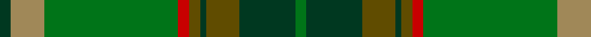

In pattern [GGGGGRGYG](/patterns/gggggrgyg/).

This was sourced from tartans-authority.  It is a [9 stripes tartan](/stripes/stripes9/).

Original link http://www.tartansauthority.com/tartan-ferret/display/6919/

## Attestations

This cloth appears in 2 source records; the oldest owns this page.

- 2005 — Fitzgibbon (Name) (tartans-authority, [record](http://www.tartansauthority.com/tartan-ferret/display/6919/))
- 01/01/2006 — Fitzgibbon (register-of-tartans, [record](https://www.tartanregister.gov.uk/tartanDetails.aspx?ref=1198))

## Thread count
DG/4 LT12 G48 R4 T4 DG2 T12 DG20 G/4

## Palette
Each colour and its ΔE from the base-6 reference it is a variant of.

| Colour | Shade | Base | ΔE (OKLab) |
|---|---|---|---|
| DG | <code style="background-color:#003820;">#003820</code> `#003820` | G <code style="background-color:#006100;">#006100</code> | 0.15 |
| G | <code style="background-color:#007418;">#007418</code> `#007418` | G <code style="background-color:#006100;">#006100</code> | 0.06 |
| LT | <code style="background-color:#A08858;">#A08858</code> `#A08858` | Y <code style="background-color:#F2BF00;">#F2BF00</code> | 0.21 |
| R | <code style="background-color:#C80000;">#C80000</code> `#C80000` | R <code style="background-color:#CC0000;">#CC0000</code> | 0.01 |
| T | <code style="background-color:#604C00;">#604C00</code> `#604C00` | G <code style="background-color:#006100;">#006100</code> | 0.11 |

## Nearest tartans

The nearest existing variants by ΔTartan distance.

1. [All Ireland Green (Fashion)](/setts/s13/g6ga2r2g30gb2ga4gb2gc2gb1gc20gb1ga2r4x2~g006818-ga289c18-gb808080-gc003820-r880000/) — ΔT 1.11
1. [All Irish Green Irish District Tartan Tartan Number: 4065. Earliest known date: 1997 Part of a collection produced by Lochcarron in 1997 to acknowledge the early historical and cultural links between the Scots and Irish. See products available Copyright © Blair Urquhart, Comrie, 2015](/setts/s13/g6ga2r2g30ra2ga4ra2gb2ra1gb20ra1ga2r4x2~g006818-ga289c18-gb003820-r880000-rac44c10/) — ΔT 1.19
1. [Hannigan of Dirleton (Personal)](/setts/s8/b4g4ga2w3g27ga30y1r3x2~b780078-g006818-ga5c6428-rc8002c-we0e0e0-ye8c000/) — ΔT 1.33
1. [Ramsay (Green Fashion)](/setts/s7/g1r7g7b2r1ga15w1x4~b5c5c5c-g006818-ga285800-r880000-wc0c0c0/) — ΔT 1.47
1. [State Seal of Minnesota (Fashion)](/setts/s8/r4g46r10b10ga33b5ga4y3x2~b2c2c80-g006818-ga604000-r880000-ybc8c00/) — ΔT 1.47
1. [Royal Scottish Agricultural Benevolent Institution](/setts/s10/g5b5g5b5g5ga24b1ba12ga6b3x2~b3c2010-ba003478-g845800-ga146400/) — ΔT 1.53
1. [Chisholm Hunting Clan Tartan Tartan Number: 1458. Earliest known date: 1906 This is a classic example of the process that began during the late Victorian period when the new analine dyes of the 1860s were considered to be too bright. Subtler forms of the tartan were produced, often replacing the red ground with green or brown. See products available Copyright © Blair Urquhart, Comrie, 2015](/setts/s10/g6w1g24b6ga2b1ga2b1ga12r1x2~b2c2c80-g604000-ga006818-rc80000-we0e0e0/) — ΔT 1.54
1. [Westmeath (District)](/setts/s14/g11r6b6ba2g3ba2b6r6g36y2ba3y2b5r5x2~b003c64-ba4c3428-g006818-r880000-yd09800/) — ΔT 1.62
1. [John Telfar Dunbar/Hunting Tartan Tartan Number: 776. Earliest known date: pre 2003 Check this entry... See products available Copyright © Blair Urquhart, Comrie, 2015](/setts/s7/g5k2g28k10ga26b4g4x2~b2c2c80-g006818-ga604000-k101010/) — ΔT 1.66
1. [Ensign of Ontario Canadian Tartan Tartan Number: 2032. Earliest known date: 1965 The Ensign tartan owes its inspiration to the Provincial Coat of Arms which was granted to the province by Royal Warrant of Queen Victoria in 1868. The yellow is taken from the three golden maple leaves of the lower shield and the red from the cross of St George on the upper. The black and brown come from the bear, the moose and the deer. There is also a District tartan called Northern Ontario. See products available Copyright © Blair Urquhart, Comrie, 2015](/setts/s15/g21k1r4k1ga21g3ga3g3ga21g3y4g21ga3g3ga3x2~g006818-ga604000-k101010-rc80000-ye8c000/) — ΔT 1.67

## Neighbour map

Every grey dot is one of 15726 variants placed by the first two principal components of the ΔTartan feature space (44% of its variance). Red is this tartan; blue dots are its nearest — click one to open its page.

<svg viewBox="0 0 640 380" role="img" style="max-width:100%;height:auto;border:1px solid #e0e0e0;border-radius:4px;display:block" xmlns="http://www.w3.org/2000/svg"><image href="/nn/cloud.v1.png" width="640" height="380"/><a href="/setts/s13/g6ga2r2g30gb2ga4gb2gc2gb1gc20gb1ga2r4x2~g006818-ga289c18-gb808080-gc003820-r880000/"><circle cx="332.4" cy="120.6" r="4" fill="#3465a4"><title>All Ireland Green (Fashion)</title></circle></a><a href="/setts/s13/g6ga2r2g30ra2ga4ra2gb2ra1gb20ra1ga2r4x2~g006818-ga289c18-gb003820-r880000-rac44c10/"><circle cx="325.9" cy="116.0" r="4" fill="#3465a4"><title>All Irish Green Irish District Tartan Tartan Number: 4065. Earliest known date: 1997 Part of a collection produced by Lochcarron in 1997 to acknowledge the early historical and cultural links between the Scots and Irish. See products available Copyright © Blair Urquhart, Comrie, 2015</title></circle></a><a href="/setts/s8/b4g4ga2w3g27ga30y1r3x2~b780078-g006818-ga5c6428-rc8002c-we0e0e0-ye8c000/"><circle cx="331.6" cy="135.0" r="4" fill="#3465a4"><title>Hannigan of Dirleton (Personal)</title></circle></a><a href="/setts/s7/g1r7g7b2r1ga15w1x4~b5c5c5c-g006818-ga285800-r880000-wc0c0c0/"><circle cx="313.0" cy="199.5" r="4" fill="#3465a4"><title>Ramsay (Green Fashion)</title></circle></a><a href="/setts/s8/r4g46r10b10ga33b5ga4y3x2~b2c2c80-g006818-ga604000-r880000-ybc8c00/"><circle cx="287.7" cy="183.4" r="4" fill="#3465a4"><title>State Seal of Minnesota (Fashion)</title></circle></a><a href="/setts/s10/g5b5g5b5g5ga24b1ba12ga6b3x2~b3c2010-ba003478-g845800-ga146400/"><circle cx="299.9" cy="186.2" r="4" fill="#3465a4"><title>Royal Scottish Agricultural Benevolent Institution</title></circle></a><a href="/setts/s10/g6w1g24b6ga2b1ga2b1ga12r1x2~b2c2c80-g604000-ga006818-rc80000-we0e0e0/"><circle cx="388.9" cy="149.6" r="4" fill="#3465a4"><title>Chisholm Hunting Clan Tartan Tartan Number: 1458. Earliest known date: 1906 This is a classic example of the process that began during the late Victorian period when the new analine dyes of the 1860s were considered to be too bright. Subtler forms of the tartan were produced, often replacing the red ground with green or brown. See products available Copyright © Blair Urquhart, Comrie, 2015</title></circle></a><a href="/setts/s14/g11r6b6ba2g3ba2b6r6g36y2ba3y2b5r5x2~b003c64-ba4c3428-g006818-r880000-yd09800/"><circle cx="329.5" cy="136.6" r="4" fill="#3465a4"><title>Westmeath (District)</title></circle></a><a href="/setts/s7/g5k2g28k10ga26b4g4x2~b2c2c80-g006818-ga604000-k101010/"><circle cx="331.6" cy="224.3" r="4" fill="#3465a4"><title>John Telfar Dunbar/Hunting Tartan Tartan Number: 776. Earliest known date: pre 2003 Check this entry... See products available Copyright © Blair Urquhart, Comrie, 2015</title></circle></a><a href="/setts/s15/g21k1r4k1ga21g3ga3g3ga21g3y4g21ga3g3ga3x2~g006818-ga604000-k101010-rc80000-ye8c000/"><circle cx="365.1" cy="155.9" r="4" fill="#3465a4"><title>Ensign of Ontario Canadian Tartan Tartan Number: 2032. Earliest known date: 1965 The Ensign tartan owes its inspiration to the Provincial Coat of Arms which was granted to the province by Royal Warrant of Queen Victoria in 1868. The yellow is taken from the three golden maple leaves of the lower shield and the red from the cross of St George on the upper. The black and brown come from the bear, the moose and the deer. There is also a District tartan called Northern Ontario. See products available Copyright © Blair Urquhart, Comrie, 2015</title></circle></a><circle cx="327.2" cy="159.9" r="5" fill="#c00000"/></svg>

ID: /setts/s9/g2y6ga24r2gb2g1gb6g10ga2x2~g003820-ga007418-gb604c00-rc80000-ya08858/
