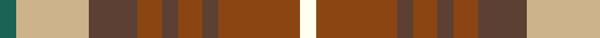

In pattern [GYGRGRGRW](/patterns/gygrgrgrw/).

This was sourced from register-of-tartans.  It is a [9 stripes tartan](/stripes/stripes9/).

Original link https://www.tartanregister.gov.uk/tartanDetails.aspx?ref=10273

## Thread count
G/8 LG36 Ta24 T12 Ta8 T12 Ta8 T40 W/8

## Palette
Each colour and its ΔE from the base-6 reference it is a variant of.

| Colour | Shade | Base | ΔE (OKLab) |
|---|---|---|---|
| G | <code style="background-color:#1B6453;">#1B6453</code> `#1B6453` | G <code style="background-color:#006100;">#006100</code> | 0.09 |
| LG | <code style="background-color:#CDB38B;">#CDB38B</code> `#CDB38B` | Y <code style="background-color:#F2BF00;">#F2BF00</code> | 0.12 |
| T | <code style="background-color:#8B4513;">#8B4513</code> `#8B4513` | R <code style="background-color:#CC0000;">#CC0000</code> | 0.13 |
| Ta | <code style="background-color:#5C4033;">#5C4033</code> `#5C4033` | G <code style="background-color:#006100;">#006100</code> | 0.16 |
| W | <code style="background-color:#FFFFF0;">#FFFFF0</code> `#FFFFF0` | W <code style="background-color:#F7F7F7;">#F7F7F7</code> | 0.03 |

## Nearest tartans

The nearest existing variants by ΔTartan distance.

1. [Tinkler (Corporate)](/setts/s9/g2y9b6r3b2r3b2r10w2x4~b441800-g006818-r880000-we0e0e0-yac986c/) — ΔT 1.13
1. [Toorak Chapler (Fashion)](/setts/s9/g3y1w1g1y1g3w3ya6r1x6~g604000-r880000-wc0c0c0-ya08858-yac4bc68/) — ΔT 1.15
1. [Deeside District](/setts/s7/y1b4r1ra5ba2ra1y1x2~b536c9a-ba5d002c-r9b4000-ra96815c-yffc800/) — ΔT 1.23
1. [Blackie (Artefact)](/setts/s8/g9y2g9w5r9b2r9b2x2~b5c8ca8-g006818-rc80000-we0e0e0-ye8c000/) — ΔT 1.23
1. [Maple Leaf](/setts/s12/g19r3g3r15y13r15g3r3g19ya6y6ga6x2~g004024-ga603311-r880000-ya08858-yaffd700/) — ΔT 1.26
1. [Quinn (Name?)](/setts/s12/g20r20ga5r5ga30k10g10y8ga30r5ga5r20x2~g408060-ga006818-k101010-rc80000-ye8c000/) — ΔT 1.33
1. [Glenmorangie (Corporate)](/setts/s11/g6r2g2r4g13k12y13r4y2r2y6x2~g805400-k101010-ra8608c-yc09458/) — ΔT 1.35
1. [Harmony 14](/setts/s11/g3ga16gb11ga2y11ga2y11ga2gb11ga16w3x2~g005020-ga808080-gb503c14-we0e0e0-yc89600/) — ΔT 1.36
1. [Sydney (Nova Scotia) (District)](/setts/s8/r16k4w2k4r6ra11r2ra16x2~k101010-r888888-rab84c00-we0e0e0/) — ΔT 1.43
1. [Blackie](/setts/s8/g9y2g9w5r9b2r9b2x2~b5c8ca8-g006818-rc80000-wffffff-ye8c000/) — ΔT 1.45

## Neighbour map

Every grey dot is one of 15726 variants placed by the first two principal components of the ΔTartan feature space (44% of its variance). Red is this tartan; blue dots are its nearest — click one to open its page.

<svg viewBox="0 0 640 380" role="img" style="max-width:100%;height:auto;border:1px solid #e0e0e0;border-radius:4px;display:block" xmlns="http://www.w3.org/2000/svg"><image href="/nn/cloud.v1.png" width="640" height="380"/><a href="/setts/s9/g2y9b6r3b2r3b2r10w2x4~b441800-g006818-r880000-we0e0e0-yac986c/"><circle cx="158.7" cy="204.7" r="4" fill="#3465a4"><title>Tinkler (Corporate)</title></circle></a><a href="/setts/s9/g3y1w1g1y1g3w3ya6r1x6~g604000-r880000-wc0c0c0-ya08858-yac4bc68/"><circle cx="125.5" cy="191.0" r="4" fill="#3465a4"><title>Toorak Chapler (Fashion)</title></circle></a><a href="/setts/s7/y1b4r1ra5ba2ra1y1x2~b536c9a-ba5d002c-r9b4000-ra96815c-yffc800/"><circle cx="140.1" cy="201.3" r="4" fill="#3465a4"><title>Deeside District</title></circle></a><a href="/setts/s8/g9y2g9w5r9b2r9b2x2~b5c8ca8-g006818-rc80000-we0e0e0-ye8c000/"><circle cx="122.9" cy="223.8" r="4" fill="#3465a4"><title>Blackie (Artefact)</title></circle></a><a href="/setts/s12/g19r3g3r15y13r15g3r3g19ya6y6ga6x2~g004024-ga603311-r880000-ya08858-yaffd700/"><circle cx="160.3" cy="197.4" r="4" fill="#3465a4"><title>Maple Leaf</title></circle></a><a href="/setts/s12/g20r20ga5r5ga30k10g10y8ga30r5ga5r20x2~g408060-ga006818-k101010-rc80000-ye8c000/"><circle cx="161.3" cy="200.7" r="4" fill="#3465a4"><title>Quinn (Name?)</title></circle></a><a href="/setts/s11/g6r2g2r4g13k12y13r4y2r2y6x2~g805400-k101010-ra8608c-yc09458/"><circle cx="141.4" cy="200.5" r="4" fill="#3465a4"><title>Glenmorangie (Corporate)</title></circle></a><a href="/setts/s11/g3ga16gb11ga2y11ga2y11ga2gb11ga16w3x2~g005020-ga808080-gb503c14-we0e0e0-yc89600/"><circle cx="204.6" cy="196.8" r="4" fill="#3465a4"><title>Harmony 14</title></circle></a><a href="/setts/s8/r16k4w2k4r6ra11r2ra16x2~k101010-r888888-rab84c00-we0e0e0/"><circle cx="243.6" cy="212.6" r="4" fill="#3465a4"><title>Sydney (Nova Scotia) (District)</title></circle></a><a href="/setts/s8/g9y2g9w5r9b2r9b2x2~b5c8ca8-g006818-rc80000-wffffff-ye8c000/"><circle cx="113.4" cy="219.7" r="4" fill="#3465a4"><title>Blackie</title></circle></a><circle cx="162.5" cy="208.0" r="5" fill="#c00000"/></svg>

ID: /setts/s9/g2y9ga6r3ga2r3ga2r10w2x4~g1b6453-ga5c4033-r8b4513-wfffff0-ycdb38b/
