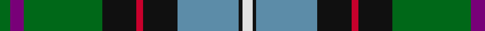

In pattern [GBGKRKBKW](/patterns/gbgkrkbkw/).

This was sourced from house-of-tartan.  It is a [9 stripes tartan](/stripes/stripes9/).

Original link http://www.house-of-tartan.scotland.net/house/TartanViewjs.asp?colr=Def&tnam=2157

## Thread count
G/6 P8 G46 K20 R4 K20 B36 K2 LN/6

## Palette
Each colour and its ΔE from the base-6 reference it is a variant of.

| Colour | Shade | Base | ΔE (OKLab) |
|---|---|---|---|
| B | <code style="background-color:#5C8CA8;">#5C8CA8</code> `#5C8CA8` | B <code style="background-color:#2A418A;">#2A418A</code> | 0.23 |
| G | <code style="background-color:#006818;">#006818</code> `#006818` | G <code style="background-color:#006100;">#006100</code> | 0.02 |
| K | <code style="background-color:#101010;">#101010</code> `#101010` | K <code style="background-color:#000000;">#000000</code> | 0.17 |
| LN | <code style="background-color:#E0E0E0;">#E0E0E0</code> `#E0E0E0` | W <code style="background-color:#F7F7F7;">#F7F7F7</code> | 0.07 |
| P | <code style="background-color:#780078;">#780078</code> `#780078` | B <code style="background-color:#2A418A;">#2A418A</code> | 0.17 |
| R | <code style="background-color:#C8002C;">#C8002C</code> `#C8002C` | R <code style="background-color:#CC0000;">#CC0000</code> | 0.03 |

## Nearest tartans

The nearest existing variants by ΔTartan distance.

1. [Hogg Dress (Name)](/setts/s9/b34r3b8ba4b8k24g34k2w6~b4880a0-ba1c1c50-g006818-k101010-rc80000-we0e0e0/) — ΔT 0.84
1. [Bergen Scottish](/setts/s7/b5w3r12g37k12ba21w2x2~b2c2c80-ba202060-g006818-k101010-rc80000-wf8f8f8/) — ΔT 0.86
1. [Groen (Personal)](/setts/s11/b12r2b3r4b15k24g18y1k3g3w3x2~b506878-g184c20-k101010-rc80000-wfcfcfc-ye8c000/) — ΔT 0.87
1. [Whitson Family Tartan Tartan Number: 1422. Earliest known date: 1984 UK Design No 514358 See products available Copyright © Blair Urquhart, Comrie, 2015](/setts/s9/w4k1g19y1k19b13r2b4r2x2~b2c2c80-g006818-k101010-rc80000-we0e0e0-ye8c000/) — ΔT 0.87
1. [Bruntsfield Links Golfing Soc. (Corp](/setts/s11/r6g22ga8g4ga12g2ga18b8ba12b35y4~b1c1c50-ba2888c4-g289c18-ga003820-rc80000-yc4bc68/) — ΔT 0.88
1. [Macneil of Barra - Chief (Personal)](/setts/s7/w1r2b16k14g15k3y1x2~b1474b4-g006818-k101010-rc80000-wfcfcfc-ye8c000/) — ΔT 0.90
1. [Froben, Christian (Personal)](/setts/s8/k2w2k8y8b24g13k3r1x2~b202060-g006818-k101010-r880000-wfcfcfc-yfccc00/) — ΔT 0.94
1. [Tooth Family Tartan Tartan Number: 922. Earliest known date: 1980 STS collection. See products available Copyright © Blair Urquhart, Comrie, 2015](/setts/s8/g5y1r2g25k14b19w4g2x2~b2c2c80-g006818-k101010-rc80000-we0e0e0-ye8c000/) — ΔT 0.95
1. [Birch](/setts/s9/g3b4g23k10r2k10ba18k1w3x2~b800080-ba5480b0-g008000-k000000-rc00020-we0e0e0/) — ΔT 0.95
1. [McGeachie (Personal)](/setts/s8/w1k6b9r12k12g32k6y1x2~b3850c8-g006818-k101010-rc80000-we0e0e0-ye8c000/) — ΔT 0.97

## Neighbour map

Every grey dot is one of 15726 variants placed by the first two principal components of the ΔTartan feature space (44% of its variance). Red is this tartan; blue dots are its nearest — click one to open its page.

<svg viewBox="0 0 640 380" role="img" style="max-width:100%;height:auto;border:1px solid #e0e0e0;border-radius:4px;display:block" xmlns="http://www.w3.org/2000/svg"><image href="/nn/cloud.v1.png" width="640" height="380"/><a href="/setts/s9/b34r3b8ba4b8k24g34k2w6~b4880a0-ba1c1c50-g006818-k101010-rc80000-we0e0e0/"><circle cx="178.1" cy="137.7" r="4" fill="#3465a4"><title>Hogg Dress (Name)</title></circle></a><a href="/setts/s7/b5w3r12g37k12ba21w2x2~b2c2c80-ba202060-g006818-k101010-rc80000-wf8f8f8/"><circle cx="167.0" cy="143.5" r="4" fill="#3465a4"><title>Bergen Scottish</title></circle></a><a href="/setts/s11/b12r2b3r4b15k24g18y1k3g3w3x2~b506878-g184c20-k101010-rc80000-wfcfcfc-ye8c000/"><circle cx="173.0" cy="116.0" r="4" fill="#3465a4"><title>Groen (Personal)</title></circle></a><a href="/setts/s9/w4k1g19y1k19b13r2b4r2x2~b2c2c80-g006818-k101010-rc80000-we0e0e0-ye8c000/"><circle cx="140.8" cy="124.0" r="4" fill="#3465a4"><title>Whitson Family Tartan Tartan Number: 1422. Earliest known date: 1984 UK Design No 514358 See products available Copyright © Blair Urquhart, Comrie, 2015</title></circle></a><a href="/setts/s11/r6g22ga8g4ga12g2ga18b8ba12b35y4~b1c1c50-ba2888c4-g289c18-ga003820-rc80000-yc4bc68/"><circle cx="127.9" cy="140.0" r="4" fill="#3465a4"><title>Bruntsfield Links Golfing Soc. (Corp</title></circle></a><a href="/setts/s7/w1r2b16k14g15k3y1x2~b1474b4-g006818-k101010-rc80000-wfcfcfc-ye8c000/"><circle cx="148.5" cy="152.2" r="4" fill="#3465a4"><title>Macneil of Barra - Chief (Personal)</title></circle></a><a href="/setts/s8/k2w2k8y8b24g13k3r1x2~b202060-g006818-k101010-r880000-wfcfcfc-yfccc00/"><circle cx="164.0" cy="117.2" r="4" fill="#3465a4"><title>Froben, Christian (Personal)</title></circle></a><a href="/setts/s8/g5y1r2g25k14b19w4g2x2~b2c2c80-g006818-k101010-rc80000-we0e0e0-ye8c000/"><circle cx="217.1" cy="129.3" r="4" fill="#3465a4"><title>Tooth Family Tartan Tartan Number: 922. Earliest known date: 1980 STS collection. See products available Copyright © Blair Urquhart, Comrie, 2015</title></circle></a><a href="/setts/s9/g3b4g23k10r2k10ba18k1w3x2~b800080-ba5480b0-g008000-k000000-rc00020-we0e0e0/"><circle cx="131.7" cy="117.0" r="4" fill="#3465a4"><title>Birch</title></circle></a><a href="/setts/s8/w1k6b9r12k12g32k6y1x2~b3850c8-g006818-k101010-rc80000-we0e0e0-ye8c000/"><circle cx="209.3" cy="117.1" r="4" fill="#3465a4"><title>McGeachie (Personal)</title></circle></a><circle cx="157.5" cy="124.9" r="5" fill="#c00000"/></svg>

ID: /setts/s9/g3b4g23k10r2k10ba18k1w3x2~b780078-ba5c8ca8-g006818-k101010-rc8002c-we0e0e0/
