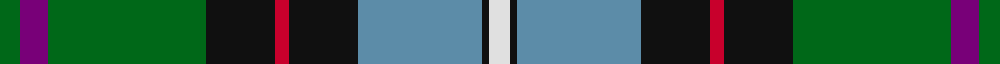

This page is one **sett** — a single exact thread-count. It belongs to the [tartan](/tartans/g3dp4g23k10r2k10t18k1w3/)
(the same proportion at any scale), whose colour order is pattern [GBGKRKBKW](/stripes/gbgkrkbkw/).

Sourced from house-of-tartan.  It is a [9 stripe tartan](/stripes/stripes9/).

Original link http://www.house-of-tartan.scotland.net/house/TartanViewjs.asp?colr=Def&tnam=2157

## Thread count
G/6 P8 G46 K20 R4 K20 B36 K2 LN/6

## Palette

Palette: <strong>Tartan Register</strong>
<table><thead><tr><th>Colour</th><th>Threads</th><th>Shade</th><th>Base</th><th>OKLCh</th></tr></thead><tbody><tr><td>G/</td><td style="text-align:right;font-variant-numeric:tabular-nums">6</td><td><code style="background-color:#006818;">#006818</code> <small style="color:#888">#006818</small></td><td>G <code style="background-color:#006100;">#006100</code></td><td><small style="color:#888">oklch(45.0% 0.142 145.0)</small></td></tr><tr><td>P</td><td style="text-align:right;font-variant-numeric:tabular-nums">8</td><td><code style="background-color:#780078;">#780078</code> <small style="color:#888">#780078</small></td><td>B <code style="background-color:#2A418A;">#2A418A</code></td><td><small style="color:#888">oklch(40.2% 0.185 328.4)</small></td></tr><tr><td>G</td><td style="text-align:right;font-variant-numeric:tabular-nums">46</td><td><code style="background-color:#006818;">#006818</code> <small style="color:#888">#006818</small></td><td>G <code style="background-color:#006100;">#006100</code></td><td><small style="color:#888">oklch(45.0% 0.142 145.0)</small></td></tr><tr><td>K</td><td style="text-align:right;font-variant-numeric:tabular-nums">20</td><td><code style="background-color:#101010;">#101010</code> <small style="color:#888">#101010</small></td><td>K <code style="background-color:#000000;">#000000</code></td><td><small style="color:#888">oklch(17.3% 0.000 89.9)</small></td></tr><tr><td>R</td><td style="text-align:right;font-variant-numeric:tabular-nums">4</td><td><code style="background-color:#C8002C;">#C8002C</code> <small style="color:#888">#C8002C</small></td><td>R <code style="background-color:#CC0000;">#CC0000</code></td><td><small style="color:#888">oklch(52.6% 0.212 22.0)</small></td></tr><tr><td>K</td><td style="text-align:right;font-variant-numeric:tabular-nums">20</td><td><code style="background-color:#101010;">#101010</code> <small style="color:#888">#101010</small></td><td>K <code style="background-color:#000000;">#000000</code></td><td><small style="color:#888">oklch(17.3% 0.000 89.9)</small></td></tr><tr><td>B</td><td style="text-align:right;font-variant-numeric:tabular-nums">36</td><td><code style="background-color:#5C8CA8;">#5C8CA8</code> <small style="color:#888">#5C8CA8</small></td><td>B <code style="background-color:#2A418A;">#2A418A</code></td><td><small style="color:#888">oklch(61.7% 0.067 235.0)</small></td></tr><tr><td>K</td><td style="text-align:right;font-variant-numeric:tabular-nums">2</td><td><code style="background-color:#101010;">#101010</code> <small style="color:#888">#101010</small></td><td>K <code style="background-color:#000000;">#000000</code></td><td><small style="color:#888">oklch(17.3% 0.000 89.9)</small></td></tr><tr><td>LN/</td><td style="text-align:right;font-variant-numeric:tabular-nums">6</td><td><code style="background-color:#E0E0E0;">#E0E0E0</code> <small style="color:#888">#E0E0E0</small></td><td>W <code style="background-color:#F7F7F7;">#F7F7F7</code></td><td><small style="color:#888">oklch(90.7% 0.000 89.9)</small></td></tr></tbody></table>

## Nearest tartans

The nearest existing variants by ΔTartan distance, with this tartan at the top so the swatches line up against it.

ΔTartan

Tartan

Sett

—

<a href="/ttd/edit/#slug=g3dp4g23k10r2k10t18k1w3~x2">Birch Family Tartan Tartan Number: 2157. Earliest known date: 1993 The Birch family tartan was designed and produced by Mr Robin Birch of Connell Reid kiltmaker, Blairgowrie. The new sett has been recorded by the Scottish Tartans Society. See products available Copyright © Blair Urquhart, Comrie, 2015</a> <a class="nn-out" href="/setts/s9/g3dp4g23k10r2k10t18k1w3~x2/" title="open its dictionary page">↗</a>

0.84

<a href="/ttd/edit/#slug=t34r3t8db4t8k24g34k2w6">Hogg Dress (Name)</a> <a class="nn-out" href="/setts/s9/t34r3t8db4t8k24g34k2w6/" title="open its dictionary page">↗</a>

0.86

<a href="/ttd/edit/#slug=db5w3r12g37k12db21w2~x2">Bergen Scottish</a> <a class="nn-out" href="/setts/s7/db5w3r12g37k12db21w2~x2/" title="open its dictionary page">↗</a>

0.87

<a href="/ttd/edit/#slug=n12r2n3r4n15k24dg18ly1k3dg3w3~x2">Groen (Personal)</a> <a class="nn-out" href="/setts/s11/n12r2n3r4n15k24dg18ly1k3dg3w3~x2/" title="open its dictionary page">↗</a>

0.88

<a href="/ttd/edit/#slug=r6g22dg8g4dg12g2dg18db8t12db35ly4">Bruntsfield Links Golfing Soc. (Corp</a> <a class="nn-out" href="/setts/s11/r6g22dg8g4dg12g2dg18db8t12db35ly4/" title="open its dictionary page">↗</a>

0.90

<a href="/ttd/edit/#slug=w1r2b16k14g15k3ly1~x2">Macneil of Barra - Chief (Personal)</a> <a class="nn-out" href="/setts/s7/w1r2b16k14g15k3ly1~x2/" title="open its dictionary page">↗</a>

0.94

<a href="/ttd/edit/#slug=k2w2k8ly8db24g13k3r1~x2">Froben, Christian (Personal)</a> <a class="nn-out" href="/setts/s8/k2w2k8ly8db24g13k3r1~x2/" title="open its dictionary page">↗</a>

0.94

<a href="/ttd/edit/#slug=g3p4g23k10r2k10t18k1w3~x2">Birch</a> <a class="nn-out" href="/setts/s9/g3p4g23k10r2k10t18k1w3~x2/" title="open its dictionary page">↗</a>

0.97

<a href="/ttd/edit/#slug=w1k6b9r12k12g32k6ly1~x2">McGeachie (Personal)</a> <a class="nn-out" href="/setts/s8/w1k6b9r12k12g32k6ly1~x2/" title="open its dictionary page">↗</a>

1.02

<a href="/ttd/edit/#slug=g20dg14db9ly2db9k1w2~x4">Hughes</a> <a class="nn-out" href="/setts/s7/g20dg14db9ly2db9k1w2~x4/" title="open its dictionary page">↗</a>

1.03

<a href="/ttd/edit/#slug=k2w2k8lo8db24dg13k3m1~x2">Froben, Christian (Personal)</a> <a class="nn-out" href="/setts/s8/k2w2k8lo8db24dg13k3m1~x2/" title="open its dictionary page">↗</a>

## Neighbour map

Every grey dot is one of 14299 variants placed by the first two principal components of the ΔTartan feature space (44% of its variance). Red is this tartan; blue dots are its nearest — click one to open its page.

<svg viewBox="0 0 640 380" role="img" style="max-width:100%;height:auto;border:1px solid #e0e0e0;border-radius:4px;display:block" xmlns="http://www.w3.org/2000/svg"><image href="/nn/cloud.v1.png" width="640" height="380"/><a href="/setts/s9/t34r3t8db4t8k24g34k2w6/"><circle cx="181.6" cy="141.7" r="4" fill="#3465a4"><title>Hogg Dress (Name)</title></circle></a><a href="/setts/s7/db5w3r12g37k12db21w2~x2/"><circle cx="170.0" cy="146.2" r="4" fill="#3465a4"><title>Bergen Scottish</title></circle></a><a href="/setts/s11/n12r2n3r4n15k24dg18ly1k3dg3w3~x2/"><circle cx="176.1" cy="120.9" r="4" fill="#3465a4"><title>Groen (Personal)</title></circle></a><a href="/setts/s11/r6g22dg8g4dg12g2dg18db8t12db35ly4/"><circle cx="131.6" cy="145.7" r="4" fill="#3465a4"><title>Bruntsfield Links Golfing Soc. (Corp</title></circle></a><a href="/setts/s7/w1r2b16k14g15k3ly1~x2/"><circle cx="152.3" cy="155.8" r="4" fill="#3465a4"><title>Macneil of Barra - Chief (Personal)</title></circle></a><a href="/setts/s8/k2w2k8ly8db24g13k3r1~x2/"><circle cx="167.5" cy="118.4" r="4" fill="#3465a4"><title>Froben, Christian (Personal)</title></circle></a><a href="/setts/s9/g3p4g23k10r2k10t18k1w3~x2/"><circle cx="135.6" cy="117.9" r="4" fill="#3465a4"><title>Birch</title></circle></a><a href="/setts/s8/w1k6b9r12k12g32k6ly1~x2/"><circle cx="212.2" cy="119.8" r="4" fill="#3465a4"><title>McGeachie (Personal)</title></circle></a><a href="/setts/s7/g20dg14db9ly2db9k1w2~x4/"><circle cx="167.1" cy="160.1" r="4" fill="#3465a4"><title>Hughes</title></circle></a><a href="/setts/s8/k2w2k8lo8db24dg13k3m1~x2/"><circle cx="187.9" cy="130.5" r="4" fill="#3465a4"><title>Froben, Christian (Personal)</title></circle></a><circle cx="160.9" cy="128.5" r="5" fill="#c00000"/></svg>

ID: /setts/s9/g3dp4g23k10r2k10t18k1w3~x2/
