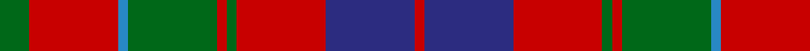

In pattern [GRBGRGRBR](/patterns/grbgrgrbr/).

This was sourced from tartans-authority.  It is a [9 stripes tartan](/stripes/stripes9/).

Original link http://www.tartansauthority.com/tartan-ferret/display/2348/

## Thread count
G/12 R36 B4 G36 R4 G4 R36 DB36 R/4

## Palette
Each colour and its ΔE from the base-6 reference it is a variant of.

| Colour | Shade | Base | ΔE (OKLab) |
|---|---|---|---|
| B | <code style="background-color:#2888C4;">#2888C4</code> `#2888C4` | B <code style="background-color:#2A418A;">#2A418A</code> | 0.21 |
| DB | <code style="background-color:#2C2C80;">#2C2C80</code> `#2C2C80` | B <code style="background-color:#2A418A;">#2A418A</code> | 0.06 |
| G | <code style="background-color:#006818;">#006818</code> `#006818` | G <code style="background-color:#006100;">#006100</code> | 0.02 |
| R | <code style="background-color:#C80000;">#C80000</code> `#C80000` | R <code style="background-color:#CC0000;">#CC0000</code> | 0.01 |

## Nearest tartans

The nearest existing variants by ΔTartan distance.

1. [Leitrim](/setts/s10/g3b18g4b3g4r13g3g18b2y3x2~b401000-g808080-rc00000-yff8500/) — ΔT 0.38
1. [Baronage](/setts/s9/g3r9b1g9r1g1r8ba9r1x4~b3c82af-ba141e46-g005020-rc80028/) — ΔT 0.43
1. [Henkel](/setts/s10/g28k3r22k8w3k8r22k3g28k3x2~g808080-k101010-rc80000-wfcfcfc/) — ΔT 0.70
1. [Montrose Clan Tartan Tartan Number: 350. Earliest known date: 1819 Canadian fancy. Presented by Mrs K Sinclair See products available Copyright © Blair Urquhart, Comrie, 2015](/setts/s9/b1k1r12g12k6b5r12k1b1x2~b2c2c80-g006818-k101010-rc80000/) — ΔT 0.77
1. [MacKillop Clan Tartan Tartan Number: 512. Earliest known date: pre 2003 The MacKillops are a Sept of MacDonald of Keppoch, whose tartan this sett closely resembles. See products available Copyright © Blair Urquhart, Comrie, 2015](/setts/s10/g3r2b2r13ba1b4r2g7r2b2x2~b2c2c80-ba5c8ca8-g006818-rc80000/) — ΔT 0.80
1. [MacBean/MacElvain](/setts/s7/k2r12b6r3g12r4b1x2~b2c4084-g005020-k101010-rdc0000/) — ΔT 0.82
1. [Gates](/setts/s9/b24r3b4r6g8r3g8r30k3x2~b2c2c80-g006818-k101010-rc80000/) — ΔT 0.83
1. [MacKillop](/setts/s10/g3r2b2r13ba1b4r2g7r2b2x2~b304080-ba5480b0-g008000-rc00000/) — ΔT 0.84
1. [Glenaladale, Plaid](/setts/s10/b28r26w2b5w2r26g28r5w2r5x2~b304080-g008000-rc00000-we0e0e0/) — ΔT 0.87
1. [Glenfinnan (Clan?)](/setts/s10/b28r26w2b5w2r26y28r5w2r5x2~b506880-r880000-wfcfcfc-y78a064/) — ΔT 0.88

## Neighbour map

Every grey dot is one of 15726 variants placed by the first two principal components of the ΔTartan feature space (44% of its variance). Red is this tartan; blue dots are its nearest — click one to open its page.

<svg viewBox="0 0 640 380" role="img" style="max-width:100%;height:auto;border:1px solid #e0e0e0;border-radius:4px;display:block" xmlns="http://www.w3.org/2000/svg"><image href="/nn/cloud.v1.png" width="640" height="380"/><a href="/setts/s10/g3b18g4b3g4r13g3g18b2y3x2~b401000-g808080-rc00000-yff8500/"><circle cx="246.8" cy="185.1" r="4" fill="#3465a4"><title>Leitrim</title></circle></a><a href="/setts/s9/g3r9b1g9r1g1r8ba9r1x4~b3c82af-ba141e46-g005020-rc80028/"><circle cx="245.8" cy="199.2" r="4" fill="#3465a4"><title>Baronage</title></circle></a><a href="/setts/s10/g28k3r22k8w3k8r22k3g28k3x2~g808080-k101010-rc80000-wfcfcfc/"><circle cx="225.3" cy="182.0" r="4" fill="#3465a4"><title>Henkel</title></circle></a><a href="/setts/s9/b1k1r12g12k6b5r12k1b1x2~b2c2c80-g006818-k101010-rc80000/"><circle cx="248.0" cy="178.6" r="4" fill="#3465a4"><title>Montrose Clan Tartan Tartan Number: 350. Earliest known date: 1819 Canadian fancy. Presented by Mrs K Sinclair See products available Copyright © Blair Urquhart, Comrie, 2015</title></circle></a><a href="/setts/s10/g3r2b2r13ba1b4r2g7r2b2x2~b2c2c80-ba5c8ca8-g006818-rc80000/"><circle cx="289.5" cy="170.3" r="4" fill="#3465a4"><title>MacKillop Clan Tartan Tartan Number: 512. Earliest known date: pre 2003 The MacKillops are a Sept of MacDonald of Keppoch, whose tartan this sett closely resembles. See products available Copyright © Blair Urquhart, Comrie, 2015</title></circle></a><a href="/setts/s7/k2r12b6r3g12r4b1x2~b2c4084-g005020-k101010-rdc0000/"><circle cx="259.3" cy="199.4" r="4" fill="#3465a4"><title>MacBean/MacElvain</title></circle></a><a href="/setts/s9/b24r3b4r6g8r3g8r30k3x2~b2c2c80-g006818-k101010-rc80000/"><circle cx="269.3" cy="179.6" r="4" fill="#3465a4"><title>Gates</title></circle></a><a href="/setts/s10/g3r2b2r13ba1b4r2g7r2b2x2~b304080-ba5480b0-g008000-rc00000/"><circle cx="291.5" cy="171.9" r="4" fill="#3465a4"><title>MacKillop</title></circle></a><a href="/setts/s10/b28r26w2b5w2r26g28r5w2r5x2~b304080-g008000-rc00000-we0e0e0/"><circle cx="266.9" cy="163.4" r="4" fill="#3465a4"><title>Glenaladale, Plaid</title></circle></a><a href="/setts/s10/b28r26w2b5w2r26y28r5w2r5x2~b506880-r880000-wfcfcfc-y78a064/"><circle cx="272.8" cy="167.2" r="4" fill="#3465a4"><title>Glenfinnan (Clan?)</title></circle></a><circle cx="250.9" cy="197.0" r="5" fill="#c00000"/></svg>

ID: /setts/s9/g3r9b1g9r1g1r9ba9r1x4~b2888c4-ba2c2c80-g006818-rc80000/
