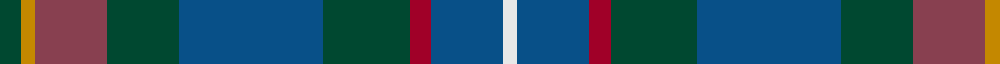

In pattern [GYRGBGRBW](/patterns/gyrgbgrbw/).

This was sourced from house-of-tartan.  It is a [9 stripes tartan](/stripes/stripes9/).

Original link http://www.house-of-tartan.scotland.net/house/TartanViewjs.asp?colr=Def&tnam=10924

## Thread count
DG/6 DY4 DR20 DG20 B40 DG24 DRa6 B20 LN/4

## Palette
Each colour and its ΔE from the base-6 reference it is a variant of.

| Colour | Shade | Base | ΔE (OKLab) |
|---|---|---|---|
| B | <code style="background-color:#085088;">#085088</code> `#085088` | B <code style="background-color:#2A418A;">#2A418A</code> | 0.05 |
| DG | <code style="background-color:#004830;">#004830</code> `#004830` | G <code style="background-color:#006100;">#006100</code> | 0.11 |
| DR | <code style="background-color:#884050;">#884050</code> `#884050` | R <code style="background-color:#CC0000;">#CC0000</code> | 0.14 |
| DRa | <code style="background-color:#A00028;">#A00028</code> `#A00028` | R <code style="background-color:#CC0000;">#CC0000</code> | 0.10 |
| DY | <code style="background-color:#C48800;">#C48800</code> `#C48800` | Y <code style="background-color:#F2BF00;">#F2BF00</code> | 0.16 |
| LN | <code style="background-color:#E8E8E8;">#E8E8E8</code> `#E8E8E8` | W <code style="background-color:#F7F7F7;">#F7F7F7</code> | 0.05 |

## Nearest tartans

The nearest existing variants by ΔTartan distance.

1. [Blairmore House (Corporate)](/setts/s8/b17w2b2r2b2ba12g16y3~b003478-ba3c2010-g0c5454-r8c0000-wc8c8c8-yc88c00~x4/) — ΔT 1.08
1. [Copar a'Beannichte (Personal)](/setts/s9/g20ga6gb15b5gb2b15r4b10ra2~b003c64-g006818-ga0098a0-gb003820-r888888-rac80000~x2/) — ΔT 1.19
1. [Westbrook (2013)](/setts/s9/g15ga3b2ga3g8ba12bb20r2bb4~b4c0000-ba1870a4-bb1c1c50-g004c00-ga718048-r880000~x2/) — ΔT 1.20
1. [Seaford House](/setts/s9/b3ba3b12ba26g26r3g26ba28w3~b788cb4-ba003c64-g003820-rc8002c-wffffff/) — ΔT 1.29
1. [Patel (2013)](/setts/s9/g3y2r10g10b20g12ra3b10w2~b1870a4-g004028-r781c38-ra960028-wffffff-ye0a126~x2/) — ΔT 1.32
1. [Remember the Somme 1916](/setts/s8/g5ga2b2ba15r2y2g5r2~b2c2c80-ba202060-g003820-ga006818-ra00000-y48a4c0~x4/) — ΔT 1.34
1. [State Seal of Iowa (Fashion)](/setts/s8/b5ba43b18w4ba6r5g25y5~b003c64-ba1474b4-g604000-r880000-we8ccb8-ybc8c00~x2/) — ΔT 1.35
1. [Cowie](/setts/s6/r3b24k7ba11g11y2~b003c64-ba2c2c80-g006818-k101010-rc80000-ye8c000~x2/) — ΔT 1.36
1. [MacConnell](/setts/s10/b20g6b6w2g20r8g6r4g10y3~b003c64-g003820-r880000-wa8ace8-yb8b8b8~x2/) — ΔT 1.39
1. [Blairmore House](/setts/s8/b17w2b2r2b2ba12g16y3~b003478-ba3c2010-g0c5454-r8c0000-wffffff-yc88c00~x4/) — ΔT 1.39

## Neighbour map

Every grey dot is one of 15726 variants placed by the first two principal components of the ΔTartan feature space (44% of its variance). Red is this tartan; blue dots are its nearest — click one to open its page.

<svg viewBox="0 0 640 380" role="img" style="max-width:100%;height:auto;border:1px solid #e0e0e0;border-radius:4px;display:block" xmlns="http://www.w3.org/2000/svg"><image href="/nn/cloud.v1.png" width="640" height="380"/><a href="/setts/s8/b17w2b2r2b2ba12g16y3~b003478-ba3c2010-g0c5454-r8c0000-wc8c8c8-yc88c00~x4/"><circle cx="190.7" cy="188.6" r="4" fill="#3465a4"><title>Blairmore House (Corporate)</title></circle></a><a href="/setts/s9/g20ga6gb15b5gb2b15r4b10ra2~b003c64-g006818-ga0098a0-gb003820-r888888-rac80000~x2/"><circle cx="189.0" cy="206.3" r="4" fill="#3465a4"><title>Copar a'Beannichte (Personal)</title></circle></a><a href="/setts/s9/g15ga3b2ga3g8ba12bb20r2bb4~b4c0000-ba1870a4-bb1c1c50-g004c00-ga718048-r880000~x2/"><circle cx="172.6" cy="185.8" r="4" fill="#3465a4"><title>Westbrook (2013)</title></circle></a><a href="/setts/s9/b3ba3b12ba26g26r3g26ba28w3~b788cb4-ba003c64-g003820-rc8002c-wffffff/"><circle cx="245.9" cy="212.9" r="4" fill="#3465a4"><title>Seaford House</title></circle></a><a href="/setts/s9/g3y2r10g10b20g12ra3b10w2~b1870a4-g004028-r781c38-ra960028-wffffff-ye0a126~x2/"><circle cx="182.9" cy="183.4" r="4" fill="#3465a4"><title>Patel (2013)</title></circle></a><a href="/setts/s8/g5ga2b2ba15r2y2g5r2~b2c2c80-ba202060-g003820-ga006818-ra00000-y48a4c0~x4/"><circle cx="219.7" cy="192.3" r="4" fill="#3465a4"><title>Remember the Somme 1916</title></circle></a><a href="/setts/s8/b5ba43b18w4ba6r5g25y5~b003c64-ba1474b4-g604000-r880000-we8ccb8-ybc8c00~x2/"><circle cx="216.9" cy="168.6" r="4" fill="#3465a4"><title>State Seal of Iowa (Fashion)</title></circle></a><a href="/setts/s6/r3b24k7ba11g11y2~b003c64-ba2c2c80-g006818-k101010-rc80000-ye8c000~x2/"><circle cx="194.1" cy="199.1" r="4" fill="#3465a4"><title>Cowie</title></circle></a><a href="/setts/s10/b20g6b6w2g20r8g6r4g10y3~b003c64-g003820-r880000-wa8ace8-yb8b8b8~x2/"><circle cx="276.8" cy="215.7" r="4" fill="#3465a4"><title>MacConnell</title></circle></a><a href="/setts/s8/b17w2b2r2b2ba12g16y3~b003478-ba3c2010-g0c5454-r8c0000-wffffff-yc88c00~x4/"><circle cx="173.8" cy="181.6" r="4" fill="#3465a4"><title>Blairmore House</title></circle></a><circle cx="217.6" cy="199.4" r="5" fill="#c00000"/></svg>

ID: /setts/s9/g3y2r10g10b20g12ra3b10w2~b085088-g004830-r884050-raa00028-we8e8e8-yc48800~x2/
