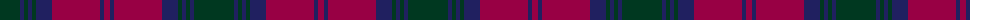

In pattern [GBGBGBRBR](/patterns/gbgbgbrbr/).

This was sourced from house-of-tartan.  It is a [9 stripes tartan](/stripes/stripes9/).

Original link http://www.house-of-tartan.scotland.net/house/TartanViewjs.asp?colr=Def&tnam=704

## Thread count
DG/40 DB4 DG4 DB4 DG4 DB16 R48 DB4 R/6

## Palette
Each colour and its ΔE from the base-6 reference it is a variant of.

| Colour | Shade | Base | ΔE (OKLab) |
|---|---|---|---|
| DB | <code style="background-color:#202060;">#202060</code> `#202060` | B <code style="background-color:#2C4084;">#2C4084</code> | 0.11 |
| DG | <code style="background-color:#003820;">#003820</code> `#003820` | G <code style="background-color:#006400;">#006400</code> | 0.16 |
| R | <code style="background-color:#980044;">#980044</code> `#980044` | R <code style="background-color:#C80000;">#C80000</code> | 0.12 |

ID: /setts/s9/g40b4g4b4g4b16r48b4r6-b202060-g003820-r980044/
