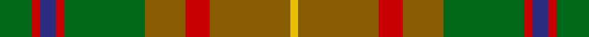

This page is one **sett** — a single exact thread-count. It belongs to the [tartan](/tartans/g4r1db2r1g10t5r3t10y1/)
(the same proportion at any scale), whose colour order is pattern [GRBRGGRGY](/stripes/grbrggrgy/).

Sourced from register-of-tartans.  It is a [9 stripe tartan](/stripes/stripes9/).

Original link https://www.tartanregister.gov.uk/tartanDetails.aspx?ref=2983

2 attestations — the source records this cloth was collapsed from (oldest owns this page)

<ul>
<li>01/01/2000 — Moncton, City of (register-of-tartans, <a href="https://www.tartanregister.gov.uk/tartanDetails.aspx?ref=2983">record</a>)</li>
<li>2000 — Moncton, City of (District) (tartans-authority, <a href="http://www.tartansauthority.com/tartan-ferret/display/7384/">record</a>)</li>
</ul>

## Register references

External register numbers recorded for this tartan.

- Scottish Register of Tartans: [2983](https://www.tartanregister.gov.uk/tartanDetails.aspx?ref=2983)
- Scottish Tartans Authority (ITI): 7384
- Scottish Tartans World Register: 2937

## Thread count
G/16 R4 DB8 R4 G40 T20 R12 T40 Y/4

## Palette
Each colour and the base-6 reference it is a variant of.

| Colour | Shade | Base |
|---|---|---|
| DB | <code style="background-color:#2C2C80;">#2C2C80</code> `oklch(35.0% 0.138 276.6)` <small>#2C2C80</small> | B <code style="background-color:#2A418A;">#2A418A</code> |
| G | <code style="background-color:#006818;">#006818</code> `oklch(45.0% 0.142 145.0)` <small>#006818</small> | G <code style="background-color:#006100;">#006100</code> |
| R | <code style="background-color:#C80000;">#C80000</code> `oklch(52.3% 0.215 29.2)` <small>#C80000</small> | R <code style="background-color:#CC0000;">#CC0000</code> |
| T | <code style="background-color:#885C00;">#885C00</code> `oklch(50.9% 0.107 76.4)` <small>#885C00</small> | G <code style="background-color:#006100;">#006100</code> |
| Y | <code style="background-color:#E8C000;">#E8C000</code> `oklch(81.9% 0.168 93.7)` <small>#E8C000</small> | Y <code style="background-color:#F2BF00;">#F2BF00</code> |

## Nearest tartans

The nearest existing variants by ΔTartan distance, with this tartan at the top so the swatches line up against it.

ΔTartan

Tartan

Sett

—

<a href="/ttd/edit/#slug=g4r1db2r1g10y5r3y10ly1~x4">Moncton, City of</a> <a class="nn-out" href="/setts/s9/g4r1db2r1g10y5r3y10ly1~x4/" title="open its dictionary page">↗</a>

1.03

<a href="/ttd/edit/#slug=dy9k2dy2r2g6k1lo1k1g6r3~x4">MacAart (Personal)</a> <a class="nn-out" href="/setts/s10/dy9k2dy2r2g6k1lo1k1g6r3~x4/" title="open its dictionary page">↗</a>

1.13

<a href="/ttd/edit/#slug=r3dy16g10r3g3lb2g3r3~x2">Scott Htg (Clan)</a> <a class="nn-out" href="/setts/s8/r3dy16g10r3g3lb2g3r3~x2/" title="open its dictionary page">↗</a>

1.28

<a href="/ttd/edit/#slug=lo18do3lo3do3lo3do16y16r2ly2r2y16do16lo17do3lo3~x2">Lander (2013)</a> <a class="nn-out" href="/setts/s15/lo18do3lo3do3lo3do16y16r2ly2r2y16do16lo17do3lo3~x2/" title="open its dictionary page">↗</a>

1.28

<a href="/ttd/edit/#slug=r3o23g8g6g8t6g10t12g3~x2">Lawrence's Seven Pillars of Khaki</a> <a class="nn-out" href="/setts/s9/r3o23g8g6g8t6g10t12g3~x2/" title="open its dictionary page">↗</a>

1.29

<a href="/ttd/edit/#slug=dy35dg19r3y8r3dg8r3t3~x2">John Muir Way</a> <a class="nn-out" href="/setts/s8/dy35dg19r3y8r3dg8r3t3~x2/" title="open its dictionary page">↗</a>

1.30

<a href="/ttd/edit/#slug=r2dy1dg9y1dy2y6g2y1~x4">Tomass</a> <a class="nn-out" href="/setts/s8/r2dy1dg9y1dy2y6g2y1~x4/" title="open its dictionary page">↗</a>

1.31

<a href="/ttd/edit/#slug=do6lg3do18dy2do2dy10y28r2y4~x2">Scottish Crofting Foundation</a> <a class="nn-out" href="/setts/s9/do6lg3do18dy2do2dy10y28r2y4~x2/" title="open its dictionary page">↗</a>

1.32

<a href="/ttd/edit/#slug=dy16r16lr3dg16o2r1o2dy6r2~x4">Henry, W. A.</a> <a class="nn-out" href="/setts/s9/dy16r16lr3dg16o2r1o2dy6r2~x4/" title="open its dictionary page">↗</a>

1.33

<a href="/ttd/edit/#slug=dy9k2dy2r2g6k1ly1k1g6r3~x2">MacAart Family Tartan Tartan Number: 1477. Earliest known date: pre 2003 Restricted See products available Copyright © Blair Urquhart, Comrie, 2015</a> <a class="nn-out" href="/setts/s10/dy9k2dy2r2g6k1ly1k1g6r3~x2/" title="open its dictionary page">↗</a>

1.33

<a href="/ttd/edit/#slug=r3g6k1lo1k1g6r2dy2k2dy9k2~x4">MacAart (Personal)</a> <a class="nn-out" href="/setts/s11/r3g6k1lo1k1g6r2dy2k2dy9k2~x4/" title="open its dictionary page">↗</a>

## Neighbour map

Every grey dot is one of 14299 variants placed by the first two principal components of the ΔTartan feature space (44% of its variance). Red is this tartan; blue dots are its nearest — click one to open its page.

<svg viewBox="0 0 640 380" role="img" style="max-width:100%;height:auto;border:1px solid #e0e0e0;border-radius:4px;display:block" xmlns="http://www.w3.org/2000/svg"><image href="/nn/cloud.v1.png" width="640" height="380"/><a href="/setts/s10/dy9k2dy2r2g6k1lo1k1g6r3~x4/"><circle cx="217.3" cy="216.0" r="4" fill="#3465a4"><title>MacAart (Personal)</title></circle></a><a href="/setts/s8/r3dy16g10r3g3lb2g3r3~x2/"><circle cx="247.9" cy="226.7" r="4" fill="#3465a4"><title>Scott Htg (Clan)</title></circle></a><a href="/setts/s15/lo18do3lo3do3lo3do16y16r2ly2r2y16do16lo17do3lo3~x2/"><circle cx="222.2" cy="189.8" r="4" fill="#3465a4"><title>Lander (2013)</title></circle></a><a href="/setts/s9/r3o23g8g6g8t6g10t12g3~x2/"><circle cx="198.4" cy="236.6" r="4" fill="#3465a4"><title>Lawrence's Seven Pillars of Khaki</title></circle></a><a href="/setts/s8/dy35dg19r3y8r3dg8r3t3~x2/"><circle cx="302.0" cy="206.0" r="4" fill="#3465a4"><title>John Muir Way</title></circle></a><a href="/setts/s8/r2dy1dg9y1dy2y6g2y1~x4/"><circle cx="234.2" cy="220.5" r="4" fill="#3465a4"><title>Tomass</title></circle></a><a href="/setts/s9/do6lg3do18dy2do2dy10y28r2y4~x2/"><circle cx="309.8" cy="194.3" r="4" fill="#3465a4"><title>Scottish Crofting Foundation</title></circle></a><a href="/setts/s9/dy16r16lr3dg16o2r1o2dy6r2~x4/"><circle cx="238.0" cy="182.9" r="4" fill="#3465a4"><title>Henry, W. A.</title></circle></a><a href="/setts/s10/dy9k2dy2r2g6k1ly1k1g6r3~x2/"><circle cx="190.5" cy="198.7" r="4" fill="#3465a4"><title>MacAart Family Tartan Tartan Number: 1477. Earliest known date: pre 2003 Restricted See products available Copyright © Blair Urquhart, Comrie, 2015</title></circle></a><a href="/setts/s11/r3g6k1lo1k1g6r2dy2k2dy9k2~x4/"><circle cx="195.0" cy="207.6" r="4" fill="#3465a4"><title>MacAart (Personal)</title></circle></a><circle cx="257.0" cy="208.6" r="5" fill="#c00000"/></svg>

ID: /setts/s9/g4r1db2r1g10y5r3y10ly1~x4/
