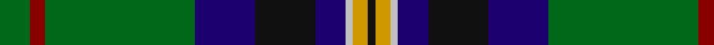

In pattern [GRGBKBWYK](/patterns/grgbkbwyk/).

This was sourced from register-of-tartans.  It is a [9 stripes tartan](/stripes/stripes9/).

Original link https://www.tartanregister.gov.uk/tartanDetails.aspx?ref=942

## Attestations

This cloth appears in 2 source records; the oldest owns this page.

- 01/01/2002 — Dodd of Branford (register-of-tartans, [record](https://www.tartanregister.gov.uk/tartanDetails.aspx?ref=942))
- pre 2002 — Dodd of Branford (Name) (tartans-authority, [record](http://www.tartansauthority.com/tartan-ferret/display/4686/))

## Thread count
G/8 DR4 G40 DB16 K16 DB8 N2 DY4 K/2

## Palette
Each colour and its ΔE from the base-6 reference it is a variant of.

| Colour | Shade | Base | ΔE (OKLab) |
|---|---|---|---|
| DB | <code style="background-color:#1C0070;">#1C0070</code> `#1C0070` | B <code style="background-color:#2A418A;">#2A418A</code> | 0.14 |
| DR | <code style="background-color:#880000;">#880000</code> `#880000` | R <code style="background-color:#CC0000;">#CC0000</code> | 0.15 |
| DY | <code style="background-color:#D09800;">#D09800</code> `#D09800` | Y <code style="background-color:#F2BF00;">#F2BF00</code> | 0.12 |
| G | <code style="background-color:#006818;">#006818</code> `#006818` | G <code style="background-color:#006100;">#006100</code> | 0.02 |
| K | <code style="background-color:#101010;">#101010</code> `#101010` | K <code style="background-color:#000000;">#000000</code> | 0.17 |
| N | <code style="background-color:#C0C0C0;">#C0C0C0</code> `#C0C0C0` | W <code style="background-color:#F7F7F7;">#F7F7F7</code> | 0.17 |

## Nearest tartans

The nearest existing variants by ΔTartan distance.

1. [Tooth Family Tartan Tartan Number: 922. Earliest known date: 1980 STS collection. See products available Copyright © Blair Urquhart, Comrie, 2015](/setts/s8/g5y1r2g25k14b19w4g2x2~b2c2c80-g006818-k101010-rc80000-we0e0e0-ye8c000/) — ΔT 0.68
1. [Storrie (Name)](/setts/s11/g20k1r1k1g20k10r2k2ra2b20w1x2~b2c2c80-g006818-k101010-r888888-rac8002c-wfcfcfc/) — ΔT 0.72
1. [Scotland’s Golf Coast](/setts/s9/y2w1b16ba2b2ba3b8g20ya2x2~b141e46-ba780078-g285800-wffffff-y48a4c0-yae0a126/) — ΔT 0.79
1. [Kleto, Susan (Personal)](/setts/s9/w1b16y1r3y1g6ga2g6w1x2~b003c64-g003c14-ga767e52-r8b0000-wffffff-ye0a126/) — ΔT 0.87
1. [Nova Scotia](/setts/s9/w2b20g2ga2g2ga4g8y2r1x2~b304080-g003000-ga30a010-rc00000-we0e0e0-yf0c000/) — ΔT 0.90
1. [McAvoy (Personal)](/setts/s10/y3g5k2g5w1g17b4r1b22w2x2~b003c64-g285800-k101010-rc80000-we0e0e0-ye8c000/) — ΔT 0.91
1. [Wells (1970) (Name)](/setts/s11/r5w2g30b6g4b3g4b24g4ga5ra3x2~b1c1c50-g006818-ga604000-r888888-rac80000-we0e0e0/) — ΔT 0.92
1. [Wishart Hunting Family Tartan Tartan Number: 2104. Earliest known date: 1990 The Wisharts of Pittarrow and Logie Wishart were a lowland family dating from around the 12th Century. The family's origins are unknown, but the name Guiscard, Wiscard, Wishart, meaning 'cunning' is Norman-French. We have also sought to associate the Wishart tartan with that of another family by virtue of the marriage of a Sir John Wishart to Jean, daughter of William Douglas, 9th Earl of Angus in the 16th Century. The Wishart tartan combines the Wallace and Douglas tartans, in an original new sett which was designed by Dr David Wishart with the assistance of the Scottish College of Textiles in Galashiels. (D. Wishart, 1990) See products available Copyright © Blair Urquhart, Comrie, 2015](/setts/s7/k2b2g16ba2y1ba13w2x2~b2c2c80-ba202060-g006818-k101010-we0e0e0-ye8c000/) — ΔT 0.95
1. [East Lothian (Fashion) Fashion Tartan Tartan Number: 2561. Earliest known date: 1999 David McGill's company has designed quite a wide range of fashion tartans and in many cases, has given them names suggesting that they are tartans for cities, counties, states and even countries. See products available Copyright © Blair Urquhart, Comrie, 2015](/setts/s12/b17ba4b2k11g33y4g33k11b2ba4b17bb6x2~b2c2c80-ba780078-bb5c8ca8-g006818-k101010-ye8c000/) — ΔT 0.96
1. [Tooth (Personal)](/setts/s8/g5y1r2g25k14b19w2g4x2~b2c2c80-g5c6428-k101010-r880000-wf8f8f8-ybc8c00/) — ΔT 0.99

## Neighbour map

Every grey dot is one of 15726 variants placed by the first two principal components of the ΔTartan feature space (44% of its variance). Red is this tartan; blue dots are its nearest — click one to open its page.

<svg viewBox="0 0 640 380" role="img" style="max-width:100%;height:auto;border:1px solid #e0e0e0;border-radius:4px;display:block" xmlns="http://www.w3.org/2000/svg"><image href="/nn/cloud.v1.png" width="640" height="380"/><a href="/setts/s8/g5y1r2g25k14b19w4g2x2~b2c2c80-g006818-k101010-rc80000-we0e0e0-ye8c000/"><circle cx="217.1" cy="129.3" r="4" fill="#3465a4"><title>Tooth Family Tartan Tartan Number: 922. Earliest known date: 1980 STS collection. See products available Copyright © Blair Urquhart, Comrie, 2015</title></circle></a><a href="/setts/s11/g20k1r1k1g20k10r2k2ra2b20w1x2~b2c2c80-g006818-k101010-r888888-rac8002c-wfcfcfc/"><circle cx="264.4" cy="122.4" r="4" fill="#3465a4"><title>Storrie (Name)</title></circle></a><a href="/setts/s9/y2w1b16ba2b2ba3b8g20ya2x2~b141e46-ba780078-g285800-wffffff-y48a4c0-yae0a126/"><circle cx="255.8" cy="131.5" r="4" fill="#3465a4"><title>Scotland’s Golf Coast</title></circle></a><a href="/setts/s9/w1b16y1r3y1g6ga2g6w1x2~b003c64-g003c14-ga767e52-r8b0000-wffffff-ye0a126/"><circle cx="215.4" cy="130.3" r="4" fill="#3465a4"><title>Kleto, Susan (Personal)</title></circle></a><a href="/setts/s9/w2b20g2ga2g2ga4g8y2r1x2~b304080-g003000-ga30a010-rc00000-we0e0e0-yf0c000/"><circle cx="228.3" cy="112.6" r="4" fill="#3465a4"><title>Nova Scotia</title></circle></a><a href="/setts/s10/y3g5k2g5w1g17b4r1b22w2x2~b003c64-g285800-k101010-rc80000-we0e0e0-ye8c000/"><circle cx="256.1" cy="123.3" r="4" fill="#3465a4"><title>McAvoy (Personal)</title></circle></a><a href="/setts/s11/r5w2g30b6g4b3g4b24g4ga5ra3x2~b1c1c50-g006818-ga604000-r888888-rac80000-we0e0e0/"><circle cx="251.3" cy="134.2" r="4" fill="#3465a4"><title>Wells (1970) (Name)</title></circle></a><a href="/setts/s7/k2b2g16ba2y1ba13w2x2~b2c2c80-ba202060-g006818-k101010-we0e0e0-ye8c000/"><circle cx="220.5" cy="146.3" r="4" fill="#3465a4"><title>Wishart Hunting Family Tartan Tartan Number: 2104. Earliest known date: 1990 The Wisharts of Pittarrow and Logie Wishart were a lowland family dating from around the 12th Century. The family's origins are unknown, but the name Guiscard, Wiscard, Wishart, meaning 'cunning' is Norman-French. We have also sought to associate the Wishart tartan with that of another family by virtue of the marriage of a Sir John Wishart to Jean, daughter of William Douglas, 9th Earl of Angus in the 16th Century. The Wishart tartan combines the Wallace and Douglas tartans, in an original new sett which was designed by Dr David Wishart with the assistance of the Scottish College of Textiles in Galashiels. (D. Wishart, 1990) See products available Copyright © Blair Urquhart, Comrie, 2015</title></circle></a><a href="/setts/s12/b17ba4b2k11g33y4g33k11b2ba4b17bb6x2~b2c2c80-ba780078-bb5c8ca8-g006818-k101010-ye8c000/"><circle cx="211.8" cy="139.2" r="4" fill="#3465a4"><title>East Lothian (Fashion) Fashion Tartan Tartan Number: 2561. Earliest known date: 1999 David McGill's company has designed quite a wide range of fashion tartans and in many cases, has given them names suggesting that they are tartans for cities, counties, states and even countries. See products available Copyright © Blair Urquhart, Comrie, 2015</title></circle></a><a href="/setts/s8/g5y1r2g25k14b19w2g4x2~b2c2c80-g5c6428-k101010-r880000-wf8f8f8-ybc8c00/"><circle cx="255.3" cy="133.6" r="4" fill="#3465a4"><title>Tooth (Personal)</title></circle></a><circle cx="237.2" cy="132.2" r="5" fill="#c00000"/></svg>

ID: /setts/s9/g4r2g20b8k8b4w1y2k1x2~b1c0070-g006818-k101010-r880000-wc0c0c0-yd09800/
