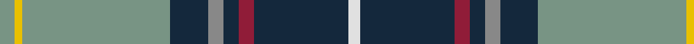

In pattern [GYGBRBRBW](/patterns/gygbrbrbw/).

This was sourced from tartans-authority.  It is a [9 stripes tartan](/stripes/stripes9/).

Original link http://www.tartansauthority.com/tartan-ferret/display/6892/

## Thread count
LG/8 Y4 LG78 DN20 N8 DN8 DR8 DN50 LN/6

## Palette
Each colour and its ΔE from the base-6 reference it is a variant of.

| Colour | Shade | Base | ΔE (OKLab) |
|---|---|---|---|
| DN | <code style="background-color:#14283C;">#14283C</code> `#14283C` | B <code style="background-color:#2A418A;">#2A418A</code> | 0.15 |
| DR | <code style="background-color:#901C38;">#901C38</code> `#901C38` | R <code style="background-color:#CC0000;">#CC0000</code> | 0.13 |
| LG | <code style="background-color:#789484;">#789484</code> `#789484` | G <code style="background-color:#006100;">#006100</code> | 0.24 |
| LN | <code style="background-color:#E0E0E0;">#E0E0E0</code> `#E0E0E0` | W <code style="background-color:#F7F7F7;">#F7F7F7</code> | 0.07 |
| N | <code style="background-color:#888888;">#888888</code> `#888888` | R <code style="background-color:#CC0000;">#CC0000</code> | 0.24 |
| Y | <code style="background-color:#E8C000;">#E8C000</code> `#E8C000` | Y <code style="background-color:#F2BF00;">#F2BF00</code> | 0.02 |

## Nearest tartans

The nearest existing variants by ΔTartan distance.

1. [Blue Blas Alba](/setts/s9/g4y2g39b10r4b4ra4b25w3~b14283c-g789484-r888888-ra901c38-wffffff-ye8c000~x2/) — ΔT 0.12
1. [Canadian Centennial](/setts/s8/r3w6r2g32b36k2b4y2~b304080-g008000-k000000-rc00000-we0e0e0-yf0c000~x2/) — ΔT 0.67
1. [Canadian Centennial District Tartan Tartan Number: 1704. Earliest known date: 1966 This tartan was approved by the Centennial Commission. The six colours represent the wealth of Canada in her people and her natural resources. See products available Copyright © Blair Urquhart, Comrie, 2015](/setts/s8/r3w6r2g32b36k2b4y2~b2c2c80-g006818-k101010-rc80000-we0e0e0-ye8c000~x2/) — ΔT 0.70
1. [Kleto, Susan (Personal)](/setts/s9/w1b16y1r3y1g6ga2g6w1~b2c2c80-g006818-ga289c18-ra00000-wfcfcfc-yfccc00~x2/) — ΔT 0.86
1. [Nova Scotia](/setts/s9/w2b20g2ga2g2ga4g8y2r1~b304080-g003000-ga30a010-rc00000-we0e0e0-yf0c000~x2/) — ΔT 0.86
1. [Nova Scotia (Province)](/setts/s9/w2b20g2ga2g2ga4g8y2r1~b38409c-g006818-ga289c18-rc80000-wffffff-ye8c000~x2/) — ΔT 0.87
1. [Nova Scotia (District)](/setts/s9/w2b20g2ga2g2ga4g8y2r1~b38409c-g006818-ga289c18-rc80000-wfcfcfc-ye8c000~x2/) — ΔT 0.87
1. [O'Donohue Personal)](/setts/s10/b24w2b6g9r6b3r6g35k2y2~b3850c8-g009468-k101010-rc80000-we0e0e0-yfccc00~x2/) — ΔT 0.98
1. [Nova Scotia Canadian District Tartan Tartan Number: 1713. Earliest known date: 1956 Mrs Douglas Murray designed a panel for a historical display showing a shepherd tending his flock on the hills of Cape Breton. To avoid trouble amongst the clansfolk of Nova Scotia she designed a new tartan for the shepherds kilt. See products available Copyright © Blair Urquhart, Comrie, 2015](/setts/s9/w2b20g2ga2g2ga4g8y2r1~b2c2c80-g003820-ga289c18-rc80000-we0e0e0-ye8c000~x2/) — ΔT 0.99
1. [(4) Traill](/setts/s7/r8y2ra7y2b24k2g1~b005f8c-g008000-k000000-rc10000-ra82644b-yefcc09~x2/) — ΔT 1.04

## Neighbour map

Every grey dot is one of 15726 variants placed by the first two principal components of the ΔTartan feature space (44% of its variance). Red is this tartan; blue dots are its nearest — click one to open its page.

<svg viewBox="0 0 640 380" role="img" style="max-width:100%;height:auto;border:1px solid #e0e0e0;border-radius:4px;display:block" xmlns="http://www.w3.org/2000/svg"><image href="/nn/cloud.v1.png" width="640" height="380"/><a href="/setts/s9/g4y2g39b10r4b4ra4b25w3~b14283c-g789484-r888888-ra901c38-wffffff-ye8c000~x2/"><circle cx="243.6" cy="113.6" r="4" fill="#3465a4"><title>Blue Blas Alba</title></circle></a><a href="/setts/s8/r3w6r2g32b36k2b4y2~b304080-g008000-k000000-rc00000-we0e0e0-yf0c000~x2/"><circle cx="240.1" cy="118.6" r="4" fill="#3465a4"><title>Canadian Centennial</title></circle></a><a href="/setts/s8/r3w6r2g32b36k2b4y2~b2c2c80-g006818-k101010-rc80000-we0e0e0-ye8c000~x2/"><circle cx="244.9" cy="120.6" r="4" fill="#3465a4"><title>Canadian Centennial District Tartan Tartan Number: 1704. Earliest known date: 1966 This tartan was approved by the Centennial Commission. The six colours represent the wealth of Canada in her people and her natural resources. See products available Copyright © Blair Urquhart, Comrie, 2015</title></circle></a><a href="/setts/s9/w1b16y1r3y1g6ga2g6w1~b2c2c80-g006818-ga289c18-ra00000-wfcfcfc-yfccc00~x2/"><circle cx="195.4" cy="118.9" r="4" fill="#3465a4"><title>Kleto, Susan (Personal)</title></circle></a><a href="/setts/s9/w2b20g2ga2g2ga4g8y2r1~b304080-g003000-ga30a010-rc00000-we0e0e0-yf0c000~x2/"><circle cx="228.3" cy="112.6" r="4" fill="#3465a4"><title>Nova Scotia</title></circle></a><a href="/setts/s9/w2b20g2ga2g2ga4g8y2r1~b38409c-g006818-ga289c18-rc80000-wffffff-ye8c000~x2/"><circle cx="227.5" cy="111.0" r="4" fill="#3465a4"><title>Nova Scotia (Province)</title></circle></a><a href="/setts/s9/w2b20g2ga2g2ga4g8y2r1~b38409c-g006818-ga289c18-rc80000-wfcfcfc-ye8c000~x2/"><circle cx="228.1" cy="111.2" r="4" fill="#3465a4"><title>Nova Scotia (District)</title></circle></a><a href="/setts/s10/b24w2b6g9r6b3r6g35k2y2~b3850c8-g009468-k101010-rc80000-we0e0e0-yfccc00~x2/"><circle cx="238.6" cy="119.2" r="4" fill="#3465a4"><title>O'Donohue Personal)</title></circle></a><a href="/setts/s9/w2b20g2ga2g2ga4g8y2r1~b2c2c80-g003820-ga289c18-rc80000-we0e0e0-ye8c000~x2/"><circle cx="229.2" cy="113.0" r="4" fill="#3465a4"><title>Nova Scotia Canadian District Tartan Tartan Number: 1713. Earliest known date: 1956 Mrs Douglas Murray designed a panel for a historical display showing a shepherd tending his flock on the hills of Cape Breton. To avoid trouble amongst the clansfolk of Nova Scotia she designed a new tartan for the shepherds kilt. See products available Copyright © Blair Urquhart, Comrie, 2015</title></circle></a><a href="/setts/s7/r8y2ra7y2b24k2g1~b005f8c-g008000-k000000-rc10000-ra82644b-yefcc09~x2/"><circle cx="274.2" cy="117.0" r="4" fill="#3465a4"><title>(4) Traill</title></circle></a><circle cx="247.3" cy="115.2" r="5" fill="#c00000"/></svg>

ID: /setts/s9/g4y2g39b10r4b4ra4b25w3~b14283c-g789484-r888888-ra901c38-we0e0e0-ye8c000~x2/
