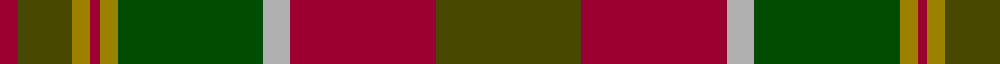

In pattern [GRYGRRRGR](/patterns/grygrrrgr/).

This was sourced from register-of-tartans.  It is a [9 stripes tartan](/stripes/stripes9/).

Original link https://www.tartanregister.gov.uk/tartanDetails.aspx?ref=1687

## Thread count
DR/8 T24 LG8 DR4 LG8 G64 N12 DR64 T/64

## Palette
Each colour and its ΔE from the base-6 reference it is a variant of.

| Colour | Shade | Base | ΔE (OKLab) |
|---|---|---|---|
| DR | <code style="background-color:#9C0030;">#9C0030</code> `#9C0030` | R <code style="background-color:#CC0000;">#CC0000</code> | 0.11 |
| G | <code style="background-color:#004C00;">#004C00</code> `#004C00` | G <code style="background-color:#006100;">#006100</code> | 0.07 |
| LG | <code style="background-color:#9C8000;">#9C8000</code> `#9C8000` | R <code style="background-color:#CC0000;">#CC0000</code> | 0.21 |
| N | <code style="background-color:#B0B0B0;">#B0B0B0</code> `#B0B0B0` | Y <code style="background-color:#F2BF00;">#F2BF00</code> | 0.18 |
| T | <code style="background-color:#484800;">#484800</code> `#484800` | G <code style="background-color:#006100;">#006100</code> | 0.09 |

## Nearest tartans

The nearest existing variants by ΔTartan distance.

1. [PSD: Operation Iraqi Freedom](/setts/s7/k8g4ga48g48r48k4ra8-g8c7038-ga285800-k101010-r880000-rac80000/) — ΔT 0.84
1. [Methven](/setts/s11/r4g6ga36r4ga4r42gb12g4gb4g48y4-g003820-ga503c14-gb5c6428-rb03000-yc88c00/) — ΔT 0.97
1. [Cavan, County](/setts/s10/g6k4ga52k8gb18g6gb18k8r18k6-g8c7038-ga006818-gb604000-k101010-rc80000/) — ΔT 1.04
1. [Methven](/setts/s11/r4g6ga36r4ga4r42gb4g4gb4g48y4-g003820-ga603800-gb408060-rc04c08-yd09800/) — ΔT 1.12
1. [Brousseau (Personal)](/setts/s9/g50r4w4b4w4r26ga56b4r6-b2c2c80-g5c6428-ga643424-ra00000-we8ccb8/) — ΔT 1.13
1. [Scottish Crofting Foundation](/setts/s9/b12y6b36g4b4g20ga56r4ga8-b441800-g604000-ga5c6428-r880000-ya0b8a4/) — ΔT 1.20
1. [MacAart (Personal)](/setts/s10/g36k8g8r8ga24k4y4k4ga24r12-g604000-ga006818-k101010-r880000-yd09800/) — ΔT 1.21
1. [Prince Edward Island District Tartan Tartan Number: 918. Earliest known date: 1964 The warmth and glow of the fertile soil, The green field and tree, The yellow and the brown of Autumn, The white of surf or a summer snow, Rust, green, yellow and white, Yes! That's our Island Tartan. See products available Copyright © Blair Urquhart, Comrie, 2015](/setts/s15/g32ga2g4ga2g4ga24r24ga2y4ga2r24ga24g24ga2w4-g006818-ga604000-ra00048-we0e0e0-ye8c000/) — ΔT 1.25
1. [MacAart (Personal)](/setts/s11/r12g24k4y4k4g24r8ga8k8ga36k8-g006818-ga604000-k101010-r880000-yd09800/) — ΔT 1.26
1. [State Seal of Minnesota (Fashion)](/setts/s8/r8g92r20b20ga66b10ga8y6-b2c2c80-g006818-ga604000-r880000-ybc8c00/) — ΔT 1.27

## Neighbour map

Every grey dot is one of 15726 variants placed by the first two principal components of the ΔTartan feature space (44% of its variance). Red is this tartan; blue dots are its nearest — click one to open its page.

<svg viewBox="0 0 640 380" role="img" style="max-width:100%;height:auto;border:1px solid #e0e0e0;border-radius:4px;display:block" xmlns="http://www.w3.org/2000/svg"><image href="/nn/cloud.v1.png" width="640" height="380"/><a href="/setts/s7/k8g4ga48g48r48k4ra8-g8c7038-ga285800-k101010-r880000-rac80000/"><circle cx="211.7" cy="195.7" r="4" fill="#3465a4"><title>PSD: Operation Iraqi Freedom</title></circle></a><a href="/setts/s11/r4g6ga36r4ga4r42gb12g4gb4g48y4-g003820-ga503c14-gb5c6428-rb03000-yc88c00/"><circle cx="247.1" cy="171.9" r="4" fill="#3465a4"><title>Methven</title></circle></a><a href="/setts/s10/g6k4ga52k8gb18g6gb18k8r18k6-g8c7038-ga006818-gb604000-k101010-rc80000/"><circle cx="202.3" cy="170.9" r="4" fill="#3465a4"><title>Cavan, County</title></circle></a><a href="/setts/s11/r4g6ga36r4ga4r42gb4g4gb4g48y4-g003820-ga603800-gb408060-rc04c08-yd09800/"><circle cx="238.4" cy="153.9" r="4" fill="#3465a4"><title>Methven</title></circle></a><a href="/setts/s9/g50r4w4b4w4r26ga56b4r6-b2c2c80-g5c6428-ga643424-ra00000-we8ccb8/"><circle cx="265.9" cy="165.7" r="4" fill="#3465a4"><title>Brousseau (Personal)</title></circle></a><a href="/setts/s9/b12y6b36g4b4g20ga56r4ga8-b441800-g604000-ga5c6428-r880000-ya0b8a4/"><circle cx="306.2" cy="186.1" r="4" fill="#3465a4"><title>Scottish Crofting Foundation</title></circle></a><a href="/setts/s10/g36k8g8r8ga24k4y4k4ga24r12-g604000-ga006818-k101010-r880000-yd09800/"><circle cx="213.6" cy="208.8" r="4" fill="#3465a4"><title>MacAart (Personal)</title></circle></a><a href="/setts/s15/g32ga2g4ga2g4ga24r24ga2y4ga2r24ga24g24ga2w4-g006818-ga604000-ra00048-we0e0e0-ye8c000/"><circle cx="229.1" cy="145.4" r="4" fill="#3465a4"><title>Prince Edward Island District Tartan Tartan Number: 918. Earliest known date: 1964 The warmth and glow of the fertile soil, The green field and tree, The yellow and the brown of Autumn, The white of surf or a summer snow, Rust, green, yellow and white, Yes! That's our Island Tartan. See products available Copyright © Blair Urquhart, Comrie, 2015</title></circle></a><a href="/setts/s11/r12g24k4y4k4g24r8ga8k8ga36k8-g006818-ga604000-k101010-r880000-yd09800/"><circle cx="191.0" cy="200.9" r="4" fill="#3465a4"><title>MacAart (Personal)</title></circle></a><a href="/setts/s8/r8g92r20b20ga66b10ga8y6-b2c2c80-g006818-ga604000-r880000-ybc8c00/"><circle cx="284.9" cy="186.4" r="4" fill="#3465a4"><title>State Seal of Minnesota (Fashion)</title></circle></a><circle cx="234.3" cy="176.5" r="5" fill="#c00000"/></svg>

ID: /setts/s9/g64r64y12ga64ra8r4ra8g24r8-g484800-ga004c00-r9c0030-ra9c8000-yb0b0b0/
