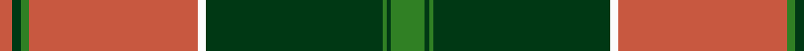

In pattern [GGGGWRGGR](/patterns/ggggwrggr/).

This was sourced from tartans-authority.  It is a [9 stripes tartan](/stripes/stripes9/).

Original link http://www.tartansauthority.com/tartan-ferret/display/3293/

## Thread count
DO/6 DG4 G4 DO80 W4 DG84 G2 DG2 G/16

## Palette
Each colour and its ΔE from the base-6 reference it is a variant of.

| Colour | Shade | Base | ΔE (OKLab) |
|---|---|---|---|
| DG | <code style="background-color:#003814;">#003814</code> `#003814` | G <code style="background-color:#006100;">#006100</code> | 0.14 |
| DO | <code style="background-color:#C85840;">#C85840</code> `#C85840` | R <code style="background-color:#CC0000;">#CC0000</code> | 0.10 |
| G | <code style="background-color:#308024;">#308024</code> `#308024` | G <code style="background-color:#006100;">#006100</code> | 0.10 |
| W | <code style="background-color:#FCFCFC;">#FCFCFC</code> `#FCFCFC` | W <code style="background-color:#F7F7F7;">#F7F7F7</code> | 0.01 |

## Nearest tartans

The nearest existing variants by ΔTartan distance.

1. [MacMillan Anc (Clans Originaux)](/setts/s11/y10k2g3k2g40k2g3r25g6y10k1x2~g006818-k101010-r901c38-yd8b000/) — ΔT 1.14
1. [Gleneil](/setts/s8/k2r2k2r24g31k1g2y2x2~g008000-k000000-rc00000-yf0c000/) — ΔT 1.14
1. [Strang (Personal)](/setts/s14/r36g18r4g6k1w2k1g2k1w2k1g6r4g18x2~g146400-k000000-rb00000-wc8c8c8/) — ΔT 1.20
1. [Connaught (Lochcarron)](/setts/s10/g36b2r2b2r2b2r30ga1r1ga4x2~b2888c4-g009468-ga285800-r980044/) — ΔT 1.25
1. [Longmore (Name)](/setts/s9/g15y3g27r2g2r33b2w1b4x2~b1474b4-g006818-rc80000-we0e0e0-ye8c000/) — ΔT 1.29
1. [Hickory](/setts/s10/b4g30k2g2k14y2k2y1k6y3x2~b202060-g604000-k320000-yfccc00/) — ΔT 1.29
1. [Crieff](/setts/s13/r2ra6g4ra70g4ra2b21ra2g85ra2g4ra6r2~b780078-g006818-rb43c50-rac80000/) — ΔT 1.35
1. [Connacht](/setts/s10/r64g4ga1g4ga1g4ga64gb2ga2gb8~g005020-ga503c14-gb2a2303-rc87814/) — ΔT 1.41
1. [Afghanistan Memorial](/setts/s13/b8k3g1k1g39k3r3g2b11k8g2k3w2x2~b14283c-g8c7038-k300500-ra00000-wfcfcfc/) — ΔT 1.43
1. [MacDonald of Kingsburgh Clan Tartan Tartan Number: 1562. Earliest known date: 1746 D.W.Stewart recorded this pattern from a relic, worn by Prince Charles Edward, and hidden in a cleft of a rock, to be recovered later and eventually preserved in the Advocates' Library in Edinburgh. See products available Copyright © Blair Urquhart, Comrie, 2015](/setts/s9/r3g3y1r18w1g21y1g1y3x2~g006818-rc80000-we0e0e0-ye8c000/) — ΔT 1.43

## Neighbour map

Every grey dot is one of 15726 variants placed by the first two principal components of the ΔTartan feature space (44% of its variance). Red is this tartan; blue dots are its nearest — click one to open its page.

<svg viewBox="0 0 640 380" role="img" style="max-width:100%;height:auto;border:1px solid #e0e0e0;border-radius:4px;display:block" xmlns="http://www.w3.org/2000/svg"><image href="/nn/cloud.v1.png" width="640" height="380"/><a href="/setts/s11/y10k2g3k2g40k2g3r25g6y10k1x2~g006818-k101010-r901c38-yd8b000/"><circle cx="321.7" cy="107.7" r="4" fill="#3465a4"><title>MacMillan Anc (Clans Originaux)</title></circle></a><a href="/setts/s8/k2r2k2r24g31k1g2y2x2~g008000-k000000-rc00000-yf0c000/"><circle cx="340.1" cy="118.2" r="4" fill="#3465a4"><title>Gleneil</title></circle></a><a href="/setts/s14/r36g18r4g6k1w2k1g2k1w2k1g6r4g18x2~g146400-k000000-rb00000-wc8c8c8/"><circle cx="359.1" cy="99.4" r="4" fill="#3465a4"><title>Strang (Personal)</title></circle></a><a href="/setts/s10/g36b2r2b2r2b2r30ga1r1ga4x2~b2888c4-g009468-ga285800-r980044/"><circle cx="347.8" cy="106.4" r="4" fill="#3465a4"><title>Connaught (Lochcarron)</title></circle></a><a href="/setts/s9/g15y3g27r2g2r33b2w1b4x2~b1474b4-g006818-rc80000-we0e0e0-ye8c000/"><circle cx="332.8" cy="113.6" r="4" fill="#3465a4"><title>Longmore (Name)</title></circle></a><a href="/setts/s10/b4g30k2g2k14y2k2y1k6y3x2~b202060-g604000-k320000-yfccc00/"><circle cx="339.2" cy="123.5" r="4" fill="#3465a4"><title>Hickory</title></circle></a><a href="/setts/s13/r2ra6g4ra70g4ra2b21ra2g85ra2g4ra6r2~b780078-g006818-rb43c50-rac80000/"><circle cx="376.6" cy="82.5" r="4" fill="#3465a4"><title>Crieff</title></circle></a><a href="/setts/s10/r64g4ga1g4ga1g4ga64gb2ga2gb8~g005020-ga503c14-gb2a2303-rc87814/"><circle cx="381.2" cy="97.8" r="4" fill="#3465a4"><title>Connacht</title></circle></a><a href="/setts/s13/b8k3g1k1g39k3r3g2b11k8g2k3w2x2~b14283c-g8c7038-k300500-ra00000-wfcfcfc/"><circle cx="329.1" cy="75.1" r="4" fill="#3465a4"><title>Afghanistan Memorial</title></circle></a><a href="/setts/s9/r3g3y1r18w1g21y1g1y3x2~g006818-rc80000-we0e0e0-ye8c000/"><circle cx="326.5" cy="132.4" r="4" fill="#3465a4"><title>MacDonald of Kingsburgh Clan Tartan Tartan Number: 1562. Earliest known date: 1746 D.W.Stewart recorded this pattern from a relic, worn by Prince Charles Edward, and hidden in a cleft of a rock, to be recovered later and eventually preserved in the Advocates' Library in Edinburgh. See products available Copyright © Blair Urquhart, Comrie, 2015</title></circle></a><circle cx="341.2" cy="104.9" r="5" fill="#c00000"/></svg>

ID: /setts/s9/g8ga1g1ga42w2r40g2ga2r3x2~g308024-ga003814-rc85840-wfcfcfc/
