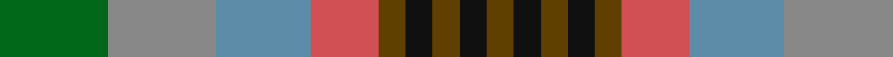

**Bands:** [GKGKGRBRG](/stripes/gkgkgrbrg/) · **Stripes:** [DY K DY K DY R T O G](/stripes/stripes9/) DY K DY K DY R T O G

This was sourced from house-of-tartan.  It is a [9 band tartan](/bands/bands9/).

Original link http://www.house-of-tartan.scotland.net/house/TartanViewjs.asp?colr=Def&tnam=831

## Thread count
G/16 N16 B14 DO10 T4 K4 T4 K4 T/4

## Palette
Each colour and its ΔE from the base-6 reference it is a variant of.

| Colour | Shade | Base | ΔE (OKLab) |
|---|---|---|---|
| B | <code style="background-color:#5C8CA8;">#5C8CA8</code> `#5C8CA8` | B <code style="background-color:#2A418A;">#2A418A</code> | 0.23 |
| DO | <code style="background-color:#D05054;">#D05054</code> `#D05054` | R <code style="background-color:#CC0000;">#CC0000</code> | 0.09 |
| G | <code style="background-color:#006818;">#006818</code> `#006818` | G <code style="background-color:#006100;">#006100</code> | 0.02 |
| K | <code style="background-color:#101010;">#101010</code> `#101010` | K <code style="background-color:#000000;">#000000</code> | 0.17 |
| N | <code style="background-color:#888888;">#888888</code> `#888888` | R <code style="background-color:#CC0000;">#CC0000</code> | 0.24 |
| T | <code style="background-color:#604000;">#604000</code> `#604000` | G <code style="background-color:#006100;">#006100</code> | 0.14 |

## Nearest tartans

The nearest existing variants by ΔTartan distance.

1. [Somerset](/setts/s9/g8y8t7r5o2k2o2k2o2~x2/) — ΔT 0.83
1. [Somerset (District)](/setts/s9/y8o8lg7lr5lb2k2lb2k2lb2~x4/) — ΔT 1.19
1. [Loch Fyne](/setts/s6/r1dy3g5lo5dt5t1~x4/) — ΔT 1.40
1. [Falardeau-Murphy (Canada) (Personal)](/setts/s7/g21t21ly3r21n3dp5n3~x2/) — ΔT 1.50
1. [Corcoran of Sherbrooke (Personal)](/setts/s9/k1lr1g5dp1g2dy5lr1y3lr1~x4/) — ΔT 1.52
1. [Rothesay](/setts/s7/g4n12lo2k10y10lo3y2~x2/) — ΔT 1.56
1. [Redgate (Name)](/setts/s13/t10r3t10k7lo5w2lo5w2lo5k7g10r3g7~x2/) — ΔT 1.61
1. [Adamson (Personal)](/setts/s9/r1dy7db3g1o3g1db3g7w1~x4/) — ΔT 1.63
1. [Labrador Club of Scotland (Corporate](/setts/s8/o21ly4dy5ly4o5k21g21lo5~x2/) — ΔT 1.67
1. [Alabama (Fashion)](/setts/s7/lo3n12r12g16k9lb8r3~x2/) — ΔT 1.70

## Neighbour map

Every grey dot is one of 14313 variants placed by the first two principal components of the ΔTartan feature space (44% of its variance). Red is this tartan; blue dots are its nearest — click one to open its page.

<svg viewBox="0 0 640 380" role="img" style="max-width:100%;height:auto;border:1px solid #e0e0e0;border-radius:4px;display:block" xmlns="http://www.w3.org/2000/svg"><image href="/nn/cloud.v1.png" width="640" height="380"/><a href="/setts/s9/g8y8t7r5o2k2o2k2o2~x2/"><circle cx="14.0" cy="210.3" r="4" fill="#3465a4"><title>Somerset</title></circle></a><a href="/setts/s9/y8o8lg7lr5lb2k2lb2k2lb2~x4/"><circle cx="14.0" cy="204.0" r="4" fill="#3465a4"><title>Somerset (District)</title></circle></a><a href="/setts/s6/r1dy3g5lo5dt5t1~x4/"><circle cx="48.1" cy="236.1" r="4" fill="#3465a4"><title>Loch Fyne</title></circle></a><a href="/setts/s7/g21t21ly3r21n3dp5n3~x2/"><circle cx="112.3" cy="193.4" r="4" fill="#3465a4"><title>Falardeau-Murphy (Canada) (Personal)</title></circle></a><a href="/setts/s9/k1lr1g5dp1g2dy5lr1y3lr1~x4/"><circle cx="109.2" cy="204.7" r="4" fill="#3465a4"><title>Corcoran of Sherbrooke (Personal)</title></circle></a><a href="/setts/s7/g4n12lo2k10y10lo3y2~x2/"><circle cx="104.7" cy="228.6" r="4" fill="#3465a4"><title>Rothesay</title></circle></a><a href="/setts/s13/t10r3t10k7lo5w2lo5w2lo5k7g10r3g7~x2/"><circle cx="14.0" cy="202.6" r="4" fill="#3465a4"><title>Redgate (Name)</title></circle></a><a href="/setts/s9/r1dy7db3g1o3g1db3g7w1~x4/"><circle cx="130.0" cy="196.1" r="4" fill="#3465a4"><title>Adamson (Personal)</title></circle></a><a href="/setts/s8/o21ly4dy5ly4o5k21g21lo5~x2/"><circle cx="70.6" cy="192.1" r="4" fill="#3465a4"><title>Labrador Club of Scotland (Corporate</title></circle></a><a href="/setts/s7/lo3n12r12g16k9lb8r3~x2/"><circle cx="25.7" cy="217.4" r="4" fill="#3465a4"><title>Alabama (Fashion)</title></circle></a><circle cx="28.9" cy="222.5" r="5" fill="#c00000"/></svg>

ID: /setts/s9/g8o8t7r5dy2k2dy2k2dy2~x2/
