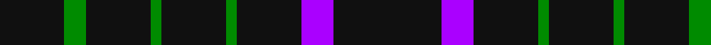

In pattern [KBKGKGKGK](/patterns/kbkgkgkgk/).

This was sourced from house-of-tartan.  It is a [9 stripes tartan](/stripes/stripes9/).

Original link http://www.house-of-tartan.scotland.net/house/TartanViewjs.asp?colr=Def&tnam=10698

## Thread count
K/12 G4 K12 G2 K12 G2 K12 P6 K/20

## Palette
Each colour and its ΔE from the base-6 reference it is a variant of.

| Colour | Shade | Base | ΔE (OKLab) |
|---|---|---|---|
| G | <code style="background-color:#008B00;">#008B00</code> `#008B00` | G <code style="background-color:#006100;">#006100</code> | 0.13 |
| K | <code style="background-color:#101010;">#101010</code> `#101010` | K <code style="background-color:#000000;">#000000</code> | 0.17 |
| P | <code style="background-color:#AA00FF;">#AA00FF</code> `#AA00FF` | B <code style="background-color:#2A418A;">#2A418A</code> | 0.28 |

## Nearest tartans

The nearest existing variants by ΔTartan distance.

1. [Lanoir](/setts/s6/k4r4k20r1k20w4~k101010-rc80000-we0e0e0~x6/) — ΔT 1.92
1. [Benson (New England)](/setts/s7/k16b2k8r3y3r3k8~b1474b4-k101010-rc80000-yb8b8b8~x2/) — ΔT 1.99
1. [London Fog Black 2 (fashion)](/setts/s10/k18b9k18w2k2w2k18y9k18w2~b2888c4-k101010-wd4d4c4-yccc0a4/) — ΔT 2.02
1. [Unidentified #45](/setts/s7/k24g3r3k24r2k2r2~g005020-k101010-rdc0000/) — ΔT 2.03
1. [Hebridean](/setts/s14/b2k10r2g2r2k10r2k10r1k2r1k10r1k2~b2c4084-g005020-k101010-rdc0000~x2/) — ΔT 2.05
1. [Renwick](/setts/s10/k3g2k20r2k12g2k4g2k6g2~g006818-k101010-rc80000~x2/) — ΔT 2.08
1. [Renwick](/setts/s10/k3g2k20r2k12g2k4g2k6g2~g008000-k000000-rc00000~x2/) — ΔT 2.08
1. [Cowe (Personal)](/setts/s7/k8b3k32ba14w3k25b3~b5c8ca8-ba1474b4-k101010-wfcfcfc~x2/) — ΔT 2.11
1. [Hebrides #11](/setts/s14/k3r2k17r3k17r3g3r3k17b3k4r1k17r2~b1474b4-g00643c-k101010-rc80000~x2/) — ΔT 2.14
1. [Crombie House Check](/setts/s6/k4k12k3r7k26r3~k000030-r806050~x2/) — ΔT 2.16

## Neighbour map

Every grey dot is one of 15726 variants placed by the first two principal components of the ΔTartan feature space (44% of its variance). Red is this tartan; blue dots are its nearest — click one to open its page.

<svg viewBox="0 0 640 380" role="img" style="max-width:100%;height:auto;border:1px solid #e0e0e0;border-radius:4px;display:block" xmlns="http://www.w3.org/2000/svg"><image href="/nn/cloud.v1.png" width="640" height="380"/><a href="/setts/s6/k4r4k20r1k20w4~k101010-rc80000-we0e0e0~x6/"><circle cx="537.0" cy="217.1" r="4" fill="#3465a4"><title>Lanoir</title></circle></a><a href="/setts/s7/k16b2k8r3y3r3k8~b1474b4-k101010-rc80000-yb8b8b8~x2/"><circle cx="402.0" cy="233.1" r="4" fill="#3465a4"><title>Benson (New England)</title></circle></a><a href="/setts/s10/k18b9k18w2k2w2k18y9k18w2~b2888c4-k101010-wd4d4c4-yccc0a4/"><circle cx="381.6" cy="211.9" r="4" fill="#3465a4"><title>London Fog Black 2 (fashion)</title></circle></a><a href="/setts/s7/k24g3r3k24r2k2r2~g005020-k101010-rdc0000/"><circle cx="577.2" cy="228.8" r="4" fill="#3465a4"><title>Unidentified #45</title></circle></a><a href="/setts/s14/b2k10r2g2r2k10r2k10r1k2r1k10r1k2~b2c4084-g005020-k101010-rdc0000~x2/"><circle cx="459.3" cy="192.9" r="4" fill="#3465a4"><title>Hebridean</title></circle></a><a href="/setts/s10/k3g2k20r2k12g2k4g2k6g2~g006818-k101010-rc80000~x2/"><circle cx="561.0" cy="236.9" r="4" fill="#3465a4"><title>Renwick</title></circle></a><a href="/setts/s10/k3g2k20r2k12g2k4g2k6g2~g008000-k000000-rc00000~x2/"><circle cx="506.9" cy="223.0" r="4" fill="#3465a4"><title>Renwick</title></circle></a><a href="/setts/s7/k8b3k32ba14w3k25b3~b5c8ca8-ba1474b4-k101010-wfcfcfc~x2/"><circle cx="410.1" cy="216.7" r="4" fill="#3465a4"><title>Cowe (Personal)</title></circle></a><a href="/setts/s14/k3r2k17r3k17r3g3r3k17b3k4r1k17r2~b1474b4-g00643c-k101010-rc80000~x2/"><circle cx="500.5" cy="176.0" r="4" fill="#3465a4"><title>Hebrides #11</title></circle></a><a href="/setts/s6/k4k12k3r7k26r3~k000030-r806050~x2/"><circle cx="550.6" cy="283.6" r="4" fill="#3465a4"><title>Crombie House Check</title></circle></a><circle cx="495.3" cy="260.4" r="5" fill="#c00000"/></svg>

ID: /setts/s9/k10b3k6g1k6g1k6g2k6~baa00ff-g008b00-k101010~x2/
