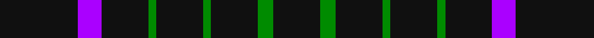

In pattern [KBKGKGKGK](/stripes/kbkgkgkgk/).

This was sourced from house-of-tartan.  It is a [9 stripe tartan](/stripes/stripes9/).

Original link http://www.house-of-tartan.scotland.net/house/TartanViewjs.asp?colr=Def&tnam=10698

## Thread count
K/20 P6 K12 G2 K12 G2 K12 G4 K/12

## Palette
Each colour and the base-6 reference it is a variant of.

| Colour | Shade | Base |
|---|---|---|
| G | <code style="background-color:#008B00;">#008B00</code> `oklch(55.2% 0.188 142.5)` <small>#008B00</small> | G <code style="background-color:#006100;">#006100</code> |
| K | <code style="background-color:#101010;">#101010</code> `oklch(17.3% 0.000 89.9)` <small>#101010</small> | K <code style="background-color:#000000;">#000000</code> |
| P | <code style="background-color:#AA00FF;">#AA00FF</code> `oklch(58.1% 0.299 307.0)` <small>#AA00FF</small> | B <code style="background-color:#2A418A;">#2A418A</code> |

## Nearest tartans

The nearest existing variants by ΔTartan distance.

1. [Lanoir](/setts/s6/k4r4k20r1k20w4~x6/) — ΔT 1.92
1. [Benson (New England)](/setts/s7/k16b2k8r3lr3r3k8~x2/) — ΔT 1.99
1. [London Fog Black 2 (fashion)](/setts/s10/k18t9k18lb2k2lb2k18lr9k18lb2/) — ΔT 2.02
1. [Unidentified #45](/setts/s7/k24dg3r3k24r2k2r2/) — ΔT 2.04
1. [Hebridean](/setts/s14/k2r1k10r1k2r1k10r2k10r2dg2r2k10db2~x2/) — ΔT 2.05
1. [Renwick](/setts/s10/k3g2k20r2k12g2k4g2k6g2~x2/) — ΔT 2.08
1. [Cowe (Personal)](/setts/s7/k8t3k32b14w3k25t3~x2/) — ΔT 2.11
1. [Hebrides #11](/setts/s14/k3r2k17r3k17r3g3r3k17b3k4r1k17r2~x2/) — ΔT 2.14
1. [Crombie House Check](/setts/s6/k4k12k3o7k26o3~x2/) — ΔT 2.16
1. [Spirit of Glyndwr Gold Welsh Fashion Tartan Tartan Number: 8351. Earliest known date: 25th May 2010 Ysbryd yr aur Glyndwr, a modern day plaid, designed and woven in Wales to commemorate Owain Glyn Dwr, crowned Welsh Prince 1406. Colours represent the slates and dark waters of Mid and North Wales, Glyndwrs homeland, with the added Gold yarn representing the gold colour in his standard (flag). Woven by the Cambrian Woollen Mill, Mid Wales exclusively for Wales Tartan Centres, Swansea. See products available Copyright © Blair Urquhart, Comrie, 2015](/setts/s8/k24n18k11n4k11n18k53lo4/) — ΔT 2.19

## Neighbour map

Every grey dot is one of 14299 variants placed by the first two principal components of the ΔTartan feature space (44% of its variance). Red is this tartan; blue dots are its nearest — click one to open its page.

<svg viewBox="0 0 640 380" role="img" style="max-width:100%;height:auto;border:1px solid #e0e0e0;border-radius:4px;display:block" xmlns="http://www.w3.org/2000/svg"><image href="/nn/cloud.v1.png" width="640" height="380"/><a href="/setts/s6/k4r4k20r1k20w4~x6/"><circle cx="538.4" cy="209.3" r="4" fill="#3465a4"><title>Lanoir</title></circle></a><a href="/setts/s7/k16b2k8r3lr3r3k8~x2/"><circle cx="403.6" cy="228.2" r="4" fill="#3465a4"><title>Benson (New England)</title></circle></a><a href="/setts/s10/k18t9k18lb2k2lb2k18lr9k18lb2/"><circle cx="383.8" cy="206.3" r="4" fill="#3465a4"><title>London Fog Black 2 (fashion)</title></circle></a><a href="/setts/s7/k24dg3r3k24r2k2r2/"><circle cx="578.3" cy="225.2" r="4" fill="#3465a4"><title>Unidentified #45</title></circle></a><a href="/setts/s14/k2r1k10r1k2r1k10r2k10r2dg2r2k10db2~x2/"><circle cx="460.6" cy="190.6" r="4" fill="#3465a4"><title>Hebridean</title></circle></a><a href="/setts/s10/k3g2k20r2k12g2k4g2k6g2~x2/"><circle cx="562.3" cy="236.9" r="4" fill="#3465a4"><title>Renwick</title></circle></a><a href="/setts/s7/k8t3k32b14w3k25t3~x2/"><circle cx="412.6" cy="212.7" r="4" fill="#3465a4"><title>Cowe (Personal)</title></circle></a><a href="/setts/s14/k3r2k17r3k17r3g3r3k17b3k4r1k17r2~x2/"><circle cx="501.7" cy="174.0" r="4" fill="#3465a4"><title>Hebrides #11</title></circle></a><a href="/setts/s6/k4k12k3o7k26o3~x2/"><circle cx="552.8" cy="280.2" r="4" fill="#3465a4"><title>Crombie House Check</title></circle></a><a href="/setts/s8/k24n18k11n4k11n18k53lo4/"><circle cx="454.4" cy="236.6" r="4" fill="#3465a4"><title>Spirit of Glyndwr Gold Welsh Fashion Tartan Tartan Number: 8351. Earliest known date: 25th May 2010 Ysbryd yr aur Glyndwr, a modern day plaid, designed and woven in Wales to commemorate Owain Glyn Dwr, crowned Welsh Prince 1406. Colours represent the slates and dark waters of Mid and North Wales, Glyndwrs homeland, with the added Gold yarn representing the gold colour in his standard (flag). Woven by the Cambrian Woollen Mill, Mid Wales exclusively for Wales Tartan Centres, Swansea. See products available Copyright © Blair Urquhart, Comrie, 2015</title></circle></a><circle cx="497.0" cy="255.7" r="5" fill="#c00000"/></svg>

ID: /setts/s9/k10p3k6g1k6g1k6g2k6~x2/
