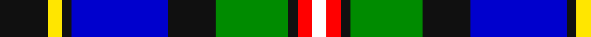

In pattern [KYKBKGKRW](/patterns/kykbkgkrw/).

This was sourced from register-of-tartans.  It is a [9 stripes tartan](/stripes/stripes9/).

Original link https://www.tartanregister.gov.uk/tartanDetails.aspx?ref=10265

## Register references

External register numbers recorded for this tartan.

- Scottish Register of Tartans: [10265](https://www.tartanregister.gov.uk/tartanDetails.aspx?ref=10265)

## Thread count
K/20 Y6 K4 B40 K20 G30 K4 R6 W/6

## Palette
Each colour and its ΔE from the base-6 reference it is a variant of.

| Colour | Shade | Base | ΔE (OKLab) |
|---|---|---|---|
| B | <code style="background-color:#0000CD;">#0000CD</code> `#0000CD` | B <code style="background-color:#2A418A;">#2A418A</code> | 0.14 |
| G | <code style="background-color:#008B00;">#008B00</code> `#008B00` | G <code style="background-color:#006100;">#006100</code> | 0.13 |
| K | <code style="background-color:#101010;">#101010</code> `#101010` | K <code style="background-color:#000000;">#000000</code> | 0.17 |
| R | <code style="background-color:#FF0000;">#FF0000</code> `#FF0000` | R <code style="background-color:#CC0000;">#CC0000</code> | 0.11 |
| W | <code style="background-color:#FFFFFF;">#FFFFFF</code> `#FFFFFF` | W <code style="background-color:#F7F7F7;">#F7F7F7</code> | 0.02 |
| Y | <code style="background-color:#FFE600;">#FFE600</code> `#FFE600` | Y <code style="background-color:#F2BF00;">#F2BF00</code> | 0.10 |

## Nearest tartans

The nearest existing variants by ΔTartan distance.

1. [Loch Awe](/setts/s9/b3k2r3g20k24ba20r3k2y3~b778899-ba0000cd-g008b00-k101010-rff0000-yffe600~x2/) — ΔT 0.75
1. [Kagame Personal Tartan Tartan Number: 7077. Earliest known date: 2006 Presented to President Kagame of Rwanda, by Tom Hunter, christmas 2006 See products available Copyright © Blair Urquhart, Comrie, 2015](/setts/s10/k4w14ka3k7g3ka3g7ka6b24wa3~b38409c-g289c18-k000000-ka101010-w98c8e8-wae0e0e0~x2/) — ΔT 0.79
1. [Kagame (Personal)](/setts/s10/k5w14ka3k7g3ka3g7ka6b24wa3~b1c1c50-g289c18-k000000-ka101010-w98c8e8-wae0e0e0~x2/) — ΔT 0.85
1. [Auchinachie](/setts/s12/g2k2b12k4r1k4y10w1y10k8b12k2~b003f87-g008b45-k101010-r8c1717-wfff68f-y96c8a2~x2/) — ΔT 0.91
1. [Scottish Bear (Mathan Albannach)](/setts/s11/g11w3b5w2y1b4w1b2ba11b3ga2~b000048-ba2c4084-g603800-ga006818-wffffff-yffff00~x2/) — ΔT 0.91
1. [McCuaig (2010) (Name)](/setts/s9/k10y3k2b20k10g15k2r3w3~b1474b4-g006818-k101010-rc8002c-we0e0e0-ye8c000~x2/) — ΔT 0.91
1. [Greene](/setts/s10/b6r4b24w3k6g18y4g2y2g4~b00008c-g007800-k000000-r8c0000-wc8c8c8-yc88c00~x2/) — ΔT 0.93
1. [Moran (Virgin Islands) (Personal)](/setts/s9/b3r3k5g8w2k13ba13b26w3~b2888c4-ba2c2c80-g006818-k101010-rc80000-we0e0e0~x2/) — ΔT 1.04
1. [Aurora House Check](/setts/s11/b40y3b11k7g22k7b3w3ya10k32yb13~b00008c-g649848-k101010-wffffff-y48a4c0-yaa0a0a0-ybffe600~x2/) — ΔT 1.07
1. [Cusack](/setts/s9/b4k2b16k12w1g13r2g2y4~b00008c-g007800-k000000-r8c0000-wfcfcfc-yc88c00~x2/) — ΔT 1.08

## Neighbour map

Every grey dot is one of 15726 variants placed by the first two principal components of the ΔTartan feature space (44% of its variance). Red is this tartan; blue dots are its nearest — click one to open its page.

<svg viewBox="0 0 640 380" role="img" style="max-width:100%;height:auto;border:1px solid #e0e0e0;border-radius:4px;display:block" xmlns="http://www.w3.org/2000/svg"><image href="/nn/cloud.v1.png" width="640" height="380"/><a href="/setts/s9/b3k2r3g20k24ba20r3k2y3~b778899-ba0000cd-g008b00-k101010-rff0000-yffe600~x2/"><circle cx="116.4" cy="132.8" r="4" fill="#3465a4"><title>Loch Awe</title></circle></a><a href="/setts/s10/k4w14ka3k7g3ka3g7ka6b24wa3~b38409c-g289c18-k000000-ka101010-w98c8e8-wae0e0e0~x2/"><circle cx="55.0" cy="145.3" r="4" fill="#3465a4"><title>Kagame Personal Tartan Tartan Number: 7077. Earliest known date: 2006 Presented to President Kagame of Rwanda, by Tom Hunter, christmas 2006 See products available Copyright © Blair Urquhart, Comrie, 2015</title></circle></a><a href="/setts/s10/k5w14ka3k7g3ka3g7ka6b24wa3~b1c1c50-g289c18-k000000-ka101010-w98c8e8-wae0e0e0~x2/"><circle cx="53.7" cy="149.1" r="4" fill="#3465a4"><title>Kagame (Personal)</title></circle></a><a href="/setts/s12/g2k2b12k4r1k4y10w1y10k8b12k2~b003f87-g008b45-k101010-r8c1717-wfff68f-y96c8a2~x2/"><circle cx="106.2" cy="141.2" r="4" fill="#3465a4"><title>Auchinachie</title></circle></a><a href="/setts/s11/g11w3b5w2y1b4w1b2ba11b3ga2~b000048-ba2c4084-g603800-ga006818-wffffff-yffff00~x2/"><circle cx="78.1" cy="134.2" r="4" fill="#3465a4"><title>Scottish Bear (Mathan Albannach)</title></circle></a><a href="/setts/s9/k10y3k2b20k10g15k2r3w3~b1474b4-g006818-k101010-rc8002c-we0e0e0-ye8c000~x2/"><circle cx="111.6" cy="156.9" r="4" fill="#3465a4"><title>McCuaig (2010) (Name)</title></circle></a><a href="/setts/s10/b6r4b24w3k6g18y4g2y2g4~b00008c-g007800-k000000-r8c0000-wc8c8c8-yc88c00~x2/"><circle cx="150.3" cy="136.3" r="4" fill="#3465a4"><title>Greene</title></circle></a><a href="/setts/s9/b3r3k5g8w2k13ba13b26w3~b2888c4-ba2c2c80-g006818-k101010-rc80000-we0e0e0~x2/"><circle cx="129.5" cy="142.0" r="4" fill="#3465a4"><title>Moran (Virgin Islands) (Personal)</title></circle></a><a href="/setts/s11/b40y3b11k7g22k7b3w3ya10k32yb13~b00008c-g649848-k101010-wffffff-y48a4c0-yaa0a0a0-ybffe600~x2/"><circle cx="86.4" cy="113.0" r="4" fill="#3465a4"><title>Aurora House Check</title></circle></a><a href="/setts/s9/b4k2b16k12w1g13r2g2y4~b00008c-g007800-k000000-r8c0000-wfcfcfc-yc88c00~x2/"><circle cx="125.4" cy="138.1" r="4" fill="#3465a4"><title>Cusack</title></circle></a><circle cx="93.6" cy="151.5" r="5" fill="#c00000"/></svg>

ID: /setts/s9/k10y3k2b20k10g15k2r3w3~b0000cd-g008b00-k101010-rff0000-wffffff-yffe600~x2/
