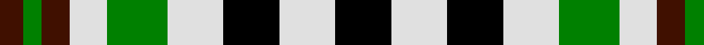

In pattern [BGBWGWKWK](/patterns/bgbwgwkwk/).

This was sourced from weddslist.  It is a [9 stripes tartan](/stripes/stripes9/).

Original link http://www.weddslist.com/cgi-bin/tartans/pg.pl?source=sts

## Thread count
DR/5 G4 DR6 LN8 G13 LN12 K12 LN12 K/12

## Palette
Each colour and its ΔE from the base-6 reference it is a variant of.

| Colour | Shade | Base | ΔE (OKLab) |
|---|---|---|---|
| DR | <code style="background-color:#401000;">#401000</code> `#401000` | B <code style="background-color:#2A418A;">#2A418A</code> | 0.24 |
| G | <code style="background-color:#008000;">#008000</code> `#008000` | G <code style="background-color:#006100;">#006100</code> | 0.10 |
| K | <code style="background-color:#000000;">#000000</code> `#000000` | K <code style="background-color:#000000;">#000000</code> | 0.00 |
| LN | <code style="background-color:#E0E0E0;">#E0E0E0</code> `#E0E0E0` | W <code style="background-color:#F7F7F7;">#F7F7F7</code> | 0.07 |

## Nearest tartans

The nearest existing variants by ΔTartan distance.

1. [Burns Heritage Check](/setts/s9/k12w12k12w12g14w8ga6g4ga6-g408060-ga604000-k101010-wfcfcfc/) — ΔT 0.94
1. [Ferguson Dress variation](/setts/s10/w16k8w16k4w6k16g16r4g16k8-g004c00-k000000-rc40000-wc8c8c8/) — ΔT 1.03
1. [Robert, Burns check](/setts/s10/w8k8w8k8w8k8w4r4g4r4-g008000-k000000-r806050-we0e0e0/) — ΔT 1.24
1. [Burns Check Trade Tartan Tartan Number: 1736. Earliest known date: 1959 Number of black stripes is not fixed. See products available Copyright © Blair Urquhart, Comrie, 2015](/setts/s10/w4k4w4k4w4k4w2g2ga2g2-g604000-ga006818-k101010-we0e0e0/) — ΔT 1.31
1. [Ramsay (Orange)](/setts/s7/k8y18k26g12y6g18w8-g006818-k101010-we0e0e0-yd87c00/) — ΔT 1.45
1. [Boxer Beauty](/setts/s7/k26g56y26g56k36w36k26-g603800-k101010-wfcfcfc-ydc943c/) — ΔT 1.52
1. [Burns Check](/setts/s10/w16k16w16k16w16k16w8g8ga8g8-g7c5400-ga408060-k101010-wfcfcfc/) — ΔT 1.54
1. [Austin / Wilson's No 173](/setts/s5/b6k6b6g12y4-b800080-g008000-k000000-yf0c000/) — ΔT 1.54
1. [Ramsay, Red](/setts/s7/k8r18k26g12r6g18w8-g008000-k000000-rb05000-we0e0e0/) — ΔT 1.55
1. [Boxer Beauty](/setts/s7/k26g56y26g56k36w36k26-g603800-k101010-wffffff-ycc7f32/) — ΔT 1.56

## Neighbour map

Every grey dot is one of 15726 variants placed by the first two principal components of the ΔTartan feature space (44% of its variance). Red is this tartan; blue dots are its nearest — click one to open its page.

<svg viewBox="0 0 640 380" role="img" style="max-width:100%;height:auto;border:1px solid #e0e0e0;border-radius:4px;display:block" xmlns="http://www.w3.org/2000/svg"><image href="/nn/cloud.v1.png" width="640" height="380"/><a href="/setts/s9/k12w12k12w12g14w8ga6g4ga6-g408060-ga604000-k101010-wfcfcfc/"><circle cx="39.1" cy="256.4" r="4" fill="#3465a4"><title>Burns Heritage Check</title></circle></a><a href="/setts/s10/w16k8w16k4w6k16g16r4g16k8-g004c00-k000000-rc40000-wc8c8c8/"><circle cx="66.1" cy="242.2" r="4" fill="#3465a4"><title>Ferguson Dress variation</title></circle></a><a href="/setts/s10/w8k8w8k8w8k8w4r4g4r4-g008000-k000000-r806050-we0e0e0/"><circle cx="56.8" cy="284.1" r="4" fill="#3465a4"><title>Robert, Burns check</title></circle></a><a href="/setts/s10/w4k4w4k4w4k4w2g2ga2g2-g604000-ga006818-k101010-we0e0e0/"><circle cx="61.5" cy="283.9" r="4" fill="#3465a4"><title>Burns Check Trade Tartan Tartan Number: 1736. Earliest known date: 1959 Number of black stripes is not fixed. See products available Copyright © Blair Urquhart, Comrie, 2015</title></circle></a><a href="/setts/s7/k8y18k26g12y6g18w8-g006818-k101010-we0e0e0-yd87c00/"><circle cx="94.0" cy="255.7" r="4" fill="#3465a4"><title>Ramsay (Orange)</title></circle></a><a href="/setts/s7/k26g56y26g56k36w36k26-g603800-k101010-wfcfcfc-ydc943c/"><circle cx="83.3" cy="299.1" r="4" fill="#3465a4"><title>Boxer Beauty</title></circle></a><a href="/setts/s10/w16k16w16k16w16k16w8g8ga8g8-g7c5400-ga408060-k101010-wfcfcfc/"><circle cx="56.1" cy="279.1" r="4" fill="#3465a4"><title>Burns Check</title></circle></a><a href="/setts/s5/b6k6b6g12y4-b800080-g008000-k000000-yf0c000/"><circle cx="71.2" cy="290.7" r="4" fill="#3465a4"><title>Austin / Wilson's No 173</title></circle></a><a href="/setts/s7/k8r18k26g12r6g18w8-g008000-k000000-rb05000-we0e0e0/"><circle cx="82.7" cy="254.2" r="4" fill="#3465a4"><title>Ramsay, Red</title></circle></a><a href="/setts/s7/k26g56y26g56k36w36k26-g603800-k101010-wffffff-ycc7f32/"><circle cx="84.6" cy="299.8" r="4" fill="#3465a4"><title>Boxer Beauty</title></circle></a><circle cx="41.3" cy="262.4" r="5" fill="#c00000"/></svg>

ID: /setts/s9/k12w12k12w12g13w8b6g4b5-b401000-g008000-k000000-we0e0e0/
