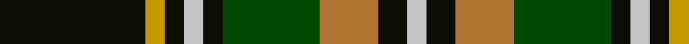

**Bands:** [KYKWKGRKW](/stripes/kykwkgrkw/) · **Stripes:** [K LY K LB K DG O K LB](/stripes/stripes9/) K LY K LB K DG O K LB

This was sourced from register-of-tartans.  It is a [9 band tartan](/bands/bands9/).

Original link https://www.tartanregister.gov.uk/tartanDetails.aspx?ref=1656

## Register references

External register numbers recorded for this tartan.

- Scottish Register of Tartans: [1656](https://www.tartanregister.gov.uk/tartanDetails.aspx?ref=1656)
- Scottish Tartans Authority (ITI): 5172

## Thread count
K/30 DY4 K4 N4 K4 G20 LT12 K6 N/4

## Palette
Each colour and its ΔE from the base-6 reference it is a variant of.

| Colour | Shade | Base | ΔE (OKLab) |
|---|---|---|---|
| DY | <code style="background-color:#C89800;">#C89800</code> `#C89800` | Y <code style="background-color:#F2BF00;">#F2BF00</code> | 0.12 |
| G | <code style="background-color:#004800;">#004800</code> `#004800` | G <code style="background-color:#006100;">#006100</code> | 0.08 |
| K | <code style="background-color:#0C0C04;">#0C0C04</code> `#0C0C04` | K <code style="background-color:#000000;">#000000</code> | 0.15 |
| LT | <code style="background-color:#B07430;">#B07430</code> `#B07430` | R <code style="background-color:#CC0000;">#CC0000</code> | 0.16 |
| N | <code style="background-color:#C4C4C4;">#C4C4C4</code> `#C4C4C4` | W <code style="background-color:#F7F7F7;">#F7F7F7</code> | 0.16 |

## Nearest tartans

The nearest existing variants by ΔTartan distance.

1. [Brown, George](/setts/s9/w3r3k4r6g22r4k18g24ly3~x2/) — ΔT 0.99
1. [Wellecomme, Bernard (Personal)](/setts/s10/db4dg8k8db4ly3dg21k3lb4k3lb4~x2/) — ΔT 1.05
1. [Cochrane LC](/setts/s13/dg22r4dg2r2dg2r4dg12k12r2db10r4db4ly3/) — ΔT 1.09
1. [Skene](/setts/s12/k4db24k4r3k4g24k4lo3k4g24r3k4~x2/) — ΔT 1.12
1. [Royal College of Physicians Corporate Tartan Tartan Number: 2350. Earliest known date: September 1996 Full name is Royal College of Physicians, Edinburgh. Designed for the Royal College of Physicians (founded in 1681 for post graduate students), by Donald Fraser Weavers as a corporate tartan. Woven by Lochcarron, May 1997. Silk sample in STA Johnston Collection. See products available Copyright © Blair Urquhart, Comrie, 2015](/setts/s10/g23r3k9r3db18r3k9r3g23ly3~x2/) — ΔT 1.15
1. [Connolly Hunting (Name)](/setts/s10/k6r2k2r2k6db7g20ly2g3r2~x2/) — ΔT 1.16
1. [Reid, Green](/setts/s13/w1r2g10r2g2k8g2db8g2r2g10r2w1~x4/) — ΔT 1.18
1. [Duchess of York](/setts/s9/db1o9g5o1k5o1g5o9w1~x2/) — ΔT 1.19
1. [Allon/Allan](/setts/s10/g8w1g1r1g4k4db8k1db1k1~x2/) — ΔT 1.22
1. [Unnamed 10](/setts/s12/k8p1k1w1k2p8k8g8k1ly1k2g8~x2/) — ΔT 1.23

## Neighbour map

Every grey dot is one of 14299 variants placed by the first two principal components of the ΔTartan feature space (44% of its variance). Red is this tartan; blue dots are its nearest — click one to open its page.

<svg viewBox="0 0 640 380" role="img" style="max-width:100%;height:auto;border:1px solid #e0e0e0;border-radius:4px;display:block" xmlns="http://www.w3.org/2000/svg"><image href="/nn/cloud.v1.png" width="640" height="380"/><a href="/setts/s9/w3r3k4r6g22r4k18g24ly3~x2/"><circle cx="230.5" cy="181.9" r="4" fill="#3465a4"><title>Brown, George</title></circle></a><a href="/setts/s10/db4dg8k8db4ly3dg21k3lb4k3lb4~x2/"><circle cx="163.2" cy="179.9" r="4" fill="#3465a4"><title>Wellecomme, Bernard (Personal)</title></circle></a><a href="/setts/s13/dg22r4dg2r2dg2r4dg12k12r2db10r4db4ly3/"><circle cx="187.3" cy="151.4" r="4" fill="#3465a4"><title>Cochrane LC</title></circle></a><a href="/setts/s12/k4db24k4r3k4g24k4lo3k4g24r3k4~x2/"><circle cx="178.3" cy="157.4" r="4" fill="#3465a4"><title>Skene</title></circle></a><a href="/setts/s10/g23r3k9r3db18r3k9r3g23ly3~x2/"><circle cx="201.2" cy="191.0" r="4" fill="#3465a4"><title>Royal College of Physicians Corporate Tartan Tartan Number: 2350. Earliest known date: September 1996 Full name is Royal College of Physicians, Edinburgh. Designed for the Royal College of Physicians (founded in 1681 for post graduate students), by Donald Fraser Weavers as a corporate tartan. Woven by Lochcarron, May 1997. Silk sample in STA Johnston Collection. See products available Copyright © Blair Urquhart, Comrie, 2015</title></circle></a><a href="/setts/s10/k6r2k2r2k6db7g20ly2g3r2~x2/"><circle cx="207.7" cy="165.5" r="4" fill="#3465a4"><title>Connolly Hunting (Name)</title></circle></a><a href="/setts/s13/w1r2g10r2g2k8g2db8g2r2g10r2w1~x4/"><circle cx="208.8" cy="162.8" r="4" fill="#3465a4"><title>Reid, Green</title></circle></a><a href="/setts/s9/db1o9g5o1k5o1g5o9w1~x2/"><circle cx="248.7" cy="189.1" r="4" fill="#3465a4"><title>Duchess of York</title></circle></a><a href="/setts/s10/g8w1g1r1g4k4db8k1db1k1~x2/"><circle cx="168.3" cy="172.3" r="4" fill="#3465a4"><title>Allon/Allan</title></circle></a><a href="/setts/s12/k8p1k1w1k2p8k8g8k1ly1k2g8~x2/"><circle cx="166.9" cy="169.4" r="4" fill="#3465a4"><title>Unnamed 10</title></circle></a><circle cx="203.3" cy="179.9" r="5" fill="#c00000"/></svg>

ID: /setts/s9/k15ly2k2lb2k2dg10o6k3lb2~x2/
