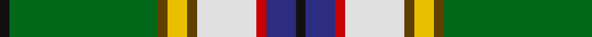

This page is one **sett** — a single exact thread-count. It belongs to the [tartan](/tartans/k1g15t1y2t1ln6r1db3k1/)
(the same proportion at any scale), whose colour order is pattern [KBRWGYGGK](/stripes/kbrwgyggk/).

Sourced from house-of-tartan.  It is a [9 stripe tartan](/stripes/stripes9/).

Original link http://www.house-of-tartan.scotland.net/house/TartanViewjs.asp?colr=Def&tnam=1069

## Thread count
K/2 G30 T2 Y4 T2 LN12 R2 DB6 K/2

## Palette
Each colour and the base-6 reference it is a variant of.

| Colour | Shade | Base |
|---|---|---|
| DB | <code style="background-color:#2C2C80;">#2C2C80</code> `oklch(35.0% 0.138 276.6)` <small>#2C2C80</small> | B <code style="background-color:#2A418A;">#2A418A</code> |
| G | <code style="background-color:#006818;">#006818</code> `oklch(45.0% 0.142 145.0)` <small>#006818</small> | G <code style="background-color:#006100;">#006100</code> |
| K | <code style="background-color:#101010;">#101010</code> `oklch(17.3% 0.000 89.9)` <small>#101010</small> | K <code style="background-color:#000000;">#000000</code> |
| LN | <code style="background-color:#E0E0E0;">#E0E0E0</code> `oklch(90.7% 0.000 89.9)` <small>#E0E0E0</small> | W <code style="background-color:#F7F7F7;">#F7F7F7</code> |
| R | <code style="background-color:#C80000;">#C80000</code> `oklch(52.3% 0.215 29.2)` <small>#C80000</small> | R <code style="background-color:#CC0000;">#CC0000</code> |
| T | <code style="background-color:#604000;">#604000</code> `oklch(39.8% 0.083 76.8)` <small>#604000</small> | G <code style="background-color:#006100;">#006100</code> |
| Y | <code style="background-color:#E8C000;">#E8C000</code> `oklch(81.9% 0.168 93.7)` <small>#E8C000</small> | Y <code style="background-color:#F2BF00;">#F2BF00</code> |

## Nearest tartans

The nearest existing variants by ΔTartan distance, with this tartan at the top so the swatches line up against it.

ΔTartan

Tartan

Sett

—

<a href="/ttd/edit/#slug=k1g15dy1ly2dy1w6r1db3k1~x2">Nor Westers Tartan Tartan Number: 1069. Earliest known date: 1963 Named after the Nor Westers Mountain Range in Ontario. Designed by Miss Evelyn B Halliday in February 1963 to commemorate the naming of the range in that year See products available Copyright © Blair Urquhart, Comrie, 2015</a> <a class="nn-out" href="/setts/s9/k1g15dy1ly2dy1w6r1db3k1~x2/" title="open its dictionary page">↗</a>

1.17

<a href="/ttd/edit/#slug=r3t16k12g2k2dg32t2dg2lb3~x2">Scottish Ambulance Service (Corporat</a> <a class="nn-out" href="/setts/s9/r3t16k12g2k2dg32t2dg2lb3~x2/" title="open its dictionary page">↗</a>

1.28

<a href="/ttd/edit/#slug=g3t3g5r4g28db8w3db3w24r2k2~x2">Downie Dress</a> <a class="nn-out" href="/setts/s11/g3t3g5r4g28db8w3db3w24r2k2~x2/" title="open its dictionary page">↗</a>

1.31

<a href="/ttd/edit/#slug=ly24k8lp4k6g76k8w14g4k9g12lo10">Offally County Crest (Fashion)</a> <a class="nn-out" href="/setts/s11/ly24k8lp4k6g76k8w14g4k9g12lo10/" title="open its dictionary page">↗</a>

1.35

<a href="/ttd/edit/#slug=t9db3g11k7g3k3g32r3w3r7~x2">Lyons</a> <a class="nn-out" href="/setts/s10/t9db3g11k7g3k3g32r3w3r7~x2/" title="open its dictionary page">↗</a>

1.35

<a href="/ttd/edit/#slug=g32r3dy12b3ly3b3lb24lb24k2lb4~x2">Webster (Name)</a> <a class="nn-out" href="/setts/s10/g32r3dy12b3ly3b3lb24lb24k2lb4~x2/" title="open its dictionary page">↗</a>

1.36

<a href="/ttd/edit/#slug=w3r4db13g37b3k3ly2~x2">Washington</a> <a class="nn-out" href="/setts/s7/w3r4db13g37b3k3ly2~x2/" title="open its dictionary page">↗</a>

1.38

<a href="/ttd/edit/#slug=lb7k1do1o2g18lb2k1lo2k1lb6k1do1lb1~x4">Wcwm 972-1</a> <a class="nn-out" href="/setts/s13/lb7k1do1o2g18lb2k1lo2k1lb6k1do1lb1~x4/" title="open its dictionary page">↗</a>

1.38

<a href="/ttd/edit/#slug=g32w2g2ly3g2w2g2k16t2db16w3~x2">MacKellar</a> <a class="nn-out" href="/setts/s11/g32w2g2ly3g2w2g2k16t2db16w3~x2/" title="open its dictionary page">↗</a>

1.39

<a href="/ttd/edit/#slug=k1g23k1ly3k1w8r1t5k1~x2">Nor Westers</a> <a class="nn-out" href="/setts/s9/k1g23k1ly3k1w8r1t5k1~x2/" title="open its dictionary page">↗</a>

1.41

<a href="/ttd/edit/#slug=g28r4k3y2k1dg2r3db20ly2~x2">Stirling, University</a> <a class="nn-out" href="/setts/s9/g28r4k3y2k1dg2r3db20ly2~x2/" title="open its dictionary page">↗</a>

## Neighbour map

Every grey dot is one of 14299 variants placed by the first two principal components of the ΔTartan feature space (44% of its variance). Red is this tartan; blue dots are its nearest — click one to open its page.

<svg viewBox="0 0 640 380" role="img" style="max-width:100%;height:auto;border:1px solid #e0e0e0;border-radius:4px;display:block" xmlns="http://www.w3.org/2000/svg"><image href="/nn/cloud.v1.png" width="640" height="380"/><a href="/setts/s9/r3t16k12g2k2dg32t2dg2lb3~x2/"><circle cx="185.1" cy="104.2" r="4" fill="#3465a4"><title>Scottish Ambulance Service (Corporat</title></circle></a><a href="/setts/s11/g3t3g5r4g28db8w3db3w24r2k2~x2/"><circle cx="166.9" cy="101.4" r="4" fill="#3465a4"><title>Downie Dress</title></circle></a><a href="/setts/s11/ly24k8lp4k6g76k8w14g4k9g12lo10/"><circle cx="236.4" cy="95.0" r="4" fill="#3465a4"><title>Offally County Crest (Fashion)</title></circle></a><a href="/setts/s10/t9db3g11k7g3k3g32r3w3r7~x2/"><circle cx="149.3" cy="126.9" r="4" fill="#3465a4"><title>Lyons</title></circle></a><a href="/setts/s10/g32r3dy12b3ly3b3lb24lb24k2lb4~x2/"><circle cx="180.2" cy="98.5" r="4" fill="#3465a4"><title>Webster (Name)</title></circle></a><a href="/setts/s7/w3r4db13g37b3k3ly2~x2/"><circle cx="270.2" cy="108.2" r="4" fill="#3465a4"><title>Washington</title></circle></a><a href="/setts/s13/lb7k1do1o2g18lb2k1lo2k1lb6k1do1lb1~x4/"><circle cx="197.1" cy="81.0" r="4" fill="#3465a4"><title>Wcwm 972-1</title></circle></a><a href="/setts/s11/g32w2g2ly3g2w2g2k16t2db16w3~x2/"><circle cx="186.8" cy="99.6" r="4" fill="#3465a4"><title>MacKellar</title></circle></a><a href="/setts/s9/k1g23k1ly3k1w8r1t5k1~x2/"><circle cx="242.1" cy="83.6" r="4" fill="#3465a4"><title>Nor Westers</title></circle></a><a href="/setts/s9/g28r4k3y2k1dg2r3db20ly2~x2/"><circle cx="216.0" cy="83.7" r="4" fill="#3465a4"><title>Stirling, University</title></circle></a><circle cx="186.7" cy="91.2" r="5" fill="#c00000"/></svg>

ID: /setts/s9/k1g15dy1ly2dy1w6r1db3k1~x2/
