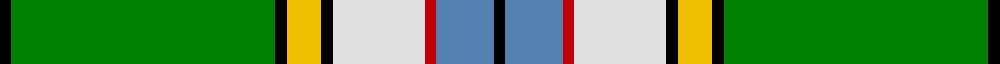

This page is one **sett** — a single exact thread-count. It belongs to the [tartan](/tartans/k1g23k1ly3k1w8r1t5k1/)
(the same proportion at any scale), whose colour order is pattern [KBRWKYKGK](/stripes/kbrwkykgk/).

Sourced from weddslist.  It is a [9 stripe tartan](/stripes/stripes9/).

Original link http://www.weddslist.com/cgi-bin/tartans/pg.pl?source=sts

## Also known as

This cloth is also recorded under:

- Nor Westers Commemorative

2 attestations — the source records this cloth was collapsed from (oldest owns this page)

<ul>
<li>undated — Nor Westers (weddslist, <a href="http://www.weddslist.com/cgi-bin/tartans/pg.pl?source=sts">record</a>)</li>
<li>undated — Nor Westers Commemorative Tartan Tartan Number: 1067. Earliest known date: 1963 Named after the Nor Westers Mountain Range in Ontario. Designed by Miss Evelyn B Halliday in February 1963 to commemorate the naming of the range in that year. Variation See products available Copyright © Blair Urquhart, Comrie, 2015 (house-of-tartan, <a href="http://www.house-of-tartan.scotland.net/house/TartanViewjs.asp?colr=Def&tnam=1067">record</a>)</li>
</ul>

## Thread count
K/2 G46 K2 Y6 K2 LN16 R2 B10 K/2

## Palette

Palette: <strong>Tartan Register</strong> <small style="color:#888">(2 of 6 colours)</small>
<table><thead><tr><th>Colour</th><th>Threads</th><th>Shade</th><th>Base</th><th>OKLCh</th></tr></thead><tbody><tr><td>K/</td><td style="text-align:right;font-variant-numeric:tabular-nums">2</td><td><code style="background-color:#000000;">#000000</code> <small style="color:#888">#000000</small></td><td>K <code style="background-color:#000000;">#000000</code></td><td><small style="color:#888">oklch(0.0% 0.000 0.0)</small></td></tr><tr><td>G</td><td style="text-align:right;font-variant-numeric:tabular-nums">46</td><td><code style="background-color:#008000;">#008000</code> <small style="color:#888">#008000</small></td><td>G <code style="background-color:#006100;">#006100</code></td><td><small style="color:#888">oklch(52.0% 0.177 142.5)</small></td></tr><tr><td>K</td><td style="text-align:right;font-variant-numeric:tabular-nums">2</td><td><code style="background-color:#000000;">#000000</code> <small style="color:#888">#000000</small></td><td>K <code style="background-color:#000000;">#000000</code></td><td><small style="color:#888">oklch(0.0% 0.000 0.0)</small></td></tr><tr><td>Y</td><td style="text-align:right;font-variant-numeric:tabular-nums">6</td><td><code style="background-color:#F0C000;">#F0C000</code> <small style="color:#888">#F0C000</small></td><td>Y <code style="background-color:#F2BF00;">#F2BF00</code></td><td><small style="color:#888">oklch(82.7% 0.169 90.5)</small></td></tr><tr><td>K</td><td style="text-align:right;font-variant-numeric:tabular-nums">2</td><td><code style="background-color:#000000;">#000000</code> <small style="color:#888">#000000</small></td><td>K <code style="background-color:#000000;">#000000</code></td><td><small style="color:#888">oklch(0.0% 0.000 0.0)</small></td></tr><tr><td>LN</td><td style="text-align:right;font-variant-numeric:tabular-nums">16</td><td><code style="background-color:#E0E0E0;">#E0E0E0</code> <small style="color:#888">#E0E0E0</small></td><td>W <code style="background-color:#F7F7F7;">#F7F7F7</code></td><td><small style="color:#888">oklch(90.7% 0.000 89.9)</small></td></tr><tr><td>R</td><td style="text-align:right;font-variant-numeric:tabular-nums">2</td><td><code style="background-color:#C00000;">#C00000</code> <small style="color:#888">#C00000</small></td><td>R <code style="background-color:#CC0000;">#CC0000</code></td><td><small style="color:#888">oklch(50.7% 0.208 29.2)</small></td></tr><tr><td>B</td><td style="text-align:right;font-variant-numeric:tabular-nums">10</td><td><code style="background-color:#5480B0;">#5480B0</code> <small style="color:#888">#5480B0</small></td><td>B <code style="background-color:#2A418A;">#2A418A</code></td><td><small style="color:#888">oklch(58.8% 0.089 251.5)</small></td></tr><tr><td>K/</td><td style="text-align:right;font-variant-numeric:tabular-nums">2</td><td><code style="background-color:#000000;">#000000</code> <small style="color:#888">#000000</small></td><td>K <code style="background-color:#000000;">#000000</code></td><td><small style="color:#888">oklch(0.0% 0.000 0.0)</small></td></tr></tbody></table>

## Nearest tartans

The nearest existing variants by ΔTartan distance, with this tartan at the top so the swatches line up against it.

ΔTartan

Tartan

Sett

—

<a href="/ttd/edit/#slug=k1g23k1ly3k1w8r1t5k1~x2">Nor Westers</a> <a class="nn-out" href="/setts/s9/k1g23k1ly3k1w8r1t5k1~x2/" title="open its dictionary page">↗</a>

0.90

<a href="/ttd/edit/#slug=ly24k8lp4k6g76k8w14g4k9g12lo10">Offally County Crest (Fashion)</a> <a class="nn-out" href="/setts/s11/ly24k8lp4k6g76k8w14g4k9g12lo10/" title="open its dictionary page">↗</a>

1.26

<a href="/ttd/edit/#slug=g2w5dg1k7w1dg2k6dg6g9o1g30ly2g3w2~x2">Reilly fae the Mearns</a> <a class="nn-out" href="/setts/s14/g2w5dg1k7w1dg2k6dg6g9o1g30ly2g3w2~x2/" title="open its dictionary page">↗</a>

1.37

<a href="/ttd/edit/#slug=ly2g16t2w2t2w2t6g7r2w1t1dp1~x6">Fredericton #2</a> <a class="nn-out" href="/setts/s12/ly2g16t2w2t2w2t6g7r2w1t1dp1~x6/" title="open its dictionary page">↗</a>

1.38

<a href="/ttd/edit/#slug=g4k2g28r4g4k18g4lp4g4lp7k1w3~x2">Moss</a> <a class="nn-out" href="/setts/s12/g4k2g28r4g4k18g4lp4g4lp7k1w3~x2/" title="open its dictionary page">↗</a>

1.39

<a href="/ttd/edit/#slug=k1g15dy1ly2dy1w6r1db3k1~x2">Nor Westers Tartan Tartan Number: 1069. Earliest known date: 1963 Named after the Nor Westers Mountain Range in Ontario. Designed by Miss Evelyn B Halliday in February 1963 to commemorate the naming of the range in that year See products available Copyright © Blair Urquhart, Comrie, 2015</a> <a class="nn-out" href="/setts/s9/k1g15dy1ly2dy1w6r1db3k1~x2/" title="open its dictionary page">↗</a>

1.43

<a href="/ttd/edit/#slug=r2dg20ly1dg1k2lb1ly1lb22w1lb1w1~x4">Unidentified (Tony Murray Collection</a> <a class="nn-out" href="/setts/s11/r2dg20ly1dg1k2lb1ly1lb22w1lb1w1~x4/" title="open its dictionary page">↗</a>

1.44

<a href="/ttd/edit/#slug=g18r1lb2k1lb2r1o6k2~x4">Humphries (Name)</a> <a class="nn-out" href="/setts/s8/g18r1lb2k1lb2r1o6k2~x4/" title="open its dictionary page">↗</a>

1.45

<a href="/ttd/edit/#slug=g39r2w1r2db14w14g2g10~x2">Southwell (Australian) (Personal)</a> <a class="nn-out" href="/setts/s8/g39r2w1r2db14w14g2g10~x2/" title="open its dictionary page">↗</a>

1.48

<a href="/ttd/edit/#slug=lb7k1do1o2g18lb2k1lo2k1lb6k1do1lb1~x4">Wcwm 972-1</a> <a class="nn-out" href="/setts/s13/lb7k1do1o2g18lb2k1lo2k1lb6k1do1lb1~x4/" title="open its dictionary page">↗</a>

1.49

<a href="/ttd/edit/#slug=lt11k2lt2k2ly2k11g30r2g3k1w5~x2">Labrador</a> <a class="nn-out" href="/setts/s11/lt11k2lt2k2ly2k11g30r2g3k1w5~x2/" title="open its dictionary page">↗</a>

## Neighbour map

Every grey dot is one of 14299 variants placed by the first two principal components of the ΔTartan feature space (44% of its variance). Red is this tartan; blue dots are its nearest — click one to open its page.

<svg viewBox="0 0 640 380" role="img" style="max-width:100%;height:auto;border:1px solid #e0e0e0;border-radius:4px;display:block" xmlns="http://www.w3.org/2000/svg"><image href="/nn/cloud.v1.png" width="640" height="380"/><a href="/setts/s11/ly24k8lp4k6g76k8w14g4k9g12lo10/"><circle cx="236.4" cy="95.0" r="4" fill="#3465a4"><title>Offally County Crest (Fashion)</title></circle></a><a href="/setts/s14/g2w5dg1k7w1dg2k6dg6g9o1g30ly2g3w2~x2/"><circle cx="280.7" cy="65.1" r="4" fill="#3465a4"><title>Reilly fae the Mearns</title></circle></a><a href="/setts/s12/ly2g16t2w2t2w2t6g7r2w1t1dp1~x6/"><circle cx="240.0" cy="109.7" r="4" fill="#3465a4"><title>Fredericton #2</title></circle></a><a href="/setts/s12/g4k2g28r4g4k18g4lp4g4lp7k1w3~x2/"><circle cx="263.1" cy="99.3" r="4" fill="#3465a4"><title>Moss</title></circle></a><a href="/setts/s9/k1g15dy1ly2dy1w6r1db3k1~x2/"><circle cx="186.7" cy="91.2" r="4" fill="#3465a4"><title>Nor Westers Tartan Tartan Number: 1069. Earliest known date: 1963 Named after the Nor Westers Mountain Range in Ontario. Designed by Miss Evelyn B Halliday in February 1963 to commemorate the naming of the range in that year See products available Copyright © Blair Urquhart, Comrie, 2015</title></circle></a><a href="/setts/s11/r2dg20ly1dg1k2lb1ly1lb22w1lb1w1~x4/"><circle cx="244.2" cy="68.3" r="4" fill="#3465a4"><title>Unidentified (Tony Murray Collection</title></circle></a><a href="/setts/s8/g18r1lb2k1lb2r1o6k2~x4/"><circle cx="289.8" cy="129.2" r="4" fill="#3465a4"><title>Humphries (Name)</title></circle></a><a href="/setts/s8/g39r2w1r2db14w14g2g10~x2/"><circle cx="253.6" cy="101.4" r="4" fill="#3465a4"><title>Southwell (Australian) (Personal)</title></circle></a><a href="/setts/s13/lb7k1do1o2g18lb2k1lo2k1lb6k1do1lb1~x4/"><circle cx="197.1" cy="81.0" r="4" fill="#3465a4"><title>Wcwm 972-1</title></circle></a><a href="/setts/s11/lt11k2lt2k2ly2k11g30r2g3k1w5~x2/"><circle cx="205.5" cy="71.5" r="4" fill="#3465a4"><title>Labrador</title></circle></a><circle cx="242.1" cy="83.6" r="5" fill="#c00000"/></svg>

ID: /setts/s9/k1g23k1ly3k1w8r1t5k1~x2/
