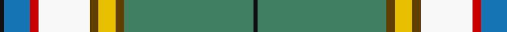

In pattern [KBRWGYGGK](/patterns/kbrwgyggk/).

This was sourced from register-of-tartans.  It is a [9 stripes tartan](/stripes/stripes9/).

Original link https://www.tartanregister.gov.uk/tartanDetails.aspx?ref=3146

## Attestations

This cloth appears in 2 source records; the oldest owns this page.

- 01/01/1963 — Nor'Westers (register-of-tartans, [record](https://www.tartanregister.gov.uk/tartanDetails.aspx?ref=3146))
- 1963 — Nor'Westers (District) (tartans-authority, [record](http://www.tartansauthority.com/tartan-ferret/display/1067/))

## Thread count
K/2 B12 R4 W24 T4 Y8 T4 Ga60 K/2

## Palette
Each colour and its ΔE from the base-6 reference it is a variant of.

| Colour | Shade | Base | ΔE (OKLab) |
|---|---|---|---|
| B | <code style="background-color:#1474B4;">#1474B4</code> `#1474B4` | B <code style="background-color:#2A418A;">#2A418A</code> | 0.15 |
| DB | <code style="background-color:#2C2C80;">#2C2C80</code> `#2C2C80` | B <code style="background-color:#2A418A;">#2A418A</code> | 0.06 |
| G | <code style="background-color:#006818;">#006818</code> `#006818` | G <code style="background-color:#006100;">#006100</code> | 0.02 |
| Ga | <code style="background-color:#408060;">#408060</code> `#408060` | G <code style="background-color:#006100;">#006100</code> | 0.14 |
| K | <code style="background-color:#101010;">#101010</code> `#101010` | K <code style="background-color:#000000;">#000000</code> | 0.17 |
| LN | <code style="background-color:#E0E0E0;">#E0E0E0</code> `#E0E0E0` | W <code style="background-color:#F7F7F7;">#F7F7F7</code> | 0.07 |
| R | <code style="background-color:#C80000;">#C80000</code> `#C80000` | R <code style="background-color:#CC0000;">#CC0000</code> | 0.01 |
| T | <code style="background-color:#604000;">#604000</code> `#604000` | G <code style="background-color:#006100;">#006100</code> | 0.14 |
| W | <code style="background-color:#F8F8F8;">#F8F8F8</code> `#F8F8F8` | W <code style="background-color:#F7F7F7;">#F7F7F7</code> | 0.00 |
| Y | <code style="background-color:#E8C000;">#E8C000</code> `#E8C000` | Y <code style="background-color:#F2BF00;">#F2BF00</code> | 0.02 |

## Nearest tartans

The nearest existing variants by ΔTartan distance.

1. [St Brigid's Quirindi](/setts/s9/b2ba12k1bb5w3bb5k1g30y2x2~b3850c8-ba4c3428-bb2474e8-g649848-k101010-wffffff-ye0a126/) — ΔT 0.66
1. [Webster (Name)](/setts/s10/g32r3ga12b3y3b3w24w24k2w4x2~b3474fc-g007800-ga503c28-k000000-rb00000-wc8c8c8-ydcbc00/) — ΔT 1.35
1. [Unidentified (Tony Murray Collection](/setts/s11/r2g20y1g1k2w1y1w22wa1w1wa1x4~g285800-k101010-r880000-w98c8e8-wae0e0e0-ye8c000/) — ΔT 1.38
1. [Nor Westers Commemorative Tartan Tartan Number: 1067. Earliest known date: 1963 Named after the Nor Westers Mountain Range in Ontario. Designed by Miss Evelyn B Halliday in February 1963 to commemorate the naming of the range in that year. Variation See products available Copyright © Blair Urquhart, Comrie, 2015](/setts/s9/k1g23k1y3k1w8r1b5k1x2~b5c8ca8-g006818-k101010-rc80000-we0e0e0-ye8c000/) — ΔT 1.41
1. [McAleavy (2014)](/setts/s11/g56y6w6ya2wa2ya2wa16y10wa2g6r3x2~g5c6428-ra00000-wf8f4d0-waffffff-ya0a0a0-yaf8e38c/) — ΔT 1.44
1. [Cadenhead (2015)](/setts/s9/w54g4r4ga12ra4ga8wa1ga8b6x2~b000086-g603800-ga289c18-r888888-ra9c68a4-w98c8e8-waffffff/) — ΔT 1.45
1. [Nickel Lodge Centennial (Corporate)](/setts/s9/r36y2r1y2r4b12w8g2ga12x2~b003c64-g604000-ga005834-r888888-we0e0e0-ye8c000/) — ΔT 1.46
1. [Nor Westers Tartan Tartan Number: 1069. Earliest known date: 1963 Named after the Nor Westers Mountain Range in Ontario. Designed by Miss Evelyn B Halliday in February 1963 to commemorate the naming of the range in that year See products available Copyright © Blair Urquhart, Comrie, 2015](/setts/s9/k1g15ga1y2ga1w6r1b3k1x2~b2c2c80-g006818-ga604000-k101010-rc80000-we0e0e0-ye8c000/) — ΔT 1.47
1. [Caskie](/setts/s7/w3k1b25r7g12k1y3x2~b2888c4-g006818-k101010-rc80000-we0e0e0-ye8c000/) — ΔT 1.52
1. [Currie](/setts/s11/b16w3b1y4g24r1g3r4g3r1ba8x2~b304080-ba5480b0-g008000-rc00000-we0e0e0-yf0c000/) — ΔT 1.60

## Neighbour map

Every grey dot is one of 15726 variants placed by the first two principal components of the ΔTartan feature space (44% of its variance). Red is this tartan; blue dots are its nearest — click one to open its page.

<svg viewBox="0 0 640 380" role="img" style="max-width:100%;height:auto;border:1px solid #e0e0e0;border-radius:4px;display:block" xmlns="http://www.w3.org/2000/svg"><image href="/nn/cloud.v1.png" width="640" height="380"/><a href="/setts/s9/b2ba12k1bb5w3bb5k1g30y2x2~b3850c8-ba4c3428-bb2474e8-g649848-k101010-wffffff-ye0a126/"><circle cx="239.1" cy="71.6" r="4" fill="#3465a4"><title>St Brigid's Quirindi</title></circle></a><a href="/setts/s10/g32r3ga12b3y3b3w24w24k2w4x2~b3474fc-g007800-ga503c28-k000000-rb00000-wc8c8c8-ydcbc00/"><circle cx="177.8" cy="97.6" r="4" fill="#3465a4"><title>Webster (Name)</title></circle></a><a href="/setts/s11/r2g20y1g1k2w1y1w22wa1w1wa1x4~g285800-k101010-r880000-w98c8e8-wae0e0e0-ye8c000/"><circle cx="241.2" cy="68.1" r="4" fill="#3465a4"><title>Unidentified (Tony Murray Collection</title></circle></a><a href="/setts/s9/k1g23k1y3k1w8r1b5k1x2~b5c8ca8-g006818-k101010-rc80000-we0e0e0-ye8c000/"><circle cx="250.3" cy="87.9" r="4" fill="#3465a4"><title>Nor Westers Commemorative Tartan Tartan Number: 1067. Earliest known date: 1963 Named after the Nor Westers Mountain Range in Ontario. Designed by Miss Evelyn B Halliday in February 1963 to commemorate the naming of the range in that year. Variation See products available Copyright © Blair Urquhart, Comrie, 2015</title></circle></a><a href="/setts/s11/g56y6w6ya2wa2ya2wa16y10wa2g6r3x2~g5c6428-ra00000-wf8f4d0-waffffff-ya0a0a0-yaf8e38c/"><circle cx="291.4" cy="61.2" r="4" fill="#3465a4"><title>McAleavy (2014)</title></circle></a><a href="/setts/s9/w54g4r4ga12ra4ga8wa1ga8b6x2~b000086-g603800-ga289c18-r888888-ra9c68a4-w98c8e8-waffffff/"><circle cx="293.4" cy="48.9" r="4" fill="#3465a4"><title>Cadenhead (2015)</title></circle></a><a href="/setts/s9/r36y2r1y2r4b12w8g2ga12x2~b003c64-g604000-ga005834-r888888-we0e0e0-ye8c000/"><circle cx="288.7" cy="90.9" r="4" fill="#3465a4"><title>Nickel Lodge Centennial (Corporate)</title></circle></a><a href="/setts/s9/k1g15ga1y2ga1w6r1b3k1x2~b2c2c80-g006818-ga604000-k101010-rc80000-we0e0e0-ye8c000/"><circle cx="183.8" cy="90.1" r="4" fill="#3465a4"><title>Nor Westers Tartan Tartan Number: 1069. Earliest known date: 1963 Named after the Nor Westers Mountain Range in Ontario. Designed by Miss Evelyn B Halliday in February 1963 to commemorate the naming of the range in that year See products available Copyright © Blair Urquhart, Comrie, 2015</title></circle></a><a href="/setts/s7/w3k1b25r7g12k1y3x2~b2888c4-g006818-k101010-rc80000-we0e0e0-ye8c000/"><circle cx="239.3" cy="116.9" r="4" fill="#3465a4"><title>Caskie</title></circle></a><a href="/setts/s11/b16w3b1y4g24r1g3r4g3r1ba8x2~b304080-ba5480b0-g008000-rc00000-we0e0e0-yf0c000/"><circle cx="214.6" cy="99.7" r="4" fill="#3465a4"><title>Currie</title></circle></a><circle cx="230.8" cy="61.4" r="5" fill="#c00000"/></svg>

ID: /setts/s9/k1g30ga2y4ga2w12r2b6k1x2~b1474b4-g408060-ga604000-k101010-rc80000-wf8f8f8-ye8c000/
