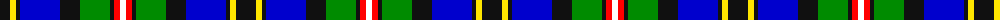

In pattern [KYKBKGKRW](/patterns/kykbkgkrw/).

This was sourced from register-of-tartans.  It is a [9 stripes tartan](/stripes/stripes9/).

Original link https://www.tartanregister.gov.uk/tartanDetails.aspx?ref=10265

## Thread count
K/20 Y6 K4 B40 K20 G30 K4 R6 W/6

## Palette
Each colour and its ΔE from the base-6 reference it is a variant of.

| Colour | Shade | Base | ΔE (OKLab) |
|---|---|---|---|
| B | <code style="background-color:#0000CD;">#0000CD</code> `#0000CD` | B <code style="background-color:#2C4084;">#2C4084</code> | 0.15 |
| G | <code style="background-color:#008B00;">#008B00</code> `#008B00` | G <code style="background-color:#006400;">#006400</code> | 0.12 |
| K | <code style="background-color:#101010;">#101010</code> `#101010` | K <code style="background-color:#000000;">#000000</code> | 0.17 |
| R | <code style="background-color:#FF0000;">#FF0000</code> `#FF0000` | R <code style="background-color:#C80000;">#C80000</code> | 0.11 |
| W | <code style="background-color:#FFFFFF;">#FFFFFF</code> `#FFFFFF` | W <code style="background-color:#F4F4F0;">#F4F4F0</code> | 0.03 |
| Y | <code style="background-color:#FFE600;">#FFE600</code> `#FFE600` | Y <code style="background-color:#E8C000;">#E8C000</code> | 0.10 |

## Nearest tartans

The nearest existing variants by ΔTartan distance.

1. [Loch Awe](/setts/s9/b6k4r6g40k48ba40r6k4y6-b778899-ba0000cd-g008b00-k101010-rff0000-yffe600/) — ΔT 0.75
1. [Kagame Personal Tartan Tartan Number: 7077. Earliest known date: 2006 Presented to President Kagame of Rwanda, by Tom Hunter, christmas 2006 See products available Copyright © Blair Urquhart, Comrie, 2015](/setts/s10/k8w28ka6k14g6ka6g14ka12b48wa6-b38409c-g289c18-k000000-ka101010-w98c8e8-wae0e0e0/) — ΔT 0.79
1. [Kagame (Personal)](/setts/s10/k10w28ka6k14g6ka6g14ka12b48wa6-b1c1c50-g289c18-k000000-ka101010-w98c8e8-wae0e0e0/) — ΔT 0.85
1. [McCuaig (2010) (Name)](/setts/s9/k20y6k4b40k20g30k4r6w6-b1474b4-g006818-k101010-rc8002c-we0e0e0-ye8c000/) — ΔT 0.90
1. [Auchinachie](/setts/s12/g4k4b24k8r2k8y20w2y20k16b24k4-b003f87-g008b45-k101010-r8c1717-wfff68f-y96c8a2/) — ΔT 0.91
1. [Scottish Bear (Mathan Albannach)](/setts/s11/g22w6b10w4y2b8w2b4ba22b6ga4-b000048-ba2c4084-g603800-ga006818-wffffff-yffff00/) — ΔT 0.91
1. [Greene](/setts/s10/b12r8b48w6k12g36y8g4y4g8-b00008c-g007800-k000000-r8c0000-wc8c8c8-yc88c00/) — ΔT 0.92
1. [Moran (Virgin Islands) (Personal)](/setts/s9/b6r6k10g16w4k26ba26b52w6-b2888c4-ba2c2c80-g006818-k101010-rc80000-we0e0e0/) — ΔT 1.03
1. [Aurora House Check](/setts/s11/b80y6b22k14g44k14b6w6ya20k64yb26-b00008c-g649848-k101010-wffffff-y48a4c0-yaa0a0a0-ybffe600/) — ΔT 1.06
1. [Unnamed, No 20](/setts/s11/b3k2b2ba8bb20r4g16ba4b2k2b3-b5480b0-ba8080d0-bb000050-g008000-k000000-rc00000/) — ΔT 1.08

## Neighbour map

Every grey dot is one of 15726 variants placed by the first two principal components of the ΔTartan feature space (44% of its variance). Red is this tartan; blue dots are its nearest — click one to open its page.

<svg viewBox="0 0 640 380" role="img" style="max-width:100%;height:auto;border:1px solid #e0e0e0;border-radius:4px;display:block" xmlns="http://www.w3.org/2000/svg"><image href="/nn/cloud.v1.png" width="640" height="380"/><a href="/setts/s9/b6k4r6g40k48ba40r6k4y6-b778899-ba0000cd-g008b00-k101010-rff0000-yffe600/"><circle cx="114.5" cy="133.0" r="4" fill="#3465a4"><title>Loch Awe</title></circle></a><a href="/setts/s10/k8w28ka6k14g6ka6g14ka12b48wa6-b38409c-g289c18-k000000-ka101010-w98c8e8-wae0e0e0/"><circle cx="53.5" cy="146.0" r="4" fill="#3465a4"><title>Kagame Personal Tartan Tartan Number: 7077. Earliest known date: 2006 Presented to President Kagame of Rwanda, by Tom Hunter, christmas 2006 See products available Copyright © Blair Urquhart, Comrie, 2015</title></circle></a><a href="/setts/s10/k10w28ka6k14g6ka6g14ka12b48wa6-b1c1c50-g289c18-k000000-ka101010-w98c8e8-wae0e0e0/"><circle cx="52.2" cy="149.8" r="4" fill="#3465a4"><title>Kagame (Personal)</title></circle></a><a href="/setts/s9/k20y6k4b40k20g30k4r6w6-b1474b4-g006818-k101010-rc8002c-we0e0e0-ye8c000/"><circle cx="110.2" cy="157.6" r="4" fill="#3465a4"><title>McCuaig (2010) (Name)</title></circle></a><a href="/setts/s12/g4k4b24k8r2k8y20w2y20k16b24k4-b003f87-g008b45-k101010-r8c1717-wfff68f-y96c8a2/"><circle cx="104.7" cy="141.6" r="4" fill="#3465a4"><title>Auchinachie</title></circle></a><a href="/setts/s11/g22w6b10w4y2b8w2b4ba22b6ga4-b000048-ba2c4084-g603800-ga006818-wffffff-yffff00/"><circle cx="76.2" cy="134.9" r="4" fill="#3465a4"><title>Scottish Bear (Mathan Albannach)</title></circle></a><a href="/setts/s10/b12r8b48w6k12g36y8g4y4g8-b00008c-g007800-k000000-r8c0000-wc8c8c8-yc88c00/"><circle cx="148.5" cy="136.2" r="4" fill="#3465a4"><title>Greene</title></circle></a><a href="/setts/s9/b6r6k10g16w4k26ba26b52w6-b2888c4-ba2c2c80-g006818-k101010-rc80000-we0e0e0/"><circle cx="127.6" cy="142.7" r="4" fill="#3465a4"><title>Moran (Virgin Islands) (Personal)</title></circle></a><a href="/setts/s11/b80y6b22k14g44k14b6w6ya20k64yb26-b00008c-g649848-k101010-wffffff-y48a4c0-yaa0a0a0-ybffe600/"><circle cx="84.1" cy="113.7" r="4" fill="#3465a4"><title>Aurora House Check</title></circle></a><a href="/setts/s11/b3k2b2ba8bb20r4g16ba4b2k2b3-b5480b0-ba8080d0-bb000050-g008000-k000000-rc00000/"><circle cx="80.3" cy="133.1" r="4" fill="#3465a4"><title>Unnamed, No 20</title></circle></a><circle cx="92.3" cy="151.6" r="5" fill="#c00000"/></svg>

ID: /setts/s9/k20y6k4b40k20g30k4r6w6-b0000cd-g008b00-k101010-rff0000-wffffff-yffe600/
