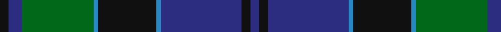

This page is one **sett** — a single exact thread-count. It belongs to the [tartan](/tartans/k2db3g16b1k13b1db18k2db2/)
(the same proportion at any scale), whose colour order is pattern [BKBBKBGBK](/stripes/bkbbkbgbk/).

Sourced from house-of-tartan.  It is a [9 stripe tartan](/stripes/stripes9/).

Original link http://www.house-of-tartan.scotland.net/house/TartanViewjs.asp?colr=Def&tnam=249

## Thread count
K/4 DB6 G32 B2 K26 B2 DB36 K4 DB/4

## Palette
Each colour and the base-6 reference it is a variant of.

| Colour | Shade | Base |
|---|---|---|
| B | <code style="background-color:#2888C4;">#2888C4</code> `oklch(60.1% 0.125 241.5)` <small>#2888C4</small> | B <code style="background-color:#2A418A;">#2A418A</code> |
| DB | <code style="background-color:#2C2C80;">#2C2C80</code> `oklch(35.0% 0.138 276.6)` <small>#2C2C80</small> | B <code style="background-color:#2A418A;">#2A418A</code> |
| G | <code style="background-color:#006818;">#006818</code> `oklch(45.0% 0.142 145.0)` <small>#006818</small> | G <code style="background-color:#006100;">#006100</code> |
| K | <code style="background-color:#101010;">#101010</code> `oklch(17.3% 0.000 89.9)` <small>#101010</small> | K <code style="background-color:#000000;">#000000</code> |

## Nearest tartans

The nearest existing variants by ΔTartan distance, with this tartan at the top so the swatches line up against it.

ΔTartan

Tartan

Sett

—

<a href="/ttd/edit/#slug=k2db3g16t1k13t1db18k2db2~x2">Hebridean Old.. District Tartan Tartan Number: 249. Earliest known date: pre 2003 Alternative count on 1990 See products available Copyright © Blair Urquhart, Comrie, 2015</a> <a class="nn-out" href="/setts/s9/k2db3g16t1k13t1db18k2db2~x2/" title="open its dictionary page">↗</a>

0.70

<a href="/ttd/edit/#slug=g20k2g2k2g2k8db24dp3db3~x2">MacHarg, Iain</a> <a class="nn-out" href="/setts/s9/g20k2g2k2g2k8db24dp3db3~x2/" title="open its dictionary page">↗</a>

0.75

<a href="/ttd/edit/#slug=k2db12k12g1t2g16t2g1k12db12k1~x4">Graham</a> <a class="nn-out" href="/setts/s11/k2db12k12g1t2g16t2g1k12db12k1~x4/" title="open its dictionary page">↗</a>

0.85

<a href="/ttd/edit/#slug=db56k6db6k6db6k44dg44ly4dg5ly8">Gordon #2</a> <a class="nn-out" href="/setts/s10/db56k6db6k6db6k44dg44ly4dg5ly8/" title="open its dictionary page">↗</a>

0.92

<a href="/ttd/edit/#slug=m7g3m2g33k31db31k3db3">Baird (Old) Clan Tartan Tartan Number: 273. Earliest known date: c.1906 This tartan is first recorded in Johnston's work of 1906, and the sample from the Highland Society of London probably dates from the same period. In both these early references the triple stripes are rendered in red. Today, however, they are generally woven in purple. The name originates from 'bard' meaning poet. The Bairds owned estates in Aberdeenshire which were later purchased by the Gordons. See products available Copyright © Blair Urquhart, Comrie, 2015</a> <a class="nn-out" href="/setts/s8/m7g3m2g33k31db31k3db3/" title="open its dictionary page">↗</a>

0.93

<a href="/ttd/edit/#slug=db30k2db2k2db2k32g15r2g4r4g30~x2">Scottish Tourist Board (1981) (Corp)</a> <a class="nn-out" href="/setts/s11/db30k2db2k2db2k32g15r2g4r4g30~x2/" title="open its dictionary page">↗</a>

0.95

<a href="/ttd/edit/#slug=k2db3k2db18k11db2k11g25p2~x2">Aitchison Family (Kinghorn) (Personal)</a> <a class="nn-out" href="/setts/s9/k2db3k2db18k11db2k11g25p2~x2/" title="open its dictionary page">↗</a>

0.98

<a href="/ttd/edit/#slug=db8k1db1k1db1k8ly1dg14ly1k8db8k1db1~x2">Black from Cumnock (Personal)</a> <a class="nn-out" href="/setts/s13/db8k1db1k1db1k8ly1dg14ly1k8db8k1db1~x2/" title="open its dictionary page">↗</a>

0.98

<a href="/ttd/edit/#slug=k4db16k12g12r1g2k2~x2">Dundas #2</a> <a class="nn-out" href="/setts/s7/k4db16k12g12r1g2k2~x2/" title="open its dictionary page">↗</a>

1.00

<a href="/ttd/edit/#slug=dg19k1dg4k1dg3k10db20ly1k7ly1db20k10ly3dg1~x2">Hope-Vere/Weir #2</a> <a class="nn-out" href="/setts/s14/dg19k1dg4k1dg3k10db20ly1k7ly1db20k10ly3dg1~x2/" title="open its dictionary page">↗</a>

1.01

<a href="/ttd/edit/#slug=dg5k1ly2k1dg19k15ly2dt20dg3~x2">Maine Acadia (Fashion)</a> <a class="nn-out" href="/setts/s9/dg5k1ly2k1dg19k15ly2dt20dg3~x2/" title="open its dictionary page">↗</a>

## Neighbour map

Every grey dot is one of 14299 variants placed by the first two principal components of the ΔTartan feature space (44% of its variance). Red is this tartan; blue dots are its nearest — click one to open its page.

<svg viewBox="0 0 640 380" role="img" style="max-width:100%;height:auto;border:1px solid #e0e0e0;border-radius:4px;display:block" xmlns="http://www.w3.org/2000/svg"><image href="/nn/cloud.v1.png" width="640" height="380"/><a href="/setts/s9/g20k2g2k2g2k8db24dp3db3~x2/"><circle cx="273.5" cy="195.7" r="4" fill="#3465a4"><title>MacHarg, Iain</title></circle></a><a href="/setts/s11/k2db12k12g1t2g16t2g1k12db12k1~x4/"><circle cx="235.0" cy="191.2" r="4" fill="#3465a4"><title>Graham</title></circle></a><a href="/setts/s10/db56k6db6k6db6k44dg44ly4dg5ly8/"><circle cx="230.4" cy="178.3" r="4" fill="#3465a4"><title>Gordon #2</title></circle></a><a href="/setts/s8/m7g3m2g33k31db31k3db3/"><circle cx="226.8" cy="192.2" r="4" fill="#3465a4"><title>Baird (Old) Clan Tartan Tartan Number: 273. Earliest known date: c.1906 This tartan is first recorded in Johnston's work of 1906, and the sample from the Highland Society of London probably dates from the same period. In both these early references the triple stripes are rendered in red. Today, however, they are generally woven in purple. The name originates from 'bard' meaning poet. The Bairds owned estates in Aberdeenshire which were later purchased by the Gordons. See products available Copyright © Blair Urquhart, Comrie, 2015</title></circle></a><a href="/setts/s11/db30k2db2k2db2k32g15r2g4r4g30~x2/"><circle cx="254.1" cy="171.2" r="4" fill="#3465a4"><title>Scottish Tourist Board (1981) (Corp)</title></circle></a><a href="/setts/s9/k2db3k2db18k11db2k11g25p2~x2/"><circle cx="247.5" cy="212.4" r="4" fill="#3465a4"><title>Aitchison Family (Kinghorn) (Personal)</title></circle></a><a href="/setts/s13/db8k1db1k1db1k8ly1dg14ly1k8db8k1db1~x2/"><circle cx="238.8" cy="179.2" r="4" fill="#3465a4"><title>Black from Cumnock (Personal)</title></circle></a><a href="/setts/s7/k4db16k12g12r1g2k2~x2/"><circle cx="248.7" cy="216.6" r="4" fill="#3465a4"><title>Dundas #2</title></circle></a><a href="/setts/s14/dg19k1dg4k1dg3k10db20ly1k7ly1db20k10ly3dg1~x2/"><circle cx="254.8" cy="161.8" r="4" fill="#3465a4"><title>Hope-Vere/Weir #2</title></circle></a><a href="/setts/s9/dg5k1ly2k1dg19k15ly2dt20dg3~x2/"><circle cx="263.0" cy="182.0" r="4" fill="#3465a4"><title>Maine Acadia (Fashion)</title></circle></a><circle cx="272.2" cy="185.7" r="5" fill="#c00000"/></svg>

ID: /setts/s9/k2db3g16t1k13t1db18k2db2~x2/
