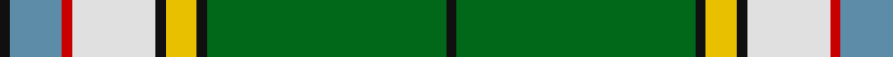

In pattern [KBRWKYKGK](/patterns/kbrwkykgk/).

This was sourced from house-of-tartan.  It is a [9 stripes tartan](/stripes/stripes9/).

Original link http://www.house-of-tartan.scotland.net/house/TartanViewjs.asp?colr=Def&tnam=1067

## Thread count
K/2 B10 R2 LN16 K2 Y6 K2 G46 K/2

## Palette
Each colour and its ΔE from the base-6 reference it is a variant of.

| Colour | Shade | Base | ΔE (OKLab) |
|---|---|---|---|
| B | <code style="background-color:#5C8CA8;">#5C8CA8</code> `#5C8CA8` | B <code style="background-color:#2A418A;">#2A418A</code> | 0.23 |
| G | <code style="background-color:#006818;">#006818</code> `#006818` | G <code style="background-color:#006100;">#006100</code> | 0.02 |
| K | <code style="background-color:#101010;">#101010</code> `#101010` | K <code style="background-color:#000000;">#000000</code> | 0.17 |
| LN | <code style="background-color:#E0E0E0;">#E0E0E0</code> `#E0E0E0` | W <code style="background-color:#F7F7F7;">#F7F7F7</code> | 0.07 |
| R | <code style="background-color:#C80000;">#C80000</code> `#C80000` | R <code style="background-color:#CC0000;">#CC0000</code> | 0.01 |
| Y | <code style="background-color:#E8C000;">#E8C000</code> `#E8C000` | Y <code style="background-color:#F2BF00;">#F2BF00</code> | 0.02 |

## Nearest tartans

The nearest existing variants by ΔTartan distance.

1. [Nor Westers](/setts/s9/k2g46k2y6k2w16r2b10k2-b5480b0-g008000-k000000-rc00000-we0e0e0-yf0c000/) — ΔT 0.47
1. [Offally County Crest (Fashion)](/setts/s11/y24k8w4k6g76k8wa14g4k9g12ya10-g006818-k101010-wf0bcbc-wae0e0e0-ye8c000-yabc8c00/) — ΔT 0.86
1. [Fredericton #2](/setts/s12/y12g96b12w12b12w12b36g42r12w6b6ba6-b5c8ca8-ba780078-g006818-rc80000-wfcfcfc-ye8c000/) — ΔT 1.13
1. [Nor Westers Tartan Tartan Number: 1069. Earliest known date: 1963 Named after the Nor Westers Mountain Range in Ontario. Designed by Miss Evelyn B Halliday in February 1963 to commemorate the naming of the range in that year See products available Copyright © Blair Urquhart, Comrie, 2015](/setts/s9/k2g30ga2y4ga2w12r2b6k2-b2c2c80-g006818-ga604000-k101010-rc80000-we0e0e0-ye8c000/) — ΔT 1.24
1. [Unidentified (Tony Murray Collection](/setts/s11/r8g80y4g4k8w4y4w88wa4w4wa4-g285800-k101010-r880000-w98c8e8-wae0e0e0-ye8c000/) — ΔT 1.25
1. [Humphries (Name)](/setts/s8/g72r4w8k4w8r4ra24k8-g007800-k000000-r8c0000-ra8c6428-wc8c8c8/) — ΔT 1.30
1. [Wcwm 972-1](/setts/s13/w28k4b4r8g72w8k4y8k4w24k4b4w4-b441800-g006818-k101010-r888888-wc0c0c0-yd09800/) — ΔT 1.30
1. [Dinwiddie Clan Tartan Tartan Number: 3212. Earliest known date: 2001 The registered tartan of the Dinwiddie Clan. Dinwiddies are normally associated with the Maxwells, but Lord Lyon stated, in 1988, that Dinwiddies were a sept of no other clan. See products available Copyright © Blair Urquhart, Comrie, 2015](/setts/s10/y8r4k4r84k26g50r12k4ra8k4-g289c18-k101010-r888888-rac8002c-ye8c000/) — ΔT 1.31
1. [Washington](/setts/s7/w6r8b26g74ba6k6y4-b304080-ba8080d0-g008000-k000000-rc00000-we0e0e0-yf0c000/) — ΔT 1.33
1. [Reilly fae the Mearns](/setts/s14/g4w10ga2k14w2ga4k12ga12g18r2g60y4g6w4-g509721-ga3b522f-k120a01-ra32d18-wf7f1e8-yf8e38c/) — ΔT 1.33

## Neighbour map

Every grey dot is one of 15726 variants placed by the first two principal components of the ΔTartan feature space (44% of its variance). Red is this tartan; blue dots are its nearest — click one to open its page.

<svg viewBox="0 0 640 380" role="img" style="max-width:100%;height:auto;border:1px solid #e0e0e0;border-radius:4px;display:block" xmlns="http://www.w3.org/2000/svg"><image href="/nn/cloud.v1.png" width="640" height="380"/><a href="/setts/s9/k2g46k2y6k2w16r2b10k2-b5480b0-g008000-k000000-rc00000-we0e0e0-yf0c000/"><circle cx="237.1" cy="83.2" r="4" fill="#3465a4"><title>Nor Westers</title></circle></a><a href="/setts/s11/y24k8w4k6g76k8wa14g4k9g12ya10-g006818-k101010-wf0bcbc-wae0e0e0-ye8c000-yabc8c00/"><circle cx="231.8" cy="94.1" r="4" fill="#3465a4"><title>Offally County Crest (Fashion)</title></circle></a><a href="/setts/s12/y12g96b12w12b12w12b36g42r12w6b6ba6-b5c8ca8-ba780078-g006818-rc80000-wfcfcfc-ye8c000/"><circle cx="235.4" cy="107.8" r="4" fill="#3465a4"><title>Fredericton #2</title></circle></a><a href="/setts/s9/k2g30ga2y4ga2w12r2b6k2-b2c2c80-g006818-ga604000-k101010-rc80000-we0e0e0-ye8c000/"><circle cx="181.5" cy="90.3" r="4" fill="#3465a4"><title>Nor Westers Tartan Tartan Number: 1069. Earliest known date: 1963 Named after the Nor Westers Mountain Range in Ontario. Designed by Miss Evelyn B Halliday in February 1963 to commemorate the naming of the range in that year See products available Copyright © Blair Urquhart, Comrie, 2015</title></circle></a><a href="/setts/s11/r8g80y4g4k8w4y4w88wa4w4wa4-g285800-k101010-r880000-w98c8e8-wae0e0e0-ye8c000/"><circle cx="238.7" cy="67.5" r="4" fill="#3465a4"><title>Unidentified (Tony Murray Collection</title></circle></a><a href="/setts/s8/g72r4w8k4w8r4ra24k8-g007800-k000000-r8c0000-ra8c6428-wc8c8c8/"><circle cx="286.0" cy="127.6" r="4" fill="#3465a4"><title>Humphries (Name)</title></circle></a><a href="/setts/s13/w28k4b4r8g72w8k4y8k4w24k4b4w4-b441800-g006818-k101010-r888888-wc0c0c0-yd09800/"><circle cx="191.5" cy="79.7" r="4" fill="#3465a4"><title>Wcwm 972-1</title></circle></a><a href="/setts/s10/y8r4k4r84k26g50r12k4ra8k4-g289c18-k101010-r888888-rac8002c-ye8c000/"><circle cx="263.0" cy="113.5" r="4" fill="#3465a4"><title>Dinwiddie Clan Tartan Tartan Number: 3212. Earliest known date: 2001 The registered tartan of the Dinwiddie Clan. Dinwiddies are normally associated with the Maxwells, but Lord Lyon stated, in 1988, that Dinwiddies were a sept of no other clan. See products available Copyright © Blair Urquhart, Comrie, 2015</title></circle></a><a href="/setts/s7/w6r8b26g74ba6k6y4-b304080-ba8080d0-g008000-k000000-rc00000-we0e0e0-yf0c000/"><circle cx="265.5" cy="106.1" r="4" fill="#3465a4"><title>Washington</title></circle></a><a href="/setts/s14/g4w10ga2k14w2ga4k12ga12g18r2g60y4g6w4-g509721-ga3b522f-k120a01-ra32d18-wf7f1e8-yf8e38c/"><circle cx="275.9" cy="64.2" r="4" fill="#3465a4"><title>Reilly fae the Mearns</title></circle></a><circle cx="248.2" cy="87.1" r="5" fill="#c00000"/></svg>

ID: /setts/s9/k2g46k2y6k2w16r2b10k2-b5c8ca8-g006818-k101010-rc80000-we0e0e0-ye8c000/
