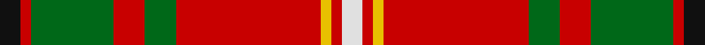

In pattern [KRGRGRYRW](/stripes/krgrgryrw/).

This was sourced from register-of-tartans.  It is a [9 stripe tartan](/stripes/stripes9/).

Original link https://www.tartanregister.gov.uk/tartanDetails.aspx?ref=2912

## Also known as

This cloth is also recorded under:

- Melieres, Michel

## Attestations

This cloth appears in 4 source records; the oldest owns this page.

- 01/01/1966 — Melieres, Michel (Personal) (register-of-tartans, [record](https://www.tartanregister.gov.uk/tartanDetails.aspx?ref=2912))
- 1966 — Melieres, Michel (Personal) (tartans-authority, [record](http://www.tartansauthority.com/tartan-ferret/display/1168/))
- undated — Melieres Michel.. (weddslist, [record](http://www.weddslist.com/cgi-bin/tartans/pg.pl?source=sts))
- undated — Melieres Michel.. Tartan Tartan Number: 1168. Earliest known date: 1966 tba See products available Copyright © Blair Urquhart, Comrie, 2015 (house-of-tartan, [record](http://www.house-of-tartan.scotland.net/house/TartanViewjs.asp?colr=Def&tnam=1168))

## Register references

External register numbers recorded for this tartan.

- Scottish Register of Tartans: [2912](https://www.tartanregister.gov.uk/tartanDetails.aspx?ref=2912)
- Scottish Tartans Authority (ITI): 1168
- Scottish Tartans World Register: 1168

## Thread count
K/4 R2 G16 R6 G6 R28 Y2 R2 LN/4

## Palette
Each colour and the base-6 reference it is a variant of.

| Colour | Shade | Base |
|---|---|---|
| G | <code style="background-color:#006818;">#006818</code> `oklch(45.0% 0.142 145.0)` <small>#006818</small> | G <code style="background-color:#006100;">#006100</code> |
| K | <code style="background-color:#101010;">#101010</code> `oklch(17.3% 0.000 89.9)` <small>#101010</small> | K <code style="background-color:#000000;">#000000</code> |
| LN | <code style="background-color:#E0E0E0;">#E0E0E0</code> `oklch(90.7% 0.000 89.9)` <small>#E0E0E0</small> | W <code style="background-color:#F7F7F7;">#F7F7F7</code> |
| R | <code style="background-color:#C80000;">#C80000</code> `oklch(52.3% 0.215 29.2)` <small>#C80000</small> | R <code style="background-color:#CC0000;">#CC0000</code> |
| Y | <code style="background-color:#E8C000;">#E8C000</code> `oklch(81.9% 0.168 93.7)` <small>#E8C000</small> | Y <code style="background-color:#F2BF00;">#F2BF00</code> |

## Nearest tartans

The nearest existing variants by ΔTartan distance.

1. [Seton (Clan)](/setts/s10/g3w1g6r2dp2r1k2r10g1r2~x8/) — ΔT 0.92
1. [MacDuff](/setts/s7/r96db16dg34g48r18k6r9/) — ΔT 0.98
1. [West Virginia Old Shawl](/setts/s11/ly1g1db2r2g2r12t2g1r2g1ly1~x4/) — ΔT 1.00
1. [Chisholm](/setts/s10/r6w1r24db6g2k1g2k1g12r1~x2/) — ΔT 1.02
1. [Loch Creran (District)](/setts/s11/r6dg8ly2dg8r6dt8r29dg3lb2r5dt3~x2/) — ΔT 1.05
1. [Hay](/setts/s14/r6dg4ly2dg17r2dg2r2dg8r26dg6r4k2r4w6~x2/) — ΔT 1.06
1. [Scott Red Clan Tartan Tartan Number: 4. Earliest known date: 1930-50 The Red Scott tartan is the sett most often seen today. The earliest recording appears to come from a sample in the MacKinlay collection at the Scottish Tartans Society. Sir Walter Scott, despite his assertion that Lowlanders never wore plaids, was largely responsible for the wide spread introduction of tartans to the Lowland families. There is also a Green Scott tartan. See products available Copyright © Blair Urquhart, Comrie, 2015](/setts/s10/r4g4w3g4r4g14r28k2r2g3~x2/) — ΔT 1.08
1. [MacDuff](/setts/s7/r96db16dg34dg48r18k6r9/) — ΔT 1.09
1. [Loch Lochy (District)](/setts/s8/r6g14r6db12r31lb2r4ly3~x2/) — ΔT 1.11
1. [Antrim County Crest (Fashion)](/setts/s9/g4ly9g3db4g3w3r32g4ly3~x2/) — ΔT 1.12

## Neighbour map

Every grey dot is one of 14299 variants placed by the first two principal components of the ΔTartan feature space (44% of its variance). Red is this tartan; blue dots are its nearest — click one to open its page.

<svg viewBox="0 0 640 380" role="img" style="max-width:100%;height:auto;border:1px solid #e0e0e0;border-radius:4px;display:block" xmlns="http://www.w3.org/2000/svg"><image href="/nn/cloud.v1.png" width="640" height="380"/><a href="/setts/s10/g3w1g6r2dp2r1k2r10g1r2~x8/"><circle cx="253.0" cy="156.0" r="4" fill="#3465a4"><title>Seton (Clan)</title></circle></a><a href="/setts/s7/r96db16dg34g48r18k6r9/"><circle cx="293.7" cy="159.4" r="4" fill="#3465a4"><title>MacDuff</title></circle></a><a href="/setts/s11/ly1g1db2r2g2r12t2g1r2g1ly1~x4/"><circle cx="326.7" cy="120.4" r="4" fill="#3465a4"><title>West Virginia Old Shawl</title></circle></a><a href="/setts/s10/r6w1r24db6g2k1g2k1g12r1~x2/"><circle cx="335.6" cy="104.4" r="4" fill="#3465a4"><title>Chisholm</title></circle></a><a href="/setts/s11/r6dg8ly2dg8r6dt8r29dg3lb2r5dt3~x2/"><circle cx="317.3" cy="136.1" r="4" fill="#3465a4"><title>Loch Creran (District)</title></circle></a><a href="/setts/s14/r6dg4ly2dg17r2dg2r2dg8r26dg6r4k2r4w6~x2/"><circle cx="272.8" cy="127.1" r="4" fill="#3465a4"><title>Hay</title></circle></a><a href="/setts/s10/r4g4w3g4r4g14r28k2r2g3~x2/"><circle cx="353.9" cy="147.9" r="4" fill="#3465a4"><title>Scott Red Clan Tartan Tartan Number: 4. Earliest known date: 1930-50 The Red Scott tartan is the sett most often seen today. The earliest recording appears to come from a sample in the MacKinlay collection at the Scottish Tartans Society. Sir Walter Scott, despite his assertion that Lowlanders never wore plaids, was largely responsible for the wide spread introduction of tartans to the Lowland families. There is also a Green Scott tartan. See products available Copyright © Blair Urquhart, Comrie, 2015</title></circle></a><a href="/setts/s7/r96db16dg34dg48r18k6r9/"><circle cx="294.1" cy="155.8" r="4" fill="#3465a4"><title>MacDuff</title></circle></a><a href="/setts/s8/r6g14r6db12r31lb2r4ly3~x2/"><circle cx="334.9" cy="149.1" r="4" fill="#3465a4"><title>Loch Lochy (District)</title></circle></a><a href="/setts/s9/g4ly9g3db4g3w3r32g4ly3~x2/"><circle cx="250.0" cy="124.6" r="4" fill="#3465a4"><title>Antrim County Crest (Fashion)</title></circle></a><circle cx="300.1" cy="135.2" r="5" fill="#c00000"/></svg>

ID: /setts/s9/k2r1g8r3g3r14ly1r1w2~x2/
