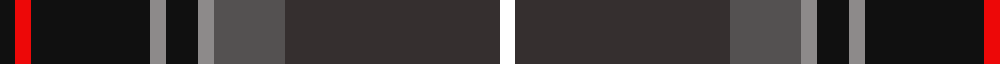

This page is one **sett** — a single exact thread-count. It belongs to the [tartan](/tartans/k2r2k15o2k4o2n9do27w2/)
(the same proportion at any scale), whose colour order is pattern [KRKRKRBBW](/stripes/krkrkrbbw/).

Sourced from register-of-tartans.  It is a [9 stripe tartan](/stripes/stripes9/).

Original link https://www.tartanregister.gov.uk/tartanDetails.aspx?ref=10833

## Register references

External register numbers recorded for this tartan.

- Scottish Register of Tartans: [10833](https://www.tartanregister.gov.uk/tartanDetails.aspx?ref=10833)

## Thread count
K/4 R4 K30 Na4 K8 Na4 N18 DN54 W/4

## Palette

Palette: <strong>Tartan Register</strong> <small style="color:#888">(2 of 6 colours)</small>
<table><thead><tr><th>Colour</th><th>Threads</th><th>Shade</th><th>Base</th><th>OKLCh</th></tr></thead><tbody><tr><td>K/</td><td style="text-align:right;font-variant-numeric:tabular-nums">4</td><td><code style="background-color:#101010;">#101010</code> <small style="color:#888">#101010</small></td><td>K <code style="background-color:#000000;">#000000</code></td><td><small style="color:#888">oklch(17.3% 0.000 89.9)</small></td></tr><tr><td>R</td><td style="text-align:right;font-variant-numeric:tabular-nums">4</td><td><code style="background-color:#ED0808;">#ED0808</code> <small style="color:#888">#ED0808</small></td><td>R <code style="background-color:#CC0000;">#CC0000</code></td><td><small style="color:#888">oklch(59.6% 0.242 29.0)</small></td></tr><tr><td>K</td><td style="text-align:right;font-variant-numeric:tabular-nums">30</td><td><code style="background-color:#101010;">#101010</code> <small style="color:#888">#101010</small></td><td>K <code style="background-color:#000000;">#000000</code></td><td><small style="color:#888">oklch(17.3% 0.000 89.9)</small></td></tr><tr><td>Na</td><td style="text-align:right;font-variant-numeric:tabular-nums">4</td><td><code style="background-color:#8D8A8A;">#8D8A8A</code> <small style="color:#888">#8D8A8A</small></td><td>R <code style="background-color:#CC0000;">#CC0000</code></td><td><small style="color:#888">oklch(63.6% 0.004 17.3)</small></td></tr><tr><td>K</td><td style="text-align:right;font-variant-numeric:tabular-nums">8</td><td><code style="background-color:#101010;">#101010</code> <small style="color:#888">#101010</small></td><td>K <code style="background-color:#000000;">#000000</code></td><td><small style="color:#888">oklch(17.3% 0.000 89.9)</small></td></tr><tr><td>Na</td><td style="text-align:right;font-variant-numeric:tabular-nums">4</td><td><code style="background-color:#8D8A8A;">#8D8A8A</code> <small style="color:#888">#8D8A8A</small></td><td>R <code style="background-color:#CC0000;">#CC0000</code></td><td><small style="color:#888">oklch(63.6% 0.004 17.3)</small></td></tr><tr><td>N</td><td style="text-align:right;font-variant-numeric:tabular-nums">18</td><td><code style="background-color:#545151;">#545151</code> <small style="color:#888">#545151</small></td><td>B <code style="background-color:#2A418A;">#2A418A</code></td><td><small style="color:#888">oklch(43.8% 0.004 17.3)</small></td></tr><tr><td>DN</td><td style="text-align:right;font-variant-numeric:tabular-nums">54</td><td><code style="background-color:#352F2F;">#352F2F</code> <small style="color:#888">#352F2F</small></td><td>B <code style="background-color:#2A418A;">#2A418A</code></td><td><small style="color:#888">oklch(31.2% 0.009 17.6)</small></td></tr><tr><td>W/</td><td style="text-align:right;font-variant-numeric:tabular-nums">4</td><td><code style="background-color:#FFFFFF;">#FFFFFF</code> <small style="color:#888">#FFFFFF</small></td><td>W <code style="background-color:#F7F7F7;">#F7F7F7</code></td><td><small style="color:#888">oklch(100.0% 0.000 89.9)</small></td></tr></tbody></table>

## Nearest tartans

The nearest existing variants by ΔTartan distance, with this tartan at the top so the swatches line up against it.

ΔTartan

Tartan

Sett

—

<a href="/ttd/edit/#slug=k2r2k15o2k4o2n9do27w2~x2">Real Mary King's Close, The</a> <a class="nn-out" href="/setts/s9/k2r2k15o2k4o2n9do27w2~x2/" title="open its dictionary page">↗</a>

0.77

<a href="/ttd/edit/#slug=db45r4k20lb3o9dr4o3dr9k11~x2">United Arrows House Check</a> <a class="nn-out" href="/setts/s9/db45r4k20lb3o9dr4o3dr9k11~x2/" title="open its dictionary page">↗</a>

0.87

<a href="/ttd/edit/#slug=n3dg3r2dg20k25k2n13k2n3r3~x2">Loch Freuchie District Tartan Tartan Number: 10725. Earliest known date: 25 October 2012 A tartan for the area around Loch Freuchie near Crieff. The tartan is based on the Murray of Atholl and Breadalbane setts, with differences, to relate the tartan to the particular Loch Freuchie area. Mr MacArthur-Fox has created a tartan for anyone to wear without fear of offending another person or group. See products available Copyright © Blair Urquhart, Comrie, 2015</a> <a class="nn-out" href="/setts/s10/n3dg3r2dg20k25k2n13k2n3r3~x2/" title="open its dictionary page">↗</a>

0.87

<a href="/ttd/edit/#slug=n3dg3r2dg20k25ly2n13k2n3r3~x2">Loch Freuchie</a> <a class="nn-out" href="/setts/s10/n3dg3r2dg20k25ly2n13k2n3r3~x2/" title="open its dictionary page">↗</a>

0.92

<a href="/ttd/edit/#slug=do4w1dg12k3db16r1db1r1~x2">Purves (2014)</a> <a class="nn-out" href="/setts/s8/do4w1dg12k3db16r1db1r1~x2/" title="open its dictionary page">↗</a>

0.98

<a href="/ttd/edit/#slug=db46ly4db4ly4db6k16n66lb11r6">Scottish Association for Neurological Sciences</a> <a class="nn-out" href="/setts/s9/db46ly4db4ly4db6k16n66lb11r6/" title="open its dictionary page">↗</a>

1.02

<a href="/ttd/edit/#slug=r2t6r1k14r1k14r1k6dg10lo1dg2lo2~x2">Ogg of Tarragann Hunting</a> <a class="nn-out" href="/setts/s12/r2t6r1k14r1k14r1k6dg10lo1dg2lo2~x2/" title="open its dictionary page">↗</a>

1.04

<a href="/ttd/edit/#slug=m5y2k30y26y2y2k4~x2">Milne-Murtagh (2009)</a> <a class="nn-out" href="/setts/s7/m5y2k30y26y2y2k4~x2/" title="open its dictionary page">↗</a>

1.05

<a href="/ttd/edit/#slug=dg28lb2dg3lo4dg3lb2dg3k14lg2db28lb3~x2">Wcwm 1290</a> <a class="nn-out" href="/setts/s11/dg28lb2dg3lo4dg3lb2dg3k14lg2db28lb3~x2/" title="open its dictionary page">↗</a>

1.10

<a href="/ttd/edit/#slug=n10r3n32y12k5y2k4y2k17o4k2lr2~x2">Scottish Spirit Fashion Tartan Tartan Number: 10970. Earliest known date: 2013 ACS Clothing. Designed by Lochcarron. Wanted 'Highland Spirit' but that was taken by Ian McLure of T J Matthews. See products available Copyright © Blair Urquhart, Comrie, 2015</a> <a class="nn-out" href="/setts/s12/n10r3n32y12k5y2k4y2k17o4k2lr2~x2/" title="open its dictionary page">↗</a>

1.10

<a href="/ttd/edit/#slug=t3k1lo2k1db10k17db2t1dy1r1~x2">Six Frigates (US)</a> <a class="nn-out" href="/setts/s10/t3k1lo2k1db10k17db2t1dy1r1~x2/" title="open its dictionary page">↗</a>

## Neighbour map

Every grey dot is one of 14299 variants placed by the first two principal components of the ΔTartan feature space (44% of its variance). Red is this tartan; blue dots are its nearest — click one to open its page.

<svg viewBox="0 0 640 380" role="img" style="max-width:100%;height:auto;border:1px solid #e0e0e0;border-radius:4px;display:block" xmlns="http://www.w3.org/2000/svg"><image href="/nn/cloud.v1.png" width="640" height="380"/><a href="/setts/s9/db45r4k20lb3o9dr4o3dr9k11~x2/"><circle cx="224.6" cy="147.0" r="4" fill="#3465a4"><title>United Arrows House Check</title></circle></a><a href="/setts/s10/n3dg3r2dg20k25k2n13k2n3r3~x2/"><circle cx="193.9" cy="156.7" r="4" fill="#3465a4"><title>Loch Freuchie District Tartan Tartan Number: 10725. Earliest known date: 25 October 2012 A tartan for the area around Loch Freuchie near Crieff. The tartan is based on the Murray of Atholl and Breadalbane setts, with differences, to relate the tartan to the particular Loch Freuchie area. Mr MacArthur-Fox has created a tartan for anyone to wear without fear of offending another person or group. See products available Copyright © Blair Urquhart, Comrie, 2015</title></circle></a><a href="/setts/s10/n3dg3r2dg20k25ly2n13k2n3r3~x2/"><circle cx="180.5" cy="148.6" r="4" fill="#3465a4"><title>Loch Freuchie</title></circle></a><a href="/setts/s8/do4w1dg12k3db16r1db1r1~x2/"><circle cx="256.1" cy="161.4" r="4" fill="#3465a4"><title>Purves (2014)</title></circle></a><a href="/setts/s9/db46ly4db4ly4db6k16n66lb11r6/"><circle cx="216.1" cy="127.9" r="4" fill="#3465a4"><title>Scottish Association for Neurological Sciences</title></circle></a><a href="/setts/s12/r2t6r1k14r1k14r1k6dg10lo1dg2lo2~x2/"><circle cx="228.6" cy="145.0" r="4" fill="#3465a4"><title>Ogg of Tarragann Hunting</title></circle></a><a href="/setts/s7/m5y2k30y26y2y2k4~x2/"><circle cx="243.5" cy="148.3" r="4" fill="#3465a4"><title>Milne-Murtagh (2009)</title></circle></a><a href="/setts/s11/dg28lb2dg3lo4dg3lb2dg3k14lg2db28lb3~x2/"><circle cx="204.4" cy="135.4" r="4" fill="#3465a4"><title>Wcwm 1290</title></circle></a><a href="/setts/s12/n10r3n32y12k5y2k4y2k17o4k2lr2~x2/"><circle cx="259.7" cy="143.1" r="4" fill="#3465a4"><title>Scottish Spirit Fashion Tartan Tartan Number: 10970. Earliest known date: 2013 ACS Clothing. Designed by Lochcarron. Wanted 'Highland Spirit' but that was taken by Ian McLure of T J Matthews. See products available Copyright © Blair Urquhart, Comrie, 2015</title></circle></a><a href="/setts/s10/t3k1lo2k1db10k17db2t1dy1r1~x2/"><circle cx="297.1" cy="137.2" r="4" fill="#3465a4"><title>Six Frigates (US)</title></circle></a><circle cx="229.5" cy="149.0" r="5" fill="#c00000"/></svg>

ID: /setts/s9/k2r2k15o2k4o2n9do27w2~x2/
