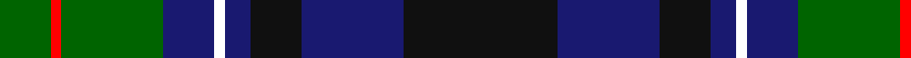

In pattern [GRGBWBKBK](/patterns/grgbwbkbk/).

This was sourced from register-of-tartans.  It is a [9 stripes tartan](/stripes/stripes9/).

Original link https://www.tartanregister.gov.uk/tartanDetails.aspx?ref=10152

## Register references

External register numbers recorded for this tartan.

- Scottish Register of Tartans: [10152](https://www.tartanregister.gov.uk/tartanDetails.aspx?ref=10152)

## Thread count
G/10 R2 G20 DB10 W2 DB5 K10 DB20 K/30

## Palette
Each colour and its ΔE from the base-6 reference it is a variant of.

| Colour | Shade | Base | ΔE (OKLab) |
|---|---|---|---|
| DB | <code style="background-color:#191970;">#191970</code> `#191970` | B <code style="background-color:#2A418A;">#2A418A</code> | 0.11 |
| G | <code style="background-color:#006400;">#006400</code> `#006400` | G <code style="background-color:#006100;">#006100</code> | 0.01 |
| K | <code style="background-color:#101010;">#101010</code> `#101010` | K <code style="background-color:#000000;">#000000</code> | 0.17 |
| R | <code style="background-color:#FF0000;">#FF0000</code> `#FF0000` | R <code style="background-color:#CC0000;">#CC0000</code> | 0.11 |
| W | <code style="background-color:#FFFFFF;">#FFFFFF</code> `#FFFFFF` | W <code style="background-color:#F7F7F7;">#F7F7F7</code> | 0.02 |

## Nearest tartans

The nearest existing variants by ΔTartan distance.

1. [Smith (Sir William)](/setts/s10/b18k20g20k1ka3k1g20k20b18ba3~b2c2c80-ba5c8ca8-g006818-k101010-ka000000~x2/) — ΔT 0.74
1. [Paterson (Dalgleish Version)](/setts/s12/y3k1g5ga2g5k12b15k2b15k12g12ga2~b2c2c80-g006818-ga808080-k101010-ye8c000~x2/) — ΔT 0.74
1. [Newman](/setts/s11/b10k10b10r2k20w1g10r2g4r2g4~b1c0070-g006818-k101010-r880000-wfcfcfc~x2/) — ΔT 0.81
1. [MacCaskill Family Tartan Tartan Number: 1152. Earliest known date: 1951 Miss M.MacDougal of the Inverness Museum wrote (7th September 1951) :- ''Herewith pattern of the MacAskill which Messrs Pringle made at the request of an old man of this name. As you can see it is a variant of the MacLeod...?" . . . wherein the colors of stripes and their guards are reversed. Designed for a farmer - Kenneth MacAskill, Milton of Leys. See products available Copyright © Blair Urquhart, Comrie, 2015](/setts/s7/k2r1g15k15b15y1k2~b2c2c80-g006818-k101010-rc80000-ye8c000~x2/) — ΔT 0.87
1. [Cailleach (Fashion)](/setts/s9/k30b20k10b5w2b10g20r2g10~b3c505c-g007440-k101010-rc80000-we0e0e0/) — ΔT 0.88
1. [Robertson Hunting Clan Tartan Tartan Number: 334. Earliest known date: pre 2003 This sample comes from the MacGregor-Hastie collection which forms the basis of the cloth archive of the Scottish Tartans Society. Some of the samples, including this one, were unmarked. One can assume that the sample dates between 1930 and 1950. See products available Copyright © Blair Urquhart, Comrie, 2015](/setts/s10/b18k10g9k2r2k2g9k10b9w2~b2c2c80-g006818-k101010-rc80000-we0e0e0~x2/) — ΔT 0.90
1. [MacMillan Hunting](/setts/s10/b3y1b12k4y2k4g8r2g8r1~b000052-g11450d-k000000-raa0000-yaaaa00~x2/) — ΔT 0.91
1. [Spar (UK) Ltd Corporate Tartan Tartan Number: 2353. Earliest known date: December 1996 Spar is a UK based grocery chain and this tartan was designed for their 1997 conference in Scotland. The tartan was launched at a dinner at Blair Castle in Perthshire on 6th May 1997. See products available Copyright © Blair Urquhart, Comrie, 2015](/setts/s12/b20k2b4k2b20k17g18r2g4w2g18k18~b1c0070-g006818-k101010-r880000-wc0c0c0~x2/) — ΔT 0.92
1. [Lochcarron District Tartan Tartan Number: 731. Earliest known date: pre 2003 Nothing See products available Copyright © Blair Urquhart, Comrie, 2015](/setts/s13/g5b25k19g23k2w2k5w2k2g23k19b30r5~b2c2c80-g006818-k101010-rc80000-we0e0e0~x2/) — ΔT 0.93
1. [Loch Carron](/setts/s13/g5b25k19g23k2w2k5w2k2g23k19b30r5~b2c2c80-g006818-k101010-rc80000-wfcfcfc~x2/) — ΔT 0.95

## Neighbour map

Every grey dot is one of 15726 variants placed by the first two principal components of the ΔTartan feature space (44% of its variance). Red is this tartan; blue dots are its nearest — click one to open its page.

<svg viewBox="0 0 640 380" role="img" style="max-width:100%;height:auto;border:1px solid #e0e0e0;border-radius:4px;display:block" xmlns="http://www.w3.org/2000/svg"><image href="/nn/cloud.v1.png" width="640" height="380"/><a href="/setts/s10/b18k20g20k1ka3k1g20k20b18ba3~b2c2c80-ba5c8ca8-g006818-k101010-ka000000~x2/"><circle cx="194.5" cy="180.1" r="4" fill="#3465a4"><title>Smith (Sir William)</title></circle></a><a href="/setts/s12/y3k1g5ga2g5k12b15k2b15k12g12ga2~b2c2c80-g006818-ga808080-k101010-ye8c000~x2/"><circle cx="169.7" cy="169.4" r="4" fill="#3465a4"><title>Paterson (Dalgleish Version)</title></circle></a><a href="/setts/s11/b10k10b10r2k20w1g10r2g4r2g4~b1c0070-g006818-k101010-r880000-wfcfcfc~x2/"><circle cx="215.5" cy="161.4" r="4" fill="#3465a4"><title>Newman</title></circle></a><a href="/setts/s7/k2r1g15k15b15y1k2~b2c2c80-g006818-k101010-rc80000-ye8c000~x2/"><circle cx="219.2" cy="182.3" r="4" fill="#3465a4"><title>MacCaskill Family Tartan Tartan Number: 1152. Earliest known date: 1951 Miss M.MacDougal of the Inverness Museum wrote (7th September 1951) :- ''Herewith pattern of the MacAskill which Messrs Pringle made at the request of an old man of this name. As you can see it is a variant of the MacLeod...?&quot; . . . wherein the colors of stripes and their guards are reversed. Designed for a farmer - Kenneth MacAskill, Milton of Leys. See products available Copyright © Blair Urquhart, Comrie, 2015</title></circle></a><a href="/setts/s9/k30b20k10b5w2b10g20r2g10~b3c505c-g007440-k101010-rc80000-we0e0e0/"><circle cx="203.9" cy="188.9" r="4" fill="#3465a4"><title>Cailleach (Fashion)</title></circle></a><a href="/setts/s10/b18k10g9k2r2k2g9k10b9w2~b2c2c80-g006818-k101010-rc80000-we0e0e0~x2/"><circle cx="165.1" cy="201.8" r="4" fill="#3465a4"><title>Robertson Hunting Clan Tartan Tartan Number: 334. Earliest known date: pre 2003 This sample comes from the MacGregor-Hastie collection which forms the basis of the cloth archive of the Scottish Tartans Society. Some of the samples, including this one, were unmarked. One can assume that the sample dates between 1930 and 1950. See products available Copyright © Blair Urquhart, Comrie, 2015</title></circle></a><a href="/setts/s10/b3y1b12k4y2k4g8r2g8r1~b000052-g11450d-k000000-raa0000-yaaaa00~x2/"><circle cx="152.5" cy="179.4" r="4" fill="#3465a4"><title>MacMillan Hunting</title></circle></a><a href="/setts/s12/b20k2b4k2b20k17g18r2g4w2g18k18~b1c0070-g006818-k101010-r880000-wc0c0c0~x2/"><circle cx="172.7" cy="189.2" r="4" fill="#3465a4"><title>Spar (UK) Ltd Corporate Tartan Tartan Number: 2353. Earliest known date: December 1996 Spar is a UK based grocery chain and this tartan was designed for their 1997 conference in Scotland. The tartan was launched at a dinner at Blair Castle in Perthshire on 6th May 1997. See products available Copyright © Blair Urquhart, Comrie, 2015</title></circle></a><a href="/setts/s13/g5b25k19g23k2w2k5w2k2g23k19b30r5~b2c2c80-g006818-k101010-rc80000-we0e0e0~x2/"><circle cx="177.3" cy="159.0" r="4" fill="#3465a4"><title>Lochcarron District Tartan Tartan Number: 731. Earliest known date: pre 2003 Nothing See products available Copyright © Blair Urquhart, Comrie, 2015</title></circle></a><a href="/setts/s13/g5b25k19g23k2w2k5w2k2g23k19b30r5~b2c2c80-g006818-k101010-rc80000-wfcfcfc~x2/"><circle cx="173.1" cy="157.2" r="4" fill="#3465a4"><title>Loch Carron</title></circle></a><circle cx="192.4" cy="186.5" r="5" fill="#c00000"/></svg>

ID: /setts/s9/k30b20k10b5w2b10g20r2g10~b191970-g006400-k101010-rff0000-wffffff/
