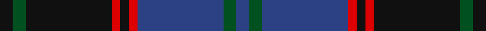

In pattern [BGBRKRKGK](/stripes/bgbrkrkgk/).

This was sourced from register-of-tartans.  It is a [9 stripe tartan](/stripes/stripes9/).

Original link https://www.tartanregister.gov.uk/tartanDetails.aspx?ref=1783

## Also known as

This cloth is also recorded under:

- Hume, or Home

## Register references

External register numbers recorded for this tartan.

- Scottish Register of Tartans: [1783](https://www.tartanregister.gov.uk/tartanDetails.aspx?ref=1783)
- Scottish Tartans World Register: 125

## Thread count
K/6 G6 K40 R4 K4 R4 B40 G6 B/6

## Palette
Each colour and the base-6 reference it is a variant of.

| Colour | Shade | Base |
|---|---|---|
| B | <code style="background-color:#2C4084;">#2C4084</code> `oklch(39.4% 0.117 268.3)` <small>#2C4084</small> | B <code style="background-color:#2A418A;">#2A418A</code> |
| G | <code style="background-color:#005020;">#005020</code> `oklch(37.7% 0.105 149.6)` <small>#005020</small> | G <code style="background-color:#006100;">#006100</code> |
| K | <code style="background-color:#101010;">#101010</code> `oklch(17.3% 0.000 89.9)` <small>#101010</small> | K <code style="background-color:#000000;">#000000</code> |
| R | <code style="background-color:#DC0000;">#DC0000</code> `oklch(56.2% 0.230 29.2)` <small>#DC0000</small> | R <code style="background-color:#CC0000;">#CC0000</code> |

## Nearest tartans

The nearest existing variants by ΔTartan distance.

1. [MacHarg, Iain](/setts/s9/g20k2g2k2g2k8db24dp3db3~x2/) — ΔT 0.89
1. [Chinzei Keiai Junior High School](/setts/s9/n3dp3k16n2o2n16k3n2o2~x2/) — ΔT 0.99
1. [Chinzei Keiai Junior High School](/setts/s9/n3lp3k16n2k2n16k3n2n2~x2/) — ΔT 1.01
1. [Durie](/setts/s9/k12r1k1r1k1r4dg12ly1dg2~x4/) — ΔT 1.03
1. [Gammell Family Tartan Tartan Number: 597. Earliest known date: 1965 Designed (probably by David Thomas and Arthur Mackie of Strathmore Woollen Co) for the Hill family of Angus as a personal tartan. Tommy Gemmell (6.3.05) said "The tartan was designed using the largest Government sett by Mrs Hill's mother - a Mrs Gammell - who was a handweaver." See products available Copyright © Blair Urquhart, Comrie, 2015](/setts/s8/db32do3db3do3db3do10g24r3~x2/) — ΔT 1.04
1. [Auld Lang Syne Burns Commemorative Tartan Tartan Number: 2400. Earliest known date: 01/01/2002 Launched on the 25th January at a the Beach Ballroom Aberdeen, to celebrate the birth of Robert Burns 2002./Threadcount and colours aren't 100% original. Generated manually./ See products available Copyright © Blair Urquhart, Comrie, 2015](/setts/s8/k1n1k1n8dy8k1dy1lt1~x6/) — ΔT 1.08
1. [Lamont](/setts/s8/db10k1db1k1db2k8dg10w1~x4/) — ΔT 1.09
1. [Chinzei Keiai Senior High School](/setts/s9/n3o3k16n2k2n16k3n2lr2~x2/) — ΔT 1.10
1. [Christian Dewar (Personal)](/setts/s9/db16k2db2k2db2k6dg13ly2dg3~x2/) — ΔT 1.11
1. [Caledonian Hotel (Corporate)](/setts/s8/n9db1n1db1n1db7k7r2~x4/) — ΔT 1.11

## Neighbour map

Every grey dot is one of 14299 variants placed by the first two principal components of the ΔTartan feature space (44% of its variance). Red is this tartan; blue dots are its nearest — click one to open its page.

<svg viewBox="0 0 640 380" role="img" style="max-width:100%;height:auto;border:1px solid #e0e0e0;border-radius:4px;display:block" xmlns="http://www.w3.org/2000/svg"><image href="/nn/cloud.v1.png" width="640" height="380"/><a href="/setts/s9/g20k2g2k2g2k8db24dp3db3~x2/"><circle cx="273.5" cy="195.7" r="4" fill="#3465a4"><title>MacHarg, Iain</title></circle></a><a href="/setts/s9/n3dp3k16n2o2n16k3n2o2~x2/"><circle cx="285.9" cy="203.7" r="4" fill="#3465a4"><title>Chinzei Keiai Junior High School</title></circle></a><a href="/setts/s9/n3lp3k16n2k2n16k3n2n2~x2/"><circle cx="297.2" cy="207.1" r="4" fill="#3465a4"><title>Chinzei Keiai Junior High School</title></circle></a><a href="/setts/s9/k12r1k1r1k1r4dg12ly1dg2~x4/"><circle cx="275.8" cy="192.3" r="4" fill="#3465a4"><title>Durie</title></circle></a><a href="/setts/s8/db32do3db3do3db3do10g24r3~x2/"><circle cx="315.5" cy="216.8" r="4" fill="#3465a4"><title>Gammell Family Tartan Tartan Number: 597. Earliest known date: 1965 Designed (probably by David Thomas and Arthur Mackie of Strathmore Woollen Co) for the Hill family of Angus as a personal tartan. Tommy Gemmell (6.3.05) said &quot;The tartan was designed using the largest Government sett by Mrs Hill's mother - a Mrs Gammell - who was a handweaver.&quot; See products available Copyright © Blair Urquhart, Comrie, 2015</title></circle></a><a href="/setts/s8/k1n1k1n8dy8k1dy1lt1~x6/"><circle cx="255.4" cy="205.3" r="4" fill="#3465a4"><title>Auld Lang Syne Burns Commemorative Tartan Tartan Number: 2400. Earliest known date: 01/01/2002 Launched on the 25th January at a the Beach Ballroom Aberdeen, to celebrate the birth of Robert Burns 2002./Threadcount and colours aren't 100% original. Generated manually./ See products available Copyright © Blair Urquhart, Comrie, 2015</title></circle></a><a href="/setts/s8/db10k1db1k1db2k8dg10w1~x4/"><circle cx="244.0" cy="219.3" r="4" fill="#3465a4"><title>Lamont</title></circle></a><a href="/setts/s9/n3o3k16n2k2n16k3n2lr2~x2/"><circle cx="295.3" cy="206.4" r="4" fill="#3465a4"><title>Chinzei Keiai Senior High School</title></circle></a><a href="/setts/s9/db16k2db2k2db2k6dg13ly2dg3~x2/"><circle cx="272.9" cy="232.2" r="4" fill="#3465a4"><title>Christian Dewar (Personal)</title></circle></a><a href="/setts/s8/n9db1n1db1n1db7k7r2~x4/"><circle cx="239.8" cy="224.7" r="4" fill="#3465a4"><title>Caledonian Hotel (Corporate)</title></circle></a><circle cx="288.7" cy="199.9" r="5" fill="#c00000"/></svg>

ID: /setts/s9/k3dg3k20r2k2r2db20dg3db3~x2/
