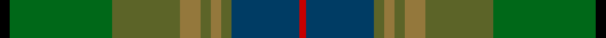

This page is one **sett** — a single exact thread-count. It belongs to the [tartan](/tartans/k3ga30gb20lt6gb3lt3gb3db20r2/)
(the same proportion at any scale), whose colour order is pattern [KGGRGRGBR](/stripes/kggrgrgbr/).

Sourced from tartans-authority.  It is a [9 stripe tartan](/stripes/stripes9/).

Original link http://www.tartansauthority.com/tartan-ferret/display/7263/

## Thread count
K/6 Ga60 Gb40 LT12 Gb6 LT6 Gb6 DB40 R/4

## Palette
Each colour and the base-6 reference it is a variant of.

| Colour | Shade | Base |
|---|---|---|
| DB | <code style="background-color:#003C64;">#003C64</code> `oklch(34.5% 0.089 246.0)` <small>#003C64</small> | B <code style="background-color:#2A418A;">#2A418A</code> |
| G | <code style="background-color:#408060;">#408060</code> `oklch(54.8% 0.084 160.1)` <small>#408060</small> | G <code style="background-color:#006100;">#006100</code> |
| Ga | <code style="background-color:#006818;">#006818</code> `oklch(45.0% 0.142 145.0)` <small>#006818</small> | G <code style="background-color:#006100;">#006100</code> |
| Gb | <code style="background-color:#5C6428;">#5C6428</code> `oklch(48.3% 0.084 116.0)` <small>#5C6428</small> | G <code style="background-color:#006100;">#006100</code> |
| K | <code style="background-color:#000000;">#000000</code> `oklch(0.0% 0.000 0.0)` <small>#000000</small> | K <code style="background-color:#000000;">#000000</code> |
| LT | <code style="background-color:#94783C;">#94783C</code> `oklch(58.7% 0.086 84.5)` <small>#94783C</small> | R <code style="background-color:#CC0000;">#CC0000</code> |
| R | <code style="background-color:#C80000;">#C80000</code> `oklch(52.3% 0.215 29.2)` <small>#C80000</small> | R <code style="background-color:#CC0000;">#CC0000</code> |

## Nearest tartans

The nearest existing variants by ΔTartan distance, with this tartan at the top so the swatches line up against it.

ΔTartan

Tartan

Sett

—

<a href="/ttd/edit/#slug=k3g30y20o6y3o3y3dt20r2~x2">Glens of Corbie (Corporate)</a> <a class="nn-out" href="/setts/s9/k3g30y20o6y3o3y3dt20r2~x2/" title="open its dictionary page">↗</a>

0.91

<a href="/ttd/edit/#slug=lo3g30y20o6y3o3y3dt20r2~x2">Glens of Corbie</a> <a class="nn-out" href="/setts/s9/lo3g30y20o6y3o3y3dt20r2~x2/" title="open its dictionary page">↗</a>

1.39

<a href="/ttd/edit/#slug=r4g46r10db10dy33db5dy4lo3~x2">State Seal of Minnesota (Fashion)</a> <a class="nn-out" href="/setts/s8/r4g46r10db10dy33db5dy4lo3~x2/" title="open its dictionary page">↗</a>

1.45

<a href="/ttd/edit/#slug=dt4k9g20dp2dg20k5dt6lb2~x2">Linden</a> <a class="nn-out" href="/setts/s8/dt4k9g20dp2dg20k5dt6lb2~x2/" title="open its dictionary page">↗</a>

1.50

<a href="/ttd/edit/#slug=m8k2y10dp30y30g55k4o6">Aberuchill District Tartan Tartan Number: 6814. Earliest known date: 2005 Aberuchill lends it name to the area south of Comrie where the river Ruchil meets the river Earn. The two rivers form the boundaries of the Aberuchill Estate for which this tartan was created. See products available Copyright © Blair Urquhart, Comrie, 2015</a> <a class="nn-out" href="/setts/s8/m8k2y10dp30y30g55k4o6/" title="open its dictionary page">↗</a>

1.51

<a href="/ttd/edit/#slug=do31lo6lr3db36do8dg60lo7t7~x2">Little-Dowse Wedding</a> <a class="nn-out" href="/setts/s8/do31lo6lr3db36do8dg60lo7t7~x2/" title="open its dictionary page">↗</a>

1.53

<a href="/ttd/edit/#slug=t27dt2t2dt16g5r5lo2dt2dy14dt2~x2">Lyon, Jeffrey M (Hunting) (Personal)</a> <a class="nn-out" href="/setts/s10/t27dt2t2dt16g5r5lo2dt2dy14dt2~x2/" title="open its dictionary page">↗</a>

1.55

<a href="/ttd/edit/#slug=g7lo2g5dg37db6r16db5b2~x2">Telfer Green</a> <a class="nn-out" href="/setts/s8/g7lo2g5dg37db6r16db5b2~x2/" title="open its dictionary page">↗</a>

1.56

<a href="/ttd/edit/#slug=r2dy1dg9y1dy2y6g2y1~x4">Tomass</a> <a class="nn-out" href="/setts/s8/r2dy1dg9y1dy2y6g2y1~x4/" title="open its dictionary page">↗</a>

1.61

<a href="/ttd/edit/#slug=g20g6dg15dt5dg2dt15o4dt10r2~x2">Copar a'Beannichte (Personal)</a> <a class="nn-out" href="/setts/s9/g20g6dg15dt5dg2dt15o4dt10r2~x2/" title="open its dictionary page">↗</a>

1.65

<a href="/ttd/edit/#slug=dy20dp2dy2dp2dy3dp8dg9g8y8dg1lr2~x2">Isle of Skye District Tartan Tartan Number: 2155. Earliest known date: 1993 The tartan was instigated and registered by Mrs Rosemary Nicolson Samios in 1992, an Australian of Skye descent, now living in Skye. It was selected through a worldwide competition won by Angus MacLeod from Lewis. Angus, a weaver by trade, produced the first commercial quantities in the traditional kilt weight in 1993 at Lochcarron Weavers in North Strome. The colours of the tartan depict those of the island, often called the 'Misty Isle'. Worn by the Torphican and Bathgate pipe band. (A patented design No. 0600930) See products available Copyright © Blair Urquhart, Comrie, 2015</a> <a class="nn-out" href="/setts/s11/dy20dp2dy2dp2dy3dp8dg9g8y8dg1lr2~x2/" title="open its dictionary page">↗</a>

## Neighbour map

Every grey dot is one of 14299 variants placed by the first two principal components of the ΔTartan feature space (44% of its variance). Red is this tartan; blue dots are its nearest — click one to open its page.

<svg viewBox="0 0 640 380" role="img" style="max-width:100%;height:auto;border:1px solid #e0e0e0;border-radius:4px;display:block" xmlns="http://www.w3.org/2000/svg"><image href="/nn/cloud.v1.png" width="640" height="380"/><a href="/setts/s9/lo3g30y20o6y3o3y3dt20r2~x2/"><circle cx="238.1" cy="190.0" r="4" fill="#3465a4"><title>Glens of Corbie</title></circle></a><a href="/setts/s8/r4g46r10db10dy33db5dy4lo3~x2/"><circle cx="289.3" cy="195.0" r="4" fill="#3465a4"><title>State Seal of Minnesota (Fashion)</title></circle></a><a href="/setts/s8/dt4k9g20dp2dg20k5dt6lb2~x2/"><circle cx="159.2" cy="208.7" r="4" fill="#3465a4"><title>Linden</title></circle></a><a href="/setts/s8/m8k2y10dp30y30g55k4o6/"><circle cx="243.5" cy="151.0" r="4" fill="#3465a4"><title>Aberuchill District Tartan Tartan Number: 6814. Earliest known date: 2005 Aberuchill lends it name to the area south of Comrie where the river Ruchil meets the river Earn. The two rivers form the boundaries of the Aberuchill Estate for which this tartan was created. See products available Copyright © Blair Urquhart, Comrie, 2015</title></circle></a><a href="/setts/s8/do31lo6lr3db36do8dg60lo7t7~x2/"><circle cx="254.0" cy="176.9" r="4" fill="#3465a4"><title>Little-Dowse Wedding</title></circle></a><a href="/setts/s10/t27dt2t2dt16g5r5lo2dt2dy14dt2~x2/"><circle cx="219.3" cy="157.4" r="4" fill="#3465a4"><title>Lyon, Jeffrey M (Hunting) (Personal)</title></circle></a><a href="/setts/s8/g7lo2g5dg37db6r16db5b2~x2/"><circle cx="285.3" cy="163.1" r="4" fill="#3465a4"><title>Telfer Green</title></circle></a><a href="/setts/s8/r2dy1dg9y1dy2y6g2y1~x4/"><circle cx="234.2" cy="220.5" r="4" fill="#3465a4"><title>Tomass</title></circle></a><a href="/setts/s9/g20g6dg15dt5dg2dt15o4dt10r2~x2/"><circle cx="192.0" cy="219.5" r="4" fill="#3465a4"><title>Copar a'Beannichte (Personal)</title></circle></a><a href="/setts/s11/dy20dp2dy2dp2dy3dp8dg9g8y8dg1lr2~x2/"><circle cx="227.8" cy="154.9" r="4" fill="#3465a4"><title>Isle of Skye District Tartan Tartan Number: 2155. Earliest known date: 1993 The tartan was instigated and registered by Mrs Rosemary Nicolson Samios in 1992, an Australian of Skye descent, now living in Skye. It was selected through a worldwide competition won by Angus MacLeod from Lewis. Angus, a weaver by trade, produced the first commercial quantities in the traditional kilt weight in 1993 at Lochcarron Weavers in North Strome. The colours of the tartan depict those of the island, often called the 'Misty Isle'. Worn by the Torphican and Bathgate pipe band. (A patented design No. 0600930) See products available Copyright © Blair Urquhart, Comrie, 2015</title></circle></a><circle cx="214.4" cy="178.5" r="5" fill="#c00000"/></svg>

ID: /setts/s9/k3g30y20o6y3o3y3dt20r2~x2/
