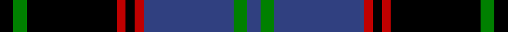

In pattern [BGBRKRKGK](/stripes/bgbrkrkgk/).

This was sourced from weddslist.  It is a [9 stripe tartan](/stripes/stripes9/).

Original link http://www.weddslist.com/cgi-bin/tartans/pg.pl?source=sts

## Also known as

This cloth is also recorded under:

- Hume, or Home

## Attestations

This cloth appears in 2 source records; the oldest owns this page.

- undated — Hume, or Home (weddslist, [record](http://www.weddslist.com/cgi-bin/tartans/pg.pl?source=sts))
- undated — Hume or Home Clan Tartan Tartan Number: 125. Earliest known date: pre 2003 Alternate spelling for Home. See products available Copyright © Blair Urquhart, Comrie, 2015 (house-of-tartan, [record](http://www.house-of-tartan.scotland.net/house/TartanViewjs.asp?colr=Def&tnam=125))

## Thread count
K/6 G6 K40 R4 K4 R4 B40 G6 B/6

## Palette
Each colour and the base-6 reference it is a variant of.

| Colour | Shade | Base |
|---|---|---|
| B | <code style="background-color:#304080;">#304080</code> `oklch(39.4% 0.109 270.2)` <small>#304080</small> | B <code style="background-color:#2A418A;">#2A418A</code> |
| G | <code style="background-color:#008000;">#008000</code> `oklch(52.0% 0.177 142.5)` <small>#008000</small> | G <code style="background-color:#006100;">#006100</code> |
| K | <code style="background-color:#000000;">#000000</code> `oklch(0.0% 0.000 0.0)` <small>#000000</small> | K <code style="background-color:#000000;">#000000</code> |
| R | <code style="background-color:#C00000;">#C00000</code> `oklch(50.7% 0.208 29.2)` <small>#C00000</small> | R <code style="background-color:#CC0000;">#CC0000</code> |

## Nearest tartans

The nearest existing variants by ΔTartan distance.

1. [Montgomerie of Eglinton](/setts/s7/k4r5k4db28k4g5k4~x2/) — ΔT 1.17
1. [New Golf Club](/setts/s9/dg4k4dg23k11r2k2r2k20w4~x2/) — ΔT 1.20
1. [Gammell](/setts/s8/db32dr3db3dr3db3dr10g24m3~x2/) — ΔT 1.23
1. [Lunar](/setts/s11/k10r1k3do7n1do1n1do1n1do1n7~x4/) — ΔT 1.25
1. [Sonsub Corporate Tartan Tartan Number: 6984. Earliest known date: 2006 Corporate colours for Sonsub Ltd, Bridge of Don, Aberdeen. Sonsub is a well known provider of remote subsea systems technology, and provides services to the North Atlantic, Mediterranean, Africa, Caspian and Middle East. See products available Copyright © Blair Urquhart, Comrie, 2015](/setts/s10/k30k5k19k5k2n20ly2n20k5ly4~x2/) — ΔT 1.26
1. [Grady, Highlands](/setts/s9/k36r3db3r3k8db23r18g3r3~x2/) — ΔT 1.27
1. [Guthrie](/setts/s9/k1g8k9r1k1r1k9db8r1~x6/) — ΔT 1.27
1. [Meoni (Personal)](/setts/s7/k1r1k18g12db18g1db1~x2/) — ΔT 1.29
1. [Louise](/setts/s11/k1r1g6k1g1k1g1k6db9k1db1~x2/) — ΔT 1.29
1. [Forbes](/setts/s9/db28k3db6k3db6k20o28k3w6~x2/) — ΔT 1.29

## Neighbour map

Every grey dot is one of 14299 variants placed by the first two principal components of the ΔTartan feature space (44% of its variance). Red is this tartan; blue dots are its nearest — click one to open its page.

<svg viewBox="0 0 640 380" role="img" style="max-width:100%;height:auto;border:1px solid #e0e0e0;border-radius:4px;display:block" xmlns="http://www.w3.org/2000/svg"><image href="/nn/cloud.v1.png" width="640" height="380"/><a href="/setts/s7/k4r5k4db28k4g5k4~x2/"><circle cx="263.8" cy="202.0" r="4" fill="#3465a4"><title>Montgomerie of Eglinton</title></circle></a><a href="/setts/s9/dg4k4dg23k11r2k2r2k20w4~x2/"><circle cx="288.1" cy="193.2" r="4" fill="#3465a4"><title>New Golf Club</title></circle></a><a href="/setts/s8/db32dr3db3dr3db3dr10g24m3~x2/"><circle cx="262.4" cy="193.6" r="4" fill="#3465a4"><title>Gammell</title></circle></a><a href="/setts/s11/k10r1k3do7n1do1n1do1n1do1n7~x4/"><circle cx="215.0" cy="178.7" r="4" fill="#3465a4"><title>Lunar</title></circle></a><a href="/setts/s10/k30k5k19k5k2n20ly2n20k5ly4~x2/"><circle cx="238.0" cy="175.7" r="4" fill="#3465a4"><title>Sonsub Corporate Tartan Tartan Number: 6984. Earliest known date: 2006 Corporate colours for Sonsub Ltd, Bridge of Don, Aberdeen. Sonsub is a well known provider of remote subsea systems technology, and provides services to the North Atlantic, Mediterranean, Africa, Caspian and Middle East. See products available Copyright © Blair Urquhart, Comrie, 2015</title></circle></a><a href="/setts/s9/k36r3db3r3k8db23r18g3r3~x2/"><circle cx="232.6" cy="166.5" r="4" fill="#3465a4"><title>Grady, Highlands</title></circle></a><a href="/setts/s9/k1g8k9r1k1r1k9db8r1~x6/"><circle cx="233.2" cy="197.0" r="4" fill="#3465a4"><title>Guthrie</title></circle></a><a href="/setts/s7/k1r1k18g12db18g1db1~x2/"><circle cx="232.1" cy="177.8" r="4" fill="#3465a4"><title>Meoni (Personal)</title></circle></a><a href="/setts/s11/k1r1g6k1g1k1g1k6db9k1db1~x2/"><circle cx="173.5" cy="173.8" r="4" fill="#3465a4"><title>Louise</title></circle></a><a href="/setts/s9/db28k3db6k3db6k20o28k3w6~x2/"><circle cx="179.8" cy="185.3" r="4" fill="#3465a4"><title>Forbes</title></circle></a><circle cx="238.4" cy="176.7" r="5" fill="#c00000"/></svg>

ID: /setts/s9/k3g3k20r2k2r2db20g3db3~x2/
