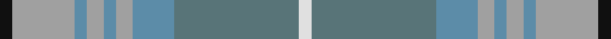

In pattern [KYBYBYBGW](/stripes/kybybybgw/).

This was sourced from tartans-authority.  It is a [9 stripe tartan](/stripes/stripes9/).

Original link http://www.tartansauthority.com/tartan-ferret/display/7721/

## Attestations

This cloth appears in 2 source records; the oldest owns this page.

- pre 2008 — Highland Road (Fashion) (tartans-authority, [record](http://www.tartansauthority.com/tartan-ferret/display/7721/))
- undated — Highland Road (register-of-tartans, [record](https://www.tartanregister.gov.uk/tartanDetails.aspx?ref=5707))

## Register references

External register numbers recorded for this tartan.

- Scottish Register of Tartans: [5707](https://www.tartanregister.gov.uk/tartanDetails.aspx?ref=5707)
- Scottish Tartans Authority (ITI): 7721

## Thread count
K/6 Na30 B6 Na8 B6 Na8 B20 N60 LN/6

## Palette
Each colour and the base-6 reference it is a variant of.

| Colour | Shade | Base |
|---|---|---|
| B | <code style="background-color:#5C8CA8;">#5C8CA8</code> `oklch(61.7% 0.067 235.0)` <small>#5C8CA8</small> | B <code style="background-color:#2A418A;">#2A418A</code> |
| K | <code style="background-color:#101010;">#101010</code> `oklch(17.3% 0.000 89.9)` <small>#101010</small> | K <code style="background-color:#000000;">#000000</code> |
| LN | <code style="background-color:#E0E0E0;">#E0E0E0</code> `oklch(90.7% 0.000 89.9)` <small>#E0E0E0</small> | W <code style="background-color:#F7F7F7;">#F7F7F7</code> |
| N | <code style="background-color:#587478;">#587478</code> `oklch(53.9% 0.033 207.1)` <small>#587478</small> | G <code style="background-color:#006100;">#006100</code> |
| Na | <code style="background-color:#A0A0A0;">#A0A0A0</code> `oklch(70.6% 0.000 89.9)` <small>#A0A0A0</small> | Y <code style="background-color:#F2BF00;">#F2BF00</code> |

## Nearest tartans

The nearest existing variants by ΔTartan distance, with this tartan at the top so the swatches line up against it.

ΔTartan

Tartan

Sett

—

<a href="/ttd/edit/#slug=k3lr15t3lr4t3lr4t10y30w3~x2">Highland Road (Fashion)</a> <a class="nn-out" href="/setts/s9/k3lr15t3lr4t3lr4t10y30w3~x2/" title="open its dictionary page">↗</a>

1.23

<a href="/ttd/edit/#slug=b5lg2b2lg9k3b9g3b3g25lr2~x2">Un-named (D C Dalgliesh) #2</a> <a class="nn-out" href="/setts/s10/b5lg2b2lg9k3b9g3b3g25lr2~x2/" title="open its dictionary page">↗</a>

1.46

<a href="/ttd/edit/#slug=lg9lr9k1lr1w1lr1k1lr9lg9r1~x6">Irving of Glentulchan (Personal)</a> <a class="nn-out" href="/setts/s10/lg9lr9k1lr1w1lr1k1lr9lg9r1~x6/" title="open its dictionary page">↗</a>

1.50

<a href="/ttd/edit/#slug=y25p3y8p13ly8lr2ly11y2p3~x2">Organic</a> <a class="nn-out" href="/setts/s9/y25p3y8p13ly8lr2ly11y2p3~x2/" title="open its dictionary page">↗</a>

1.50

<a href="/ttd/edit/#slug=lo2n28k2w2k2g26n3g5lo2~x2">Clyde (WCWM Fashion)</a> <a class="nn-out" href="/setts/s9/lo2n28k2w2k2g26n3g5lo2~x2/" title="open its dictionary page">↗</a>

1.52

<a href="/ttd/edit/#slug=r1lg9lr9k1lr1w1~x6">Irving of Glentulchan (Personal)</a> <a class="nn-out" href="/setts/s6/r1lg9lr9k1lr1w1~x6/" title="open its dictionary page">↗</a>

1.60

<a href="/ttd/edit/#slug=g2t15lr5g2t2g7w2~x4">Chambers Bay</a> <a class="nn-out" href="/setts/s7/g2t15lr5g2t2g7w2~x4/" title="open its dictionary page">↗</a>

1.60

<a href="/ttd/edit/#slug=t12g2t2g2t2o8g8o1~x2">Universal, Ancient</a> <a class="nn-out" href="/setts/s8/t12g2t2g2t2o8g8o1~x2/" title="open its dictionary page">↗</a>

1.70

<a href="/ttd/edit/#slug=b3r2n16r2b3r2g16r2b3~x4">MacPherson Gathering 1996</a> <a class="nn-out" href="/setts/s9/b3r2n16r2b3r2g16r2b3~x4/" title="open its dictionary page">↗</a>

1.77

<a href="/ttd/edit/#slug=n6db1n1db1n3lr2r1lr2y3db1y1db1y6~x4">McCulloch, Grant (Personal)</a> <a class="nn-out" href="/setts/s13/n6db1n1db1n3lr2r1lr2y3db1y1db1y6~x4/" title="open its dictionary page">↗</a>

1.82

<a href="/ttd/edit/#slug=b3r2o16r2b3r2g16r2b3~x4">MacPherson Gathering 1996</a> <a class="nn-out" href="/setts/s9/b3r2o16r2b3r2g16r2b3~x4/" title="open its dictionary page">↗</a>

## Neighbour map

Every grey dot is one of 14299 variants placed by the first two principal components of the ΔTartan feature space (44% of its variance). Red is this tartan; blue dots are its nearest — click one to open its page.

<svg viewBox="0 0 640 380" role="img" style="max-width:100%;height:auto;border:1px solid #e0e0e0;border-radius:4px;display:block" xmlns="http://www.w3.org/2000/svg"><image href="/nn/cloud.v1.png" width="640" height="380"/><a href="/setts/s10/b5lg2b2lg9k3b9g3b3g25lr2~x2/"><circle cx="286.6" cy="189.6" r="4" fill="#3465a4"><title>Un-named (D C Dalgliesh) #2</title></circle></a><a href="/setts/s10/lg9lr9k1lr1w1lr1k1lr9lg9r1~x6/"><circle cx="315.3" cy="210.1" r="4" fill="#3465a4"><title>Irving of Glentulchan (Personal)</title></circle></a><a href="/setts/s9/y25p3y8p13ly8lr2ly11y2p3~x2/"><circle cx="269.8" cy="190.4" r="4" fill="#3465a4"><title>Organic</title></circle></a><a href="/setts/s9/lo2n28k2w2k2g26n3g5lo2~x2/"><circle cx="326.6" cy="179.3" r="4" fill="#3465a4"><title>Clyde (WCWM Fashion)</title></circle></a><a href="/setts/s6/r1lg9lr9k1lr1w1~x6/"><circle cx="299.5" cy="213.9" r="4" fill="#3465a4"><title>Irving of Glentulchan (Personal)</title></circle></a><a href="/setts/s7/g2t15lr5g2t2g7w2~x4/"><circle cx="305.7" cy="243.2" r="4" fill="#3465a4"><title>Chambers Bay</title></circle></a><a href="/setts/s8/t12g2t2g2t2o8g8o1~x2/"><circle cx="290.1" cy="234.8" r="4" fill="#3465a4"><title>Universal, Ancient</title></circle></a><a href="/setts/s9/b3r2n16r2b3r2g16r2b3~x4/"><circle cx="260.3" cy="233.7" r="4" fill="#3465a4"><title>MacPherson Gathering 1996</title></circle></a><a href="/setts/s13/n6db1n1db1n3lr2r1lr2y3db1y1db1y6~x4/"><circle cx="192.1" cy="218.9" r="4" fill="#3465a4"><title>McCulloch, Grant (Personal)</title></circle></a><a href="/setts/s9/b3r2o16r2b3r2g16r2b3~x4/"><circle cx="227.3" cy="212.1" r="4" fill="#3465a4"><title>MacPherson Gathering 1996</title></circle></a><circle cx="268.2" cy="201.8" r="5" fill="#c00000"/></svg>

ID: /setts/s9/k3lr15t3lr4t3lr4t10y30w3~x2/
