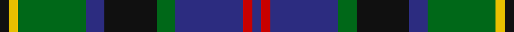

In pattern [BRBGKBGYK](/stripes/brbgkbgyk/).

This was sourced from register-of-tartans.  It is a [9 stripe tartan](/stripes/stripes9/).

Original link https://www.tartanregister.gov.uk/tartanDetails.aspx?ref=2832

## Attestations

This cloth appears in 2 source records; the oldest owns this page.

- 01/01/2004 — Maresh (register-of-tartans, [record](https://www.tartanregister.gov.uk/tartanDetails.aspx?ref=2832))
- 2004 — Maresh (Name) (tartans-authority, [record](http://www.tartansauthority.com/tartan-ferret/display/6264/))

## Register references

External register numbers recorded for this tartan.

- Scottish Register of Tartans: [2832](https://www.tartanregister.gov.uk/tartanDetails.aspx?ref=2832)
- Scottish Tartans Authority (ITI): 6264

## Thread count
K/6 Y6 G44 DB12 K34 G12 DB44 R6 DB/6

## Palette
Each colour and its ΔE from the base-6 reference it is a variant of.

| Colour | Shade | Base | ΔE (OKLab) |
|---|---|---|---|
| DB | <code style="background-color:#2C2C80;">#2C2C80</code> `#2C2C80` | B <code style="background-color:#2A418A;">#2A418A</code> | 0.06 |
| G | <code style="background-color:#006818;">#006818</code> `#006818` | G <code style="background-color:#006100;">#006100</code> | 0.02 |
| K | <code style="background-color:#101010;">#101010</code> `#101010` | K <code style="background-color:#000000;">#000000</code> | 0.17 |
| R | <code style="background-color:#C80000;">#C80000</code> `#C80000` | R <code style="background-color:#CC0000;">#CC0000</code> | 0.01 |
| Y | <code style="background-color:#E8C000;">#E8C000</code> `#E8C000` | Y <code style="background-color:#F2BF00;">#F2BF00</code> | 0.02 |

## Nearest tartans

The nearest existing variants by ΔTartan distance.

1. [Wood (Personal)](/setts/s8/g11t3g5r3g5k22db22k5~x2/) — ΔT 0.54
1. [Mantle (Personal)](/setts/s8/r3g2r3g18k14w2db16g3~x2/) — ΔT 0.58
1. [Greenock](/setts/s7/g2k2g17k16r2db17ly2~x2/) — ΔT 0.69
1. [Royal Highland Corporate Tartan Tartan Number: 2054. Earliest known date: March 1992 In 1808 the Highland Society of Scotland used the Universal or Black Watch tartan. This has been incorporated in the new design along with colours to represent the agricultural heritage and interests of the Society. This design includes changes that were made when the first version proved an exact match to the 'Wellington' tartan. The white is 'Barley white'. See products available Copyright © Blair Urquhart, Comrie, 2015](/setts/s8/lr8g33k21db6k6db33r6db6/) — ΔT 0.69
1. [Hunter of Peebleshire (Clan?)](/setts/s11/g8k1g8k8r1db8w1db8r1k8r1~x4/) — ΔT 0.73
1. [Colquhoun Clan Tartan Tartan Number: 274. Earliest known date: 1810-15 The Bonnie Banks and Braes of Loch Lomand were the setting for the interesting and sometimes violent history of the Colquhouns of Luss. Their tartan is well documented, appearing in the earliest collections, and certified by the Chief, with his seal and signature, in the archives of the Highland Society of London. (c.1816). The Clan tartan, in its present form, was woven by Wilson's of Bannockburn at the beginning of the 19th century and recorded in the firms pattern books dated 1819. Wilson often used purple in place of blue and produced proportionately equivalent patterns in different weights of cloth. Logan recorded a similar sett in 1831. The Vestiarium Scoticum shows a pattern with the white stripe next to the blue but this is regarded as an error. See products available Copyright © Blair Urquhart, Comrie, 2015](/setts/s7/r3g16w2k16db16k2db2~x2/) — ΔT 0.74
1. [Akins of Candler (Personal)](/setts/s12/g12r2g2r2k12db12ly2db12k2g11r2g2~x2/) — ΔT 0.74
1. [MacLean, Donald (Personal)](/setts/s7/g16lb3g3k10db12r2db3~x2/) — ΔT 0.75
1. [MacFrog (Personal)](/setts/s8/r3db20g3k20db3g20w3g3~x2/) — ΔT 0.75
1. [Hogarth of Firhill (Clan)](/setts/s7/t4g14ly2k14db14k2db3~x2/) — ΔT 0.78

## Neighbour map

Every grey dot is one of 14299 variants placed by the first two principal components of the ΔTartan feature space (44% of its variance). Red is this tartan; blue dots are its nearest — click one to open its page.

<svg viewBox="0 0 640 380" role="img" style="max-width:100%;height:auto;border:1px solid #e0e0e0;border-radius:4px;display:block" xmlns="http://www.w3.org/2000/svg"><image href="/nn/cloud.v1.png" width="640" height="380"/><a href="/setts/s8/g11t3g5r3g5k22db22k5~x2/"><circle cx="172.4" cy="216.8" r="4" fill="#3465a4"><title>Wood (Personal)</title></circle></a><a href="/setts/s8/r3g2r3g18k14w2db16g3~x2/"><circle cx="174.6" cy="195.8" r="4" fill="#3465a4"><title>Mantle (Personal)</title></circle></a><a href="/setts/s7/g2k2g17k16r2db17ly2~x2/"><circle cx="166.9" cy="204.0" r="4" fill="#3465a4"><title>Greenock</title></circle></a><a href="/setts/s8/lr8g33k21db6k6db33r6db6/"><circle cx="146.7" cy="217.7" r="4" fill="#3465a4"><title>Royal Highland Corporate Tartan Tartan Number: 2054. Earliest known date: March 1992 In 1808 the Highland Society of Scotland used the Universal or Black Watch tartan. This has been incorporated in the new design along with colours to represent the agricultural heritage and interests of the Society. This design includes changes that were made when the first version proved an exact match to the 'Wellington' tartan. The white is 'Barley white'. See products available Copyright © Blair Urquhart, Comrie, 2015</title></circle></a><a href="/setts/s11/g8k1g8k8r1db8w1db8r1k8r1~x4/"><circle cx="139.1" cy="199.7" r="4" fill="#3465a4"><title>Hunter of Peebleshire (Clan?)</title></circle></a><a href="/setts/s7/r3g16w2k16db16k2db2~x2/"><circle cx="150.2" cy="205.8" r="4" fill="#3465a4"><title>Colquhoun Clan Tartan Tartan Number: 274. Earliest known date: 1810-15 The Bonnie Banks and Braes of Loch Lomand were the setting for the interesting and sometimes violent history of the Colquhouns of Luss. Their tartan is well documented, appearing in the earliest collections, and certified by the Chief, with his seal and signature, in the archives of the Highland Society of London. (c.1816). The Clan tartan, in its present form, was woven by Wilson's of Bannockburn at the beginning of the 19th century and recorded in the firms pattern books dated 1819. Wilson often used purple in place of blue and produced proportionately equivalent patterns in different weights of cloth. Logan recorded a similar sett in 1831. The Vestiarium Scoticum shows a pattern with the white stripe next to the blue but this is regarded as an error. See products available Copyright © Blair Urquhart, Comrie, 2015</title></circle></a><a href="/setts/s12/g12r2g2r2k12db12ly2db12k2g11r2g2~x2/"><circle cx="148.8" cy="197.9" r="4" fill="#3465a4"><title>Akins of Candler (Personal)</title></circle></a><a href="/setts/s7/g16lb3g3k10db12r2db3~x2/"><circle cx="164.3" cy="215.2" r="4" fill="#3465a4"><title>MacLean, Donald (Personal)</title></circle></a><a href="/setts/s8/r3db20g3k20db3g20w3g3~x2/"><circle cx="143.6" cy="199.0" r="4" fill="#3465a4"><title>MacFrog (Personal)</title></circle></a><a href="/setts/s7/t4g14ly2k14db14k2db3~x2/"><circle cx="134.8" cy="220.9" r="4" fill="#3465a4"><title>Hogarth of Firhill (Clan)</title></circle></a><circle cx="168.7" cy="202.3" r="5" fill="#c00000"/></svg>

ID: /setts/s9/k3ly3g22db6k17g6db22r3db3~x2/
