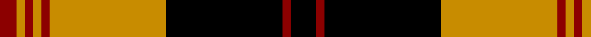

In pattern [KRKYRYRYR](/patterns/krkyryryr/).

This was sourced from register-of-tartans.  It is a [9 stripes tartan](/stripes/stripes9/).

Original link https://www.tartanregister.gov.uk/tartanDetails.aspx?ref=5078

## Thread count
DR/8 DY4 DR4 DY4 DR4 DY56 K56 DR4 K/12

## Palette
Each colour and its ΔE from the base-6 reference it is a variant of.

| Colour | Shade | Base | ΔE (OKLab) |
|---|---|---|---|
| DR | <code style="background-color:#8C0000;">#8C0000</code> `#8C0000` | R <code style="background-color:#CC0000;">#CC0000</code> | 0.14 |
| DY | <code style="background-color:#C88C00;">#C88C00</code> `#C88C00` | Y <code style="background-color:#F2BF00;">#F2BF00</code> | 0.15 |
| K | <code style="background-color:#000000;">#000000</code> `#000000` | K <code style="background-color:#000000;">#000000</code> | 0.00 |

## Nearest tartans

The nearest existing variants by ΔTartan distance.

1. [Brecheen (Name)](/setts/s9/k3r1k14y14r1y1r1y1r2x4~k000000-r8c0000-yb8983c/) — ΔT 0.33
1. [Johnston Orange/Black (Corporate)](/setts/s8/w1y1k1y12k12y1k1y1x4~k000000-wfcfcfc-yd87c00/) — ΔT 0.93
1. [Stewart of Atholl](/setts/s9/g22k1g2k1g3k8r20k1r6x2~g004c00-k000000-rc80000/) — ΔT 1.24
1. [Atlas Textile (Corporate)](/setts/s8/w1y1k1y12k12y1k1y1x4~k101010-we0e0e0-yd87c00/) — ΔT 1.31
1. [Johnston Orange/Black](/setts/s14/k1y1k12y12k1y1w1y1k1y12k12y1k1y1x4~k000000-wfcfcfc-yd87c00/) — ΔT 1.33
1. [Kerr](/setts/s10/g20k1g2k1g3k14r28k1r2k4x2~g008000-k000000-rc00000/) — ΔT 1.35
1. [Stewart of Athol](/setts/s9/g22k1g2k1g3k8r20k1r6x2~g008000-k000000-rc00000/) — ΔT 1.37
1. [Kerr](/setts/s10/g20k1g2k1g3k14r28k1r2k4x2~g004c00-k000000-rc80000/) — ΔT 1.42
1. [MacQuarrie 6](/setts/s13/g1r1g1r1g14r1k10r1g1r21g1r1k1x2~g008000-k000000-rc00000/) — ΔT 1.43
1. [Barbecue, Plaid](/setts/s10/y2k2r2w8k14r1k1r1k1r1x2~k000000-rc00000-we0e0e0-yf0c000/) — ΔT 1.49

## Neighbour map

Every grey dot is one of 15726 variants placed by the first two principal components of the ΔTartan feature space (44% of its variance). Red is this tartan; blue dots are its nearest — click one to open its page.

<svg viewBox="0 0 640 380" role="img" style="max-width:100%;height:auto;border:1px solid #e0e0e0;border-radius:4px;display:block" xmlns="http://www.w3.org/2000/svg"><image href="/nn/cloud.v1.png" width="640" height="380"/><a href="/setts/s9/k3r1k14y14r1y1r1y1r2x4~k000000-r8c0000-yb8983c/"><circle cx="270.9" cy="157.5" r="4" fill="#3465a4"><title>Brecheen (Name)</title></circle></a><a href="/setts/s8/w1y1k1y12k12y1k1y1x4~k000000-wfcfcfc-yd87c00/"><circle cx="312.7" cy="165.8" r="4" fill="#3465a4"><title>Johnston Orange/Black (Corporate)</title></circle></a><a href="/setts/s9/g22k1g2k1g3k8r20k1r6x2~g004c00-k000000-rc80000/"><circle cx="290.7" cy="156.5" r="4" fill="#3465a4"><title>Stewart of Atholl</title></circle></a><a href="/setts/s8/w1y1k1y12k12y1k1y1x4~k101010-we0e0e0-yd87c00/"><circle cx="323.4" cy="166.1" r="4" fill="#3465a4"><title>Atlas Textile (Corporate)</title></circle></a><a href="/setts/s14/k1y1k12y12k1y1w1y1k1y12k12y1k1y1x4~k000000-wfcfcfc-yd87c00/"><circle cx="304.3" cy="147.7" r="4" fill="#3465a4"><title>Johnston Orange/Black</title></circle></a><a href="/setts/s10/g20k1g2k1g3k14r28k1r2k4x2~g008000-k000000-rc00000/"><circle cx="266.4" cy="129.9" r="4" fill="#3465a4"><title>Kerr</title></circle></a><a href="/setts/s9/g22k1g2k1g3k8r20k1r6x2~g008000-k000000-rc00000/"><circle cx="278.1" cy="151.7" r="4" fill="#3465a4"><title>Stewart of Athol</title></circle></a><a href="/setts/s10/g20k1g2k1g3k14r28k1r2k4x2~g004c00-k000000-rc80000/"><circle cx="277.2" cy="133.8" r="4" fill="#3465a4"><title>Kerr</title></circle></a><a href="/setts/s13/g1r1g1r1g14r1k10r1g1r21g1r1k1x2~g008000-k000000-rc00000/"><circle cx="306.9" cy="113.9" r="4" fill="#3465a4"><title>MacQuarrie 6</title></circle></a><a href="/setts/s10/y2k2r2w8k14r1k1r1k1r1x2~k000000-rc00000-we0e0e0-yf0c000/"><circle cx="271.2" cy="134.6" r="4" fill="#3465a4"><title>Barbecue, Plaid</title></circle></a><circle cx="273.6" cy="156.4" r="5" fill="#c00000"/></svg>

ID: /setts/s9/k3r1k14y14r1y1r1y1r2x4~k000000-r8c0000-yc88c00/
