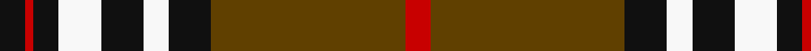

In pattern [KRKWKWKGR](/stripes/krkwkwkgr/).

This was sourced from tartans-authority.  It is a [9 stripe tartan](/stripes/stripes9/).

Original link http://www.tartansauthority.com/tartan-ferret/display/1194/

## Thread count
K/6 R2 K6 W10 K10 W6 K10 T46 R/6

## Palette
Each colour and its ΔE from the base-6 reference it is a variant of.

| Colour | Shade | Base | ΔE (OKLab) |
|---|---|---|---|
| K | <code style="background-color:#101010;">#101010</code> `#101010` | K <code style="background-color:#000000;">#000000</code> | 0.17 |
| R | <code style="background-color:#C80000;">#C80000</code> `#C80000` | R <code style="background-color:#CC0000;">#CC0000</code> | 0.01 |
| T | <code style="background-color:#604000;">#604000</code> `#604000` | G <code style="background-color:#006100;">#006100</code> | 0.14 |
| W | <code style="background-color:#F8F8F8;">#F8F8F8</code> `#F8F8F8` | W <code style="background-color:#F7F7F7;">#F7F7F7</code> | 0.00 |

## Nearest tartans

The nearest existing variants by ΔTartan distance.

1. [Burberry (Counterfeit #4)](/setts/s9/k10w10k10o32k2w2k2w2r5~x2/) — ΔT 0.82
1. [Southdown](/setts/s9/k8r1k3w5k5w3k5o23r3~x2/) — ΔT 0.87
1. [Wcwm 1399](/setts/s10/k44lb3lo16lb2lo2lb2lo2y10k3y8~x2/) — ΔT 0.87
1. [Braemar or Blair Atholl](/setts/s8/do2w2k6do3k2o14k1o1~x4/) — ΔT 0.92
1. [Distripress Annual Congress 2012](/setts/s8/r12k2w8k4n16r2k31n2/) — ΔT 0.99
1. [Clyde Valley HOG](/setts/s8/k54lr6k6lr6o20lo40k6ly3/) — ΔT 1.00
1. [Vaughan (Welsh Series)](/setts/s11/w2k35g30k3lo30k2lo4k2lo30k3w2/) — ΔT 1.04
1. [Blair Atholl (Fashion)](/setts/s8/do2lr2k6do3k2o14k1o1~x4/) — ΔT 1.05
1. [Southdown Tartan Tartan Number: 1194. Earliest known date: pre 2003 Designed for the Glasgow conference in 2002 See products available Copyright © Blair Urquhart, Comrie, 2015](/setts/s9/k8r1k3w5k5w3k5dr23r3~x2/) — ΔT 1.09
1. [Merric Dark Camel.. Trade Tartan Tartan Number: 1688. Earliest known date: 1985 School colours. See products available Copyright © Blair Urquhart, Comrie, 2015](/setts/s7/r2w8k14dy25w2k2w2~x2/) — ΔT 1.09

## Neighbour map

Every grey dot is one of 14299 variants placed by the first two principal components of the ΔTartan feature space (44% of its variance). Red is this tartan; blue dots are its nearest — click one to open its page.

<svg viewBox="0 0 640 380" role="img" style="max-width:100%;height:auto;border:1px solid #e0e0e0;border-radius:4px;display:block" xmlns="http://www.w3.org/2000/svg"><image href="/nn/cloud.v1.png" width="640" height="380"/><a href="/setts/s9/k10w10k10o32k2w2k2w2r5~x2/"><circle cx="213.2" cy="130.5" r="4" fill="#3465a4"><title>Burberry (Counterfeit #4)</title></circle></a><a href="/setts/s9/k8r1k3w5k5w3k5o23r3~x2/"><circle cx="224.7" cy="131.9" r="4" fill="#3465a4"><title>Southdown</title></circle></a><a href="/setts/s10/k44lb3lo16lb2lo2lb2lo2y10k3y8~x2/"><circle cx="287.7" cy="112.6" r="4" fill="#3465a4"><title>Wcwm 1399</title></circle></a><a href="/setts/s8/do2w2k6do3k2o14k1o1~x4/"><circle cx="256.5" cy="154.6" r="4" fill="#3465a4"><title>Braemar or Blair Atholl</title></circle></a><a href="/setts/s8/r12k2w8k4n16r2k31n2/"><circle cx="237.8" cy="150.1" r="4" fill="#3465a4"><title>Distripress Annual Congress 2012</title></circle></a><a href="/setts/s8/k54lr6k6lr6o20lo40k6ly3/"><circle cx="229.2" cy="131.4" r="4" fill="#3465a4"><title>Clyde Valley HOG</title></circle></a><a href="/setts/s11/w2k35g30k3lo30k2lo4k2lo30k3w2/"><circle cx="235.6" cy="128.5" r="4" fill="#3465a4"><title>Vaughan (Welsh Series)</title></circle></a><a href="/setts/s8/do2lr2k6do3k2o14k1o1~x4/"><circle cx="268.1" cy="161.1" r="4" fill="#3465a4"><title>Blair Atholl (Fashion)</title></circle></a><a href="/setts/s9/k8r1k3w5k5w3k5dr23r3~x2/"><circle cx="247.9" cy="141.8" r="4" fill="#3465a4"><title>Southdown Tartan Tartan Number: 1194. Earliest known date: pre 2003 Designed for the Glasgow conference in 2002 See products available Copyright © Blair Urquhart, Comrie, 2015</title></circle></a><a href="/setts/s7/r2w8k14dy25w2k2w2~x2/"><circle cx="234.2" cy="162.9" r="4" fill="#3465a4"><title>Merric Dark Camel.. Trade Tartan Tartan Number: 1688. Earliest known date: 1985 School colours. See products available Copyright © Blair Urquhart, Comrie, 2015</title></circle></a><circle cx="253.5" cy="127.2" r="5" fill="#c00000"/></svg>

ID: /setts/s9/k3r1k3w5k5w3k5dy23r3~x2/
