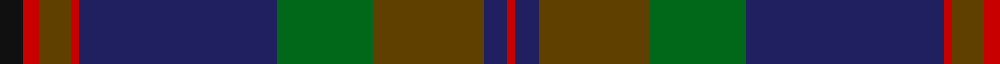

In pattern [KRGRBGGBR](/stripes/krgrbggbr/).

This was sourced from register-of-tartans.  It is a [9 stripe tartan](/stripes/stripes9/).

Original link https://www.tartanregister.gov.uk/tartanDetails.aspx?ref=2809

## Attestations

This cloth appears in 2 source records; the oldest owns this page.

- 01/01/2002 — Mann (register-of-tartans, [record](https://www.tartanregister.gov.uk/tartanDetails.aspx?ref=2809))
- pre 2002 — Mann (Name) (tartans-authority, [record](http://www.tartansauthority.com/tartan-ferret/display/4127/))

## Register references

External register numbers recorded for this tartan.

- Scottish Register of Tartans: [2809](https://www.tartanregister.gov.uk/tartanDetails.aspx?ref=2809)
- Scottish Tartans Authority (ITI): 4127

## Thread count
K/6 R4 T8 R2 DB50 G24 T28 DB6 R/2

## Palette
Each colour and its ΔE from the base-6 reference it is a variant of.

| Colour | Shade | Base | ΔE (OKLab) |
|---|---|---|---|
| DB | <code style="background-color:#202060;">#202060</code> `#202060` | B <code style="background-color:#2A418A;">#2A418A</code> | 0.11 |
| G | <code style="background-color:#006818;">#006818</code> `#006818` | G <code style="background-color:#006100;">#006100</code> | 0.02 |
| K | <code style="background-color:#101010;">#101010</code> `#101010` | K <code style="background-color:#000000;">#000000</code> | 0.17 |
| R | <code style="background-color:#C80000;">#C80000</code> `#C80000` | R <code style="background-color:#CC0000;">#CC0000</code> | 0.01 |
| T | <code style="background-color:#604000;">#604000</code> `#604000` | G <code style="background-color:#006100;">#006100</code> | 0.14 |

## Nearest tartans

The nearest existing variants by ΔTartan distance.

1. [Kinfauns Castle](/setts/s10/r4db10dg2db2dg24dp2dg2dp16dg2w1~x2/) — ΔT 0.58
1. [Rikaco Classic (Fashion)](/setts/s10/db4b4db1dg24db10r1db2r5b3r2~x2/) — ΔT 0.62
1. [King (Personal)](/setts/s11/r3y2k1y2n26k12n4y15k1n1ly3~x2/) — ΔT 0.91
1. [Lochaber #2](/setts/s8/dg3r1dg18k20r1db18t1dg2~x4/) — ΔT 0.99
1. [Chan (Name?)](/setts/s8/r2dg13r2dg13k13dt30k1ly2~x2/) — ΔT 1.00
1. [Scotland 2000 (Commemorative)](/setts/s8/lb4dt38g6dr2g6dr36lo2dr3~x2/) — ΔT 1.05
1. [Round Table of Britain and Ire Corporate Tartan Tartan Number: 2365. Earliest known date: 1997 Designed by Polly Wittering of House of Edgar in June 1997 for the Round Table of Britain and Ireland. Sample in STA Johnston Collection. For this graphic medium red, green and blue used in place of called-for dark versions of each. See products available Copyright © Blair Urquhart, Comrie, 2015](/setts/s10/db47dg14dp5do2r3dg7~x2/) — ΔT 1.05
1. [Evans (Welsh Name)](/setts/s11/r2k3dt30k2dt4k2dt30k36r30k2t2/) — ΔT 1.05
1. [Laurie](/setts/s7/dp6r2dp1dg25db16k2db4~x2/) — ΔT 1.06
1. [Colquhoun](/setts/s7/db4k2db16w1k8dg24r4~x2/) — ΔT 1.07

## Neighbour map

Every grey dot is one of 14299 variants placed by the first two principal components of the ΔTartan feature space (44% of its variance). Red is this tartan; blue dots are its nearest — click one to open its page.

<svg viewBox="0 0 640 380" role="img" style="max-width:100%;height:auto;border:1px solid #e0e0e0;border-radius:4px;display:block" xmlns="http://www.w3.org/2000/svg"><image href="/nn/cloud.v1.png" width="640" height="380"/><a href="/setts/s10/r4db10dg2db2dg24dp2dg2dp16dg2w1~x2/"><circle cx="319.9" cy="153.7" r="4" fill="#3465a4"><title>Kinfauns Castle</title></circle></a><a href="/setts/s10/db4b4db1dg24db10r1db2r5b3r2~x2/"><circle cx="299.1" cy="153.9" r="4" fill="#3465a4"><title>Rikaco Classic (Fashion)</title></circle></a><a href="/setts/s11/r3y2k1y2n26k12n4y15k1n1ly3~x2/"><circle cx="293.8" cy="134.8" r="4" fill="#3465a4"><title>King (Personal)</title></circle></a><a href="/setts/s8/dg3r1dg18k20r1db18t1dg2~x4/"><circle cx="263.4" cy="180.3" r="4" fill="#3465a4"><title>Lochaber #2</title></circle></a><a href="/setts/s8/r2dg13r2dg13k13dt30k1ly2~x2/"><circle cx="284.4" cy="169.2" r="4" fill="#3465a4"><title>Chan (Name?)</title></circle></a><a href="/setts/s8/lb4dt38g6dr2g6dr36lo2dr3~x2/"><circle cx="293.0" cy="157.0" r="4" fill="#3465a4"><title>Scotland 2000 (Commemorative)</title></circle></a><a href="/setts/s10/db47dg14dp5do2r3dg7~x2/"><circle cx="346.0" cy="159.1" r="4" fill="#3465a4"><title>Round Table of Britain and Ire Corporate Tartan Tartan Number: 2365. Earliest known date: 1997 Designed by Polly Wittering of House of Edgar in June 1997 for the Round Table of Britain and Ireland. Sample in STA Johnston Collection. For this graphic medium red, green and blue used in place of called-for dark versions of each. See products available Copyright © Blair Urquhart, Comrie, 2015</title></circle></a><a href="/setts/s11/r2k3dt30k2dt4k2dt30k36r30k2t2/"><circle cx="308.9" cy="167.3" r="4" fill="#3465a4"><title>Evans (Welsh Name)</title></circle></a><a href="/setts/s7/dp6r2dp1dg25db16k2db4~x2/"><circle cx="324.4" cy="178.2" r="4" fill="#3465a4"><title>Laurie</title></circle></a><a href="/setts/s7/db4k2db16w1k8dg24r4~x2/"><circle cx="265.5" cy="175.1" r="4" fill="#3465a4"><title>Colquhoun</title></circle></a><circle cx="295.0" cy="159.8" r="5" fill="#c00000"/></svg>

ID: /setts/s9/k3r2dy4r1db25g12dy14db3r1~x2/
