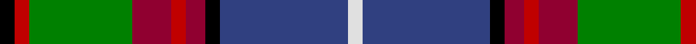

In pattern [KRGRRRKBW](/patterns/krgrrrkbw/).

This was sourced from weddslist.  It is a [9 stripes tartan](/stripes/stripes9/).

Original link http://www.weddslist.com/cgi-bin/tartans/pg.pl?source=sts

## Thread count
K/6 R6 G42 DR16 R6 DR8 K6 B52 LN/6

## Palette
Each colour and its ΔE from the base-6 reference it is a variant of.

| Colour | Shade | Base | ΔE (OKLab) |
|---|---|---|---|
| B | <code style="background-color:#304080;">#304080</code> `#304080` | B <code style="background-color:#2A418A;">#2A418A</code> | 0.02 |
| DR | <code style="background-color:#900030;">#900030</code> `#900030` | R <code style="background-color:#CC0000;">#CC0000</code> | 0.14 |
| G | <code style="background-color:#008000;">#008000</code> `#008000` | G <code style="background-color:#006100;">#006100</code> | 0.10 |
| K | <code style="background-color:#000000;">#000000</code> `#000000` | K <code style="background-color:#000000;">#000000</code> | 0.00 |
| LN | <code style="background-color:#E0E0E0;">#E0E0E0</code> `#E0E0E0` | W <code style="background-color:#F7F7F7;">#F7F7F7</code> | 0.07 |
| R | <code style="background-color:#C00000;">#C00000</code> `#C00000` | R <code style="background-color:#CC0000;">#CC0000</code> | 0.03 |

## Nearest tartans

The nearest existing variants by ΔTartan distance.

1. [Mary, Queen of Scots](/setts/s9/r5w1b10g10w1y1g2ba2w1~b2c2c80-ba5c8ca8-g006818-rc80000-we0e0e0-ye8c000~x2/) — ΔT 0.67
1. [Unidentified (ex Tony Murray)](/setts/s7/r2y2b9g1ga9r1w1~b2c2c80-g604000-ga003820-rc80000-we0e0e0-yfccc00~x2/) — ΔT 0.75
1. [Loch Awe](/setts/s9/w3k2r3g20k24b20r3k2y3~b2c2c80-g006818-k101010-rc80000-wc0c0c0-yfccc00~x2/) — ΔT 0.82
1. [Gordonstoun (Corporate)](/setts/s12/y5g19r2b11w2r11g11r2k20r2k2w2~b5c8ca8-g408060-k101010-r800028-wa8ace8-ye8c000~x2/) — ΔT 0.83
1. [Stirling and Bannockburn District Tartan Tartan Number: 1536. Earliest known date: 1847 The Stirling and Bannockburn Caledonian Society tartan produced by Wilson's of Bannockburn around 1847, has been recognised in more recent times as the District tartan for the Stirling and Bannockburn area of central Scotland. See products available Copyright © Blair Urquhart, Comrie, 2015](/setts/s10/r3g18r4b3r4k13r3ba18g2y3~b5c8ca8-ba2c2c80-g006818-k101010-rc80000-ye8c000~x2/) — ΔT 0.84
1. [Crosser Crozier Family Tartan Tartan Number: 1779. Earliest known date: 1983 Count taken from a sample in a pattern book belonging to Jardines Outfitters, Glasgow 27/05/1983 See products available Copyright © Blair Urquhart, Comrie, 2015](/setts/s11/w4b5r3b22y4k3g17r7k2r7y2~b2c2c80-g006818-k101010-rc80000-we0e0e0-ye8c000~x2/) — ΔT 0.86
1. [Culture The... Corporate Tartan Tartan Number: 1534. Earliest known date: 1989 Colours chosen to reflect a European essence that will endure beyond the 1990 'Year of Culture'. Supply and manufacture only at MacDonald MacKay (Kiltmakers) Ltd., Glasgow. See products available Copyright © Blair Urquhart, Comrie, 2015](/setts/s11/r6g2r2g21k2w4k2b23y2b2y6~b2c2c80-g006818-k101010-rc80000-we0e0e0-ye8c000~x2/) — ΔT 0.86
1. [Dunedin (USA)](/setts/s9/k3r3g21r8ra3r3k3b25w3~b2888c4-g006818-k101010-rc80000-rae87878-wfcfcfc~x2/) — ΔT 0.87
1. [Federated Women's Institutes of](/setts/s9/r2k1y2g3y4g3b12k1w2~b003478-g007800-k000000-r8c0000-wc8c8c8-yc88c00~x4/) — ΔT 0.90
1. [Wojtek Memorial Trust](/setts/s11/w3g28ga3g3ga11b4r3b3r6b15wa3~b2c2c80-g006818-ga003820-rc80000-we8ccb8-wafcfcfc~x2/) — ΔT 0.91

## Neighbour map

Every grey dot is one of 15726 variants placed by the first two principal components of the ΔTartan feature space (44% of its variance). Red is this tartan; blue dots are its nearest — click one to open its page.

<svg viewBox="0 0 640 380" role="img" style="max-width:100%;height:auto;border:1px solid #e0e0e0;border-radius:4px;display:block" xmlns="http://www.w3.org/2000/svg"><image href="/nn/cloud.v1.png" width="640" height="380"/><a href="/setts/s9/r5w1b10g10w1y1g2ba2w1~b2c2c80-ba5c8ca8-g006818-rc80000-we0e0e0-ye8c000~x2/"><circle cx="133.2" cy="140.4" r="4" fill="#3465a4"><title>Mary, Queen of Scots</title></circle></a><a href="/setts/s7/r2y2b9g1ga9r1w1~b2c2c80-g604000-ga003820-rc80000-we0e0e0-yfccc00~x2/"><circle cx="145.5" cy="159.9" r="4" fill="#3465a4"><title>Unidentified (ex Tony Murray)</title></circle></a><a href="/setts/s9/w3k2r3g20k24b20r3k2y3~b2c2c80-g006818-k101010-rc80000-wc0c0c0-yfccc00~x2/"><circle cx="141.7" cy="140.9" r="4" fill="#3465a4"><title>Loch Awe</title></circle></a><a href="/setts/s12/y5g19r2b11w2r11g11r2k20r2k2w2~b5c8ca8-g408060-k101010-r800028-wa8ace8-ye8c000~x2/"><circle cx="105.8" cy="135.9" r="4" fill="#3465a4"><title>Gordonstoun (Corporate)</title></circle></a><a href="/setts/s10/r3g18r4b3r4k13r3ba18g2y3~b5c8ca8-ba2c2c80-g006818-k101010-rc80000-ye8c000~x2/"><circle cx="89.9" cy="150.6" r="4" fill="#3465a4"><title>Stirling and Bannockburn District Tartan Tartan Number: 1536. Earliest known date: 1847 The Stirling and Bannockburn Caledonian Society tartan produced by Wilson's of Bannockburn around 1847, has been recognised in more recent times as the District tartan for the Stirling and Bannockburn area of central Scotland. See products available Copyright © Blair Urquhart, Comrie, 2015</title></circle></a><a href="/setts/s11/w4b5r3b22y4k3g17r7k2r7y2~b2c2c80-g006818-k101010-rc80000-we0e0e0-ye8c000~x2/"><circle cx="116.0" cy="128.8" r="4" fill="#3465a4"><title>Crosser Crozier Family Tartan Tartan Number: 1779. Earliest known date: 1983 Count taken from a sample in a pattern book belonging to Jardines Outfitters, Glasgow 27/05/1983 See products available Copyright © Blair Urquhart, Comrie, 2015</title></circle></a><a href="/setts/s11/r6g2r2g21k2w4k2b23y2b2y6~b2c2c80-g006818-k101010-rc80000-we0e0e0-ye8c000~x2/"><circle cx="130.2" cy="114.0" r="4" fill="#3465a4"><title>Culture The... Corporate Tartan Tartan Number: 1534. Earliest known date: 1989 Colours chosen to reflect a European essence that will endure beyond the 1990 'Year of Culture'. Supply and manufacture only at MacDonald MacKay (Kiltmakers) Ltd., Glasgow. See products available Copyright © Blair Urquhart, Comrie, 2015</title></circle></a><a href="/setts/s9/k3r3g21r8ra3r3k3b25w3~b2888c4-g006818-k101010-rc80000-rae87878-wfcfcfc~x2/"><circle cx="124.1" cy="142.4" r="4" fill="#3465a4"><title>Dunedin (USA)</title></circle></a><a href="/setts/s9/r2k1y2g3y4g3b12k1w2~b003478-g007800-k000000-r8c0000-wc8c8c8-yc88c00~x4/"><circle cx="138.7" cy="135.2" r="4" fill="#3465a4"><title>Federated Women's Institutes of</title></circle></a><a href="/setts/s11/w3g28ga3g3ga11b4r3b3r6b15wa3~b2c2c80-g006818-ga003820-rc80000-we8ccb8-wafcfcfc~x2/"><circle cx="142.7" cy="141.1" r="4" fill="#3465a4"><title>Wojtek Memorial Trust</title></circle></a><circle cx="125.6" cy="144.2" r="5" fill="#c00000"/></svg>

ID: /setts/s9/k3r3g21ra8r3ra4k3b26w3~b304080-g008000-k000000-rc00000-ra900030-we0e0e0~x2/
