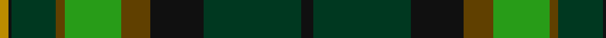

**Bands:** [KGKGGGGKY](/stripes/kgkggggky/) · **Stripes:** [K DG K DY G DY DG K LO](/stripes/stripes9/) K DG K DY G DY DG K LO

This was sourced from tartans-authority.  It is a [9 band tartan](/bands/bands9/).

Original link http://www.tartansauthority.com/tartan-ferret/display/10798/

## Thread count
DY/6 K2 DG30 T6 G38 T20 K36 DG66 K/8

## Palette
Each colour and its ΔE from the base-6 reference it is a variant of.

| Colour | Shade | Base | ΔE (OKLab) |
|---|---|---|---|
| DG | <code style="background-color:#003820;">#003820</code> `#003820` | G <code style="background-color:#006100;">#006100</code> | 0.15 |
| DY | <code style="background-color:#BC8C00;">#BC8C00</code> `#BC8C00` | Y <code style="background-color:#F2BF00;">#F2BF00</code> | 0.16 |
| G | <code style="background-color:#289C18;">#289C18</code> `#289C18` | G <code style="background-color:#006100;">#006100</code> | 0.19 |
| K | <code style="background-color:#101010;">#101010</code> `#101010` | K <code style="background-color:#000000;">#000000</code> | 0.17 |
| T | <code style="background-color:#604000;">#604000</code> `#604000` | G <code style="background-color:#006100;">#006100</code> | 0.14 |

## Nearest tartans

The nearest existing variants by ΔTartan distance.

1. [Leinster Ancestry](/setts/s9/k4dg33k18lo10g19lo3dg15k1ly3~x2/) — ΔT 1.00
1. [Hibernian Football Club](/setts/s8/g22w2g22k18dg12dp6k2w1~x2/) — ΔT 1.26
1. [Mackay, John W. (Personal)](/setts/s9/k4g35lo1k18g3db18r3g3r3~x2/) — ΔT 1.29
1. [Crumlish (2015)](/setts/s9/k44ly2dg27ly2dg16w8dg16w2dg8~x2/) — ΔT 1.32
1. [Chan (Name?)](/setts/s8/ly2k1dt30k13dg13r2dg13r2~x2/) — ΔT 1.33
1. [Cates Hunting (Clan)](/setts/s9/dg23r7g25ly5dg17k5ly1w1r1~x2/) — ΔT 1.33
1. [Pride of Ireland Fashion Tartan Tartan Number: 5157. Earliest known date: 2008 ONLY FOR DISPLAY PURPOSES. Count and sample from Lochcarron Feb. 2008. See products available Copyright © Blair Urquhart, Comrie, 2015](/setts/s10/dg9k2dg2g13k2g2ly1dg13k26ly2~x2/) — ΔT 1.38
1. [Cates Hunting](/setts/s9/dg23r7dg25ly5dg17k5ly1w1r1~x2/) — ΔT 1.38
1. [Sinclair Hunting (VS)](/setts/s7/g2r1g30k16w1db16r2~x2/) — ΔT 1.40
1. [Lawson, William](/setts/s8/lo3dg22dg13k15w3k16dg1r3~x2/) — ΔT 1.41

## Neighbour map

Every grey dot is one of 14313 variants placed by the first two principal components of the ΔTartan feature space (44% of its variance). Red is this tartan; blue dots are its nearest — click one to open its page.

<svg viewBox="0 0 640 380" role="img" style="max-width:100%;height:auto;border:1px solid #e0e0e0;border-radius:4px;display:block" xmlns="http://www.w3.org/2000/svg"><image href="/nn/cloud.v1.png" width="640" height="380"/><a href="/setts/s9/k4dg33k18lo10g19lo3dg15k1ly3~x2/"><circle cx="248.3" cy="146.7" r="4" fill="#3465a4"><title>Leinster Ancestry</title></circle></a><a href="/setts/s8/g22w2g22k18dg12dp6k2w1~x2/"><circle cx="271.5" cy="175.6" r="4" fill="#3465a4"><title>Hibernian Football Club</title></circle></a><a href="/setts/s9/k4g35lo1k18g3db18r3g3r3~x2/"><circle cx="294.5" cy="134.0" r="4" fill="#3465a4"><title>Mackay, John W. (Personal)</title></circle></a><a href="/setts/s9/k44ly2dg27ly2dg16w8dg16w2dg8~x2/"><circle cx="227.4" cy="152.4" r="4" fill="#3465a4"><title>Crumlish (2015)</title></circle></a><a href="/setts/s8/ly2k1dt30k13dg13r2dg13r2~x2/"><circle cx="284.4" cy="169.0" r="4" fill="#3465a4"><title>Chan (Name?)</title></circle></a><a href="/setts/s9/dg23r7g25ly5dg17k5ly1w1r1~x2/"><circle cx="248.7" cy="134.3" r="4" fill="#3465a4"><title>Cates Hunting (Clan)</title></circle></a><a href="/setts/s10/dg9k2dg2g13k2g2ly1dg13k26ly2~x2/"><circle cx="301.5" cy="172.1" r="4" fill="#3465a4"><title>Pride of Ireland Fashion Tartan Tartan Number: 5157. Earliest known date: 2008 ONLY FOR DISPLAY PURPOSES. Count and sample from Lochcarron Feb. 2008. See products available Copyright © Blair Urquhart, Comrie, 2015</title></circle></a><a href="/setts/s9/dg23r7dg25ly5dg17k5ly1w1r1~x2/"><circle cx="247.1" cy="133.6" r="4" fill="#3465a4"><title>Cates Hunting</title></circle></a><a href="/setts/s7/g2r1g30k16w1db16r2~x2/"><circle cx="292.4" cy="150.1" r="4" fill="#3465a4"><title>Sinclair Hunting (VS)</title></circle></a><a href="/setts/s8/lo3dg22dg13k15w3k16dg1r3~x2/"><circle cx="204.5" cy="162.0" r="4" fill="#3465a4"><title>Lawson, William</title></circle></a><circle cx="269.7" cy="162.1" r="5" fill="#c00000"/></svg>

ID: /setts/s9/k4dg33k18dy10g19dy3dg15k1lo3~x2/
