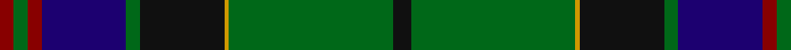

In pattern [KGYKGBRGR](/patterns/kgykgbrgr/).

This was sourced from register-of-tartans.  It is a [9 stripes tartan](/stripes/stripes9/).

Original link https://www.tartanregister.gov.uk/tartanDetails.aspx?ref=2505

## Attestations

This cloth appears in 3 source records; the oldest owns this page.

- 01/09/1996 — Mackay, John W. (Personal) (register-of-tartans, [record](https://www.tartanregister.gov.uk/tartanDetails.aspx?ref=2505))
- 1996 — Mackay, John (Personal) (tartans-authority, [record](http://www.tartansauthority.com/tartan-ferret/display/2283/))
- undated — John.W.Mackay Family Tartan Tartan Number: 2283. Earliest known date: 1996 Designed for a John MacKay when he retired from the Post Office. See products available Copyright © Blair Urquhart, Comrie, 2015 (house-of-tartan, [record](http://www.house-of-tartan.scotland.net/house/TartanViewjs.asp?colr=Def&tnam=2283))

## Thread count
DR/6 G6 DR6 DB36 G6 K36 DY2 G70 K/8

## Palette
Each colour and its ΔE from the base-6 reference it is a variant of.

| Colour | Shade | Base | ΔE (OKLab) |
|---|---|---|---|
| DB | <code style="background-color:#1C0070;">#1C0070</code> `#1C0070` | B <code style="background-color:#2A418A;">#2A418A</code> | 0.14 |
| DR | <code style="background-color:#880000;">#880000</code> `#880000` | R <code style="background-color:#CC0000;">#CC0000</code> | 0.15 |
| DY | <code style="background-color:#D09800;">#D09800</code> `#D09800` | Y <code style="background-color:#F2BF00;">#F2BF00</code> | 0.12 |
| G | <code style="background-color:#006818;">#006818</code> `#006818` | G <code style="background-color:#006100;">#006100</code> | 0.02 |
| K | <code style="background-color:#101010;">#101010</code> `#101010` | K <code style="background-color:#000000;">#000000</code> | 0.17 |

## Nearest tartans

The nearest existing variants by ΔTartan distance.

1. [Sinclair Hunting (VS)](/setts/s7/g2r1g30k16w1b16r2x2~b2c2c80-g006818-k101010-rc80000-we0e0e0/) — ΔT 0.63
1. [Hutchens (Personal)](/setts/s9/b10k12g3k1g1k1g30w4y4x2~b1c1c50-g003820-k101010-we0e0e0-ybc8c00/) — ΔT 0.75
1. [Sutherland Old Clan Tartan Tartan Number: 930. Earliest known date: 1842 (1618) The earlier date refers to a letter from Gordon Earl of Sutherland instructing Murray of Dulrossie to 'remove the red and white lines from the plaids of the men so as to bring their dress into harmony with that of the other Septs.' This sett is also recorded by Smibert in 1850. Smiberts work lends greater authority to the accuracy of the tartan. Worn by the City of Nunawading Highland pipe band (Australia) (Strathallan 1994) See products available Copyright © Blair Urquhart, Comrie, 2015](/setts/s12/g6w2g24k12b3k2b2k2b12r1b1r3x2~b2c2c80-g006818-k101010-rc80000-we0e0e0/) — ΔT 1.01
1. [Kerby/Kirby](/setts/s12/r6g1w2g24k3g3k3g3k8b8w2b4x2~b1c0070-g006818-k101010-r880000-wc0c0c0/) — ΔT 1.05
1. [McFadden (Personal)](/setts/s8/b18ba2b16k13g3k2g42y3x2~b1c0070-ba6c0070-g006818-k101010-yd09800/) — ΔT 1.06
1. [Lowry Clan Tartan Tartan Number: 3203. Earliest known date: 2000 One of a set of three similar designs for Laurie, Lawrie and Lowry, designed by Peter MacDonald for Iain Laurie. See products available Copyright © Blair Urquhart, Comrie, 2015](/setts/s7/b6y2b1g25ba16k2ba4x2~b440044-ba2c2c80-g006818-k101010-ye8c000/) — ΔT 1.07
1. [Sutherland (Clan)](/setts/s12/g6w2g24k12b3k2b2k2b12r1b1r3x2~b2c2c80-g006818-k101010-rc80000-wfcfcfc/) — ΔT 1.07
1. [Urquhart - 1842 (Clan)](/setts/s12/b4w2b24k3b3k3b8k24g48k3g3r2x2~b202060-g006818-k101010-rc80000-we0e0e0/) — ΔT 1.10
1. [Sinclair Hunting](/setts/s7/g2r1g30k16y1b16r2x2~b000052-g11450d-k000000-raa0000-yaaaaaa/) — ΔT 1.10
1. [Sinclair Hunting](/setts/s7/g2r1g30k16y1b16r2~b000052-g11450d-k000000-raa0000-yaaaaaa/) — ΔT 1.10

## Neighbour map

Every grey dot is one of 15726 variants placed by the first two principal components of the ΔTartan feature space (44% of its variance). Red is this tartan; blue dots are its nearest — click one to open its page.

<svg viewBox="0 0 640 380" role="img" style="max-width:100%;height:auto;border:1px solid #e0e0e0;border-radius:4px;display:block" xmlns="http://www.w3.org/2000/svg"><image href="/nn/cloud.v1.png" width="640" height="380"/><a href="/setts/s7/g2r1g30k16w1b16r2x2~b2c2c80-g006818-k101010-rc80000-we0e0e0/"><circle cx="289.4" cy="146.0" r="4" fill="#3465a4"><title>Sinclair Hunting (VS)</title></circle></a><a href="/setts/s9/b10k12g3k1g1k1g30w4y4x2~b1c1c50-g003820-k101010-we0e0e0-ybc8c00/"><circle cx="308.8" cy="128.9" r="4" fill="#3465a4"><title>Hutchens (Personal)</title></circle></a><a href="/setts/s12/g6w2g24k12b3k2b2k2b12r1b1r3x2~b2c2c80-g006818-k101010-rc80000-we0e0e0/"><circle cx="242.6" cy="120.9" r="4" fill="#3465a4"><title>Sutherland Old Clan Tartan Tartan Number: 930. Earliest known date: 1842 (1618) The earlier date refers to a letter from Gordon Earl of Sutherland instructing Murray of Dulrossie to 'remove the red and white lines from the plaids of the men so as to bring their dress into harmony with that of the other Septs.' This sett is also recorded by Smibert in 1850. Smiberts work lends greater authority to the accuracy of the tartan. Worn by the City of Nunawading Highland pipe band (Australia) (Strathallan 1994) See products available Copyright © Blair Urquhart, Comrie, 2015</title></circle></a><a href="/setts/s12/r6g1w2g24k3g3k3g3k8b8w2b4x2~b1c0070-g006818-k101010-r880000-wc0c0c0/"><circle cx="242.0" cy="123.1" r="4" fill="#3465a4"><title>Kerby/Kirby</title></circle></a><a href="/setts/s8/b18ba2b16k13g3k2g42y3x2~b1c0070-ba6c0070-g006818-k101010-yd09800/"><circle cx="267.1" cy="156.0" r="4" fill="#3465a4"><title>McFadden (Personal)</title></circle></a><a href="/setts/s7/b6y2b1g25ba16k2ba4x2~b440044-ba2c2c80-g006818-k101010-ye8c000/"><circle cx="282.7" cy="155.1" r="4" fill="#3465a4"><title>Lowry Clan Tartan Tartan Number: 3203. Earliest known date: 2000 One of a set of three similar designs for Laurie, Lawrie and Lowry, designed by Peter MacDonald for Iain Laurie. See products available Copyright © Blair Urquhart, Comrie, 2015</title></circle></a><a href="/setts/s12/g6w2g24k12b3k2b2k2b12r1b1r3x2~b2c2c80-g006818-k101010-rc80000-wfcfcfc/"><circle cx="238.3" cy="119.2" r="4" fill="#3465a4"><title>Sutherland (Clan)</title></circle></a><a href="/setts/s12/b4w2b24k3b3k3b8k24g48k3g3r2x2~b202060-g006818-k101010-rc80000-we0e0e0/"><circle cx="264.9" cy="121.8" r="4" fill="#3465a4"><title>Urquhart - 1842 (Clan)</title></circle></a><a href="/setts/s7/g2r1g30k16y1b16r2x2~b000052-g11450d-k000000-raa0000-yaaaaaa/"><circle cx="289.4" cy="150.6" r="4" fill="#3465a4"><title>Sinclair Hunting</title></circle></a><a href="/setts/s7/g2r1g30k16y1b16r2~b000052-g11450d-k000000-raa0000-yaaaaaa/"><circle cx="289.4" cy="150.6" r="4" fill="#3465a4"><title>Sinclair Hunting</title></circle></a><circle cx="291.4" cy="129.1" r="5" fill="#c00000"/></svg>

ID: /setts/s9/k4g35y1k18g3b18r3g3r3x2~b1c0070-g006818-k101010-r880000-yd09800/
