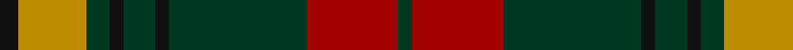

This page is one **sett** — a single exact thread-count. It belongs to the [tartan](/tartans/k4lo15dg5k3dg7k3dg30r20dg3/)
(the same proportion at any scale), whose colour order is pattern [GRGKGKGYK](/stripes/grgkgkgyk/).

Sourced from register-of-tartans.  It is a [9 stripe tartan](/stripes/stripes9/).

Original link https://www.tartanregister.gov.uk/tartanDetails.aspx?ref=2536

2 attestations — the source records this cloth was collapsed from (oldest owns this page)

<ul>
<li>01/11/1996 — MacKillen (register-of-tartans, <a href="https://www.tartanregister.gov.uk/tartanDetails.aspx?ref=2536">record</a>)</li>
<li>pre 2002 — MacKillen (Personal) (tartans-authority, <a href="http://www.tartansauthority.com/tartan-ferret/display/3422/">record</a>)</li>
</ul>

## Register references

External register numbers recorded for this tartan.

- Scottish Register of Tartans: [2536](https://www.tartanregister.gov.uk/tartanDetails.aspx?ref=2536)
- Scottish Tartans Authority (ITI): 3422
- Scottish Tartans World Register: 2848

## Thread count
K/8 DY30 DG10 K6 DG14 K6 DG60 DR40 DG/6

## Palette

Palette: <strong>Tartan Register</strong>
<table><thead><tr><th>Colour</th><th>Threads</th><th>Shade</th><th>Base</th><th>OKLCh</th></tr></thead><tbody><tr><td>K/</td><td style="text-align:right;font-variant-numeric:tabular-nums">8</td><td><code style="background-color:#101010;">#101010</code> <small style="color:#888">#101010</small></td><td>K <code style="background-color:#000000;">#000000</code></td><td><small style="color:#888">oklch(17.3% 0.000 89.9)</small></td></tr><tr><td>DY</td><td style="text-align:right;font-variant-numeric:tabular-nums">30</td><td><code style="background-color:#BC8C00;">#BC8C00</code> <small style="color:#888">#BC8C00</small></td><td>Y <code style="background-color:#F2BF00;">#F2BF00</code></td><td><small style="color:#888">oklch(66.8% 0.137 84.1)</small></td></tr><tr><td>DG</td><td style="text-align:right;font-variant-numeric:tabular-nums">10</td><td><code style="background-color:#003820;">#003820</code> <small style="color:#888">#003820</small></td><td>G <code style="background-color:#006100;">#006100</code></td><td><small style="color:#888">oklch(30.0% 0.070 158.3)</small></td></tr><tr><td>K</td><td style="text-align:right;font-variant-numeric:tabular-nums">6</td><td><code style="background-color:#101010;">#101010</code> <small style="color:#888">#101010</small></td><td>K <code style="background-color:#000000;">#000000</code></td><td><small style="color:#888">oklch(17.3% 0.000 89.9)</small></td></tr><tr><td>DG</td><td style="text-align:right;font-variant-numeric:tabular-nums">14</td><td><code style="background-color:#003820;">#003820</code> <small style="color:#888">#003820</small></td><td>G <code style="background-color:#006100;">#006100</code></td><td><small style="color:#888">oklch(30.0% 0.070 158.3)</small></td></tr><tr><td>K</td><td style="text-align:right;font-variant-numeric:tabular-nums">6</td><td><code style="background-color:#101010;">#101010</code> <small style="color:#888">#101010</small></td><td>K <code style="background-color:#000000;">#000000</code></td><td><small style="color:#888">oklch(17.3% 0.000 89.9)</small></td></tr><tr><td>DG</td><td style="text-align:right;font-variant-numeric:tabular-nums">60</td><td><code style="background-color:#003820;">#003820</code> <small style="color:#888">#003820</small></td><td>G <code style="background-color:#006100;">#006100</code></td><td><small style="color:#888">oklch(30.0% 0.070 158.3)</small></td></tr><tr><td>DR</td><td style="text-align:right;font-variant-numeric:tabular-nums">40</td><td><code style="background-color:#A00000;">#A00000</code> <small style="color:#888">#A00000</small></td><td>R <code style="background-color:#CC0000;">#CC0000</code></td><td><small style="color:#888">oklch(44.3% 0.182 29.2)</small></td></tr><tr><td>DG/</td><td style="text-align:right;font-variant-numeric:tabular-nums">6</td><td><code style="background-color:#003820;">#003820</code> <small style="color:#888">#003820</small></td><td>G <code style="background-color:#006100;">#006100</code></td><td><small style="color:#888">oklch(30.0% 0.070 158.3)</small></td></tr></tbody></table>

## Nearest tartans

The nearest existing variants by ΔTartan distance, with this tartan at the top so the swatches line up against it.

ΔTartan

Tartan

Sett

—

<a href="/ttd/edit/#slug=k4lo15dg5k3dg7k3dg30r20dg3~x2">MacKillen</a> <a class="nn-out" href="/setts/s9/k4lo15dg5k3dg7k3dg30r20dg3~x2/" title="open its dictionary page">↗</a>

0.78

<a href="/ttd/edit/#slug=ly5dg14dy4db4dy27dg3dy4ly5">Invertere Corporate Tartan Tartan Number: 1882. Earliest known date: 1988 Overstripes are yellow in warp See products available Copyright © Blair Urquhart, Comrie, 2015</a> <a class="nn-out" href="/setts/s8/ly5dg14dy4db4dy27dg3dy4ly5/" title="open its dictionary page">↗</a>

0.86

<a href="/ttd/edit/#slug=r8g2r12k6r3db3g24k2~x2">McInery (Personal)</a> <a class="nn-out" href="/setts/s8/r8g2r12k6r3db3g24k2~x2/" title="open its dictionary page">↗</a>

0.89

<a href="/ttd/edit/#slug=r4t3r32db30r4dg32r3dg32r3dg3~x2">Unidentified Plaid #15</a> <a class="nn-out" href="/setts/s10/r4t3r32db30r4dg32r3dg32r3dg3~x2/" title="open its dictionary page">↗</a>

1.01

<a href="/ttd/edit/#slug=r3k2r3g12r3w1r1g1~x4">MacCall/McCall</a> <a class="nn-out" href="/setts/s8/r3k2r3g12r3w1r1g1~x4/" title="open its dictionary page">↗</a>

1.08

<a href="/ttd/edit/#slug=k1db1g16r16k12db8g16db1k1~x2">MacNett</a> <a class="nn-out" href="/setts/s9/k1db1g16r16k12db8g16db1k1~x2/" title="open its dictionary page">↗</a>

1.09

<a href="/ttd/edit/#slug=r4t3r32db30r4g32r3g32r3g3~x2">Unidentified Plaid 6</a> <a class="nn-out" href="/setts/s10/r4t3r32db30r4g32r3g32r3g3~x2/" title="open its dictionary page">↗</a>

1.12

<a href="/ttd/edit/#slug=k2r7k6g12ly1g1k2~x4">Blackstock Hunting</a> <a class="nn-out" href="/setts/s7/k2r7k6g12ly1g1k2~x4/" title="open its dictionary page">↗</a>

1.12

<a href="/ttd/edit/#slug=db1k1r12g12k6db5r12k1db1~x4">Montrose (Macnaughton variation)</a> <a class="nn-out" href="/setts/s9/db1k1r12g12k6db5r12k1db1~x4/" title="open its dictionary page">↗</a>

1.12

<a href="/ttd/edit/#slug=lb2dr12g6dr1n6dr1~x4">Fraser Green</a> <a class="nn-out" href="/setts/s6/lb2dr12g6dr1n6dr1~x4/" title="open its dictionary page">↗</a>

1.12

<a href="/ttd/edit/#slug=lo3t7do2m2do14t2do2lo3~x2">Daks (Blue Loden)</a> <a class="nn-out" href="/setts/s8/lo3t7do2m2do14t2do2lo3~x2/" title="open its dictionary page">↗</a>

## Neighbour map

Every grey dot is one of 14299 variants placed by the first two principal components of the ΔTartan feature space (44% of its variance). Red is this tartan; blue dots are its nearest — click one to open its page.

<svg viewBox="0 0 640 380" role="img" style="max-width:100%;height:auto;border:1px solid #e0e0e0;border-radius:4px;display:block" xmlns="http://www.w3.org/2000/svg"><image href="/nn/cloud.v1.png" width="640" height="380"/><a href="/setts/s8/ly5dg14dy4db4dy27dg3dy4ly5/"><circle cx="289.4" cy="201.7" r="4" fill="#3465a4"><title>Invertere Corporate Tartan Tartan Number: 1882. Earliest known date: 1988 Overstripes are yellow in warp See products available Copyright © Blair Urquhart, Comrie, 2015</title></circle></a><a href="/setts/s8/r8g2r12k6r3db3g24k2~x2/"><circle cx="281.4" cy="201.2" r="4" fill="#3465a4"><title>McInery (Personal)</title></circle></a><a href="/setts/s10/r4t3r32db30r4dg32r3dg32r3dg3~x2/"><circle cx="266.1" cy="183.6" r="4" fill="#3465a4"><title>Unidentified Plaid #15</title></circle></a><a href="/setts/s8/r3k2r3g12r3w1r1g1~x4/"><circle cx="307.8" cy="182.7" r="4" fill="#3465a4"><title>MacCall/McCall</title></circle></a><a href="/setts/s9/k1db1g16r16k12db8g16db1k1~x2/"><circle cx="236.2" cy="177.4" r="4" fill="#3465a4"><title>MacNett</title></circle></a><a href="/setts/s10/r4t3r32db30r4g32r3g32r3g3~x2/"><circle cx="261.3" cy="183.0" r="4" fill="#3465a4"><title>Unidentified Plaid 6</title></circle></a><a href="/setts/s7/k2r7k6g12ly1g1k2~x4/"><circle cx="229.5" cy="195.1" r="4" fill="#3465a4"><title>Blackstock Hunting</title></circle></a><a href="/setts/s9/db1k1r12g12k6db5r12k1db1~x4/"><circle cx="272.7" cy="198.4" r="4" fill="#3465a4"><title>Montrose (Macnaughton variation)</title></circle></a><a href="/setts/s6/lb2dr12g6dr1n6dr1~x4/"><circle cx="288.5" cy="212.1" r="4" fill="#3465a4"><title>Fraser Green</title></circle></a><a href="/setts/s8/lo3t7do2m2do14t2do2lo3~x2/"><circle cx="267.1" cy="206.3" r="4" fill="#3465a4"><title>Daks (Blue Loden)</title></circle></a><circle cx="269.2" cy="196.4" r="5" fill="#c00000"/></svg>

ID: /setts/s9/k4lo15dg5k3dg7k3dg30r20dg3~x2/
