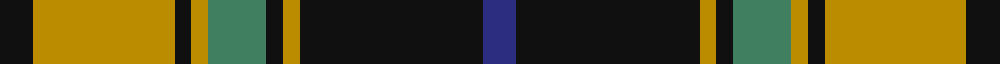

In pattern [BKYKGYKYK](/stripes/bkykgykyk/).

This was sourced from register-of-tartans.  It is a [9 stripe tartan](/stripes/stripes9/).

Original link https://www.tartanregister.gov.uk/tartanDetails.aspx?ref=377

## Attestations

This cloth appears in 2 source records; the oldest owns this page.

- 01/05/2005 — Bro-Leon (register-of-tartans, [record](https://www.tartanregister.gov.uk/tartanDetails.aspx?ref=377))
- 2005 May — Bro-Leon (Corporate) (tartans-authority, [record](http://www.tartansauthority.com/tartan-ferret/display/6653/))

## Register references

External register numbers recorded for this tartan.

- Scottish Register of Tartans: [377](https://www.tartanregister.gov.uk/tartanDetails.aspx?ref=377)
- Scottish Tartans Authority (ITI): 6653

## Thread count
K/8 DY34 K4 DY4 G14 K4 DY4 K44 DB/8

## Palette
Each colour and the base-6 reference it is a variant of.

| Colour | Shade | Base |
|---|---|---|
| DB | <code style="background-color:#2C2C80;">#2C2C80</code> `oklch(35.0% 0.138 276.6)` <small>#2C2C80</small> | B <code style="background-color:#2A418A;">#2A418A</code> |
| DY | <code style="background-color:#BC8C00;">#BC8C00</code> `oklch(66.8% 0.137 84.1)` <small>#BC8C00</small> | Y <code style="background-color:#F2BF00;">#F2BF00</code> |
| G | <code style="background-color:#408060;">#408060</code> `oklch(54.8% 0.084 160.1)` <small>#408060</small> | G <code style="background-color:#006100;">#006100</code> |
| K | <code style="background-color:#101010;">#101010</code> `oklch(17.3% 0.000 89.9)` <small>#101010</small> | K <code style="background-color:#000000;">#000000</code> |

## Nearest tartans

The nearest existing variants by ΔTartan distance, with this tartan at the top so the swatches line up against it.

ΔTartan

Tartan

Sett

—

<a href="/ttd/edit/#slug=k4lo17k2lo2g7k2lo2k22db4~x2">Bro-Leon</a> <a class="nn-out" href="/setts/s9/k4lo17k2lo2g7k2lo2k22db4~x2/" title="open its dictionary page">↗</a>

0.89

<a href="/ttd/edit/#slug=do2w2k6do3k2o14k1o1~x4">Braemar or Blair Atholl</a> <a class="nn-out" href="/setts/s8/do2w2k6do3k2o14k1o1~x4/" title="open its dictionary page">↗</a>

0.90

<a href="/ttd/edit/#slug=do2lr2k6do3k2o14k1o1~x4">Blair Atholl (Fashion)</a> <a class="nn-out" href="/setts/s8/do2lr2k6do3k2o14k1o1~x4/" title="open its dictionary page">↗</a>

0.91

<a href="/ttd/edit/#slug=k3dy3lo6k12lo1o2dy2~x4">Strummer, Joe (Commemorative)</a> <a class="nn-out" href="/setts/s7/k3dy3lo6k12lo1o2dy2~x4/" title="open its dictionary page">↗</a>

0.92

<a href="/ttd/edit/#slug=r2w8k14dy25w2k2w2~x2">Merric Dark Camel.. Trade Tartan Tartan Number: 1688. Earliest known date: 1985 School colours. See products available Copyright © Blair Urquhart, Comrie, 2015</a> <a class="nn-out" href="/setts/s7/r2w8k14dy25w2k2w2~x2/" title="open its dictionary page">↗</a>

0.93

<a href="/ttd/edit/#slug=o1w2k5o3k1o5k1o11k1o1~x4">Braemar, or Blair Atholl</a> <a class="nn-out" href="/setts/s10/o1w2k5o3k1o5k1o11k1o1~x4/" title="open its dictionary page">↗</a>

0.97

<a href="/ttd/edit/#slug=do1lr2k5do3k1o4k1o10k1o1~x4">Campbell 'Camel'</a> <a class="nn-out" href="/setts/s10/do1lr2k5do3k1o4k1o10k1o1~x4/" title="open its dictionary page">↗</a>

0.98

<a href="/ttd/edit/#slug=o1w2k5o3k1o4k1o10k1o1~x4">Braemar, Camel</a> <a class="nn-out" href="/setts/s10/o1w2k5o3k1o4k1o10k1o1~x4/" title="open its dictionary page">↗</a>

1.00

<a href="/ttd/edit/#slug=k21o2k8w2o16n6k2n8~x2">Ardmore (Fashion)</a> <a class="nn-out" href="/setts/s8/k21o2k8w2o16n6k2n8~x2/" title="open its dictionary page">↗</a>

1.01

<a href="/ttd/edit/#slug=dg28r4db25w5r22dg27r4db2~x2">New Glasgow (Canada)</a> <a class="nn-out" href="/setts/s8/dg28r4db25w5r22dg27r4db2~x2/" title="open its dictionary page">↗</a>

1.02

<a href="/ttd/edit/#slug=k4dg5k2o21g8k2~x2">MacDuck</a> <a class="nn-out" href="/setts/s6/k4dg5k2o21g8k2~x2/" title="open its dictionary page">↗</a>

## Neighbour map

Every grey dot is one of 14299 variants placed by the first two principal components of the ΔTartan feature space (44% of its variance). Red is this tartan; blue dots are its nearest — click one to open its page.

<svg viewBox="0 0 640 380" role="img" style="max-width:100%;height:auto;border:1px solid #e0e0e0;border-radius:4px;display:block" xmlns="http://www.w3.org/2000/svg"><image href="/nn/cloud.v1.png" width="640" height="380"/><a href="/setts/s8/do2w2k6do3k2o14k1o1~x4/"><circle cx="256.5" cy="154.6" r="4" fill="#3465a4"><title>Braemar or Blair Atholl</title></circle></a><a href="/setts/s8/do2lr2k6do3k2o14k1o1~x4/"><circle cx="268.1" cy="161.1" r="4" fill="#3465a4"><title>Blair Atholl (Fashion)</title></circle></a><a href="/setts/s7/k3dy3lo6k12lo1o2dy2~x4/"><circle cx="264.7" cy="193.5" r="4" fill="#3465a4"><title>Strummer, Joe (Commemorative)</title></circle></a><a href="/setts/s7/r2w8k14dy25w2k2w2~x2/"><circle cx="234.2" cy="162.9" r="4" fill="#3465a4"><title>Merric Dark Camel.. Trade Tartan Tartan Number: 1688. Earliest known date: 1985 School colours. See products available Copyright © Blair Urquhart, Comrie, 2015</title></circle></a><a href="/setts/s10/o1w2k5o3k1o5k1o11k1o1~x4/"><circle cx="270.3" cy="159.4" r="4" fill="#3465a4"><title>Braemar, or Blair Atholl</title></circle></a><a href="/setts/s10/do1lr2k5do3k1o4k1o10k1o1~x4/"><circle cx="241.6" cy="162.0" r="4" fill="#3465a4"><title>Campbell 'Camel'</title></circle></a><a href="/setts/s10/o1w2k5o3k1o4k1o10k1o1~x4/"><circle cx="235.7" cy="159.2" r="4" fill="#3465a4"><title>Braemar, Camel</title></circle></a><a href="/setts/s8/k21o2k8w2o16n6k2n8~x2/"><circle cx="239.6" cy="197.5" r="4" fill="#3465a4"><title>Ardmore (Fashion)</title></circle></a><a href="/setts/s8/dg28r4db25w5r22dg27r4db2~x2/"><circle cx="228.4" cy="185.5" r="4" fill="#3465a4"><title>New Glasgow (Canada)</title></circle></a><a href="/setts/s6/k4dg5k2o21g8k2~x2/"><circle cx="245.2" cy="194.8" r="4" fill="#3465a4"><title>MacDuck</title></circle></a><circle cx="249.0" cy="168.6" r="5" fill="#c00000"/></svg>

ID: /setts/s9/k4lo17k2lo2g7k2lo2k22db4~x2/
