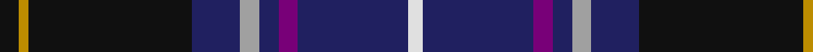

In pattern [KYKBYBBBW](/stripes/kykbybbbw/).

This was sourced from tartans-authority.  It is a [9 stripe tartan](/stripes/stripes9/).

Original link http://www.tartansauthority.com/tartan-ferret/display/6408/

## Thread count
K/8 DY4 K68 DB20 N8 DB8 P8 DB46 LN/6

## Palette
Each colour and the base-6 reference it is a variant of.

| Colour | Shade | Base |
|---|---|---|
| DB | <code style="background-color:#202060;">#202060</code> `oklch(28.9% 0.111 276.9)` <small>#202060</small> | B <code style="background-color:#2A418A;">#2A418A</code> |
| DY | <code style="background-color:#BC8C00;">#BC8C00</code> `oklch(66.8% 0.137 84.1)` <small>#BC8C00</small> | Y <code style="background-color:#F2BF00;">#F2BF00</code> |
| K | <code style="background-color:#101010;">#101010</code> `oklch(17.3% 0.000 89.9)` <small>#101010</small> | K <code style="background-color:#000000;">#000000</code> |
| LN | <code style="background-color:#E0E0E0;">#E0E0E0</code> `oklch(90.7% 0.000 89.9)` <small>#E0E0E0</small> | W <code style="background-color:#F7F7F7;">#F7F7F7</code> |
| N | <code style="background-color:#A0A0A0;">#A0A0A0</code> `oklch(70.6% 0.000 89.9)` <small>#A0A0A0</small> | Y <code style="background-color:#F2BF00;">#F2BF00</code> |
| P | <code style="background-color:#780078;">#780078</code> `oklch(40.2% 0.185 328.4)` <small>#780078</small> | B <code style="background-color:#2A418A;">#2A418A</code> |

## Nearest tartans

The nearest existing variants by ΔTartan distance, with this tartan at the top so the swatches line up against it.

ΔTartan

Tartan

Sett

—

<a href="/ttd/edit/#slug=k4lo2k34db10lr4db4dp4db23w3~x2">Heirloom Dark Alba (Fashion)</a> <a class="nn-out" href="/setts/s9/k4lo2k34db10lr4db4dp4db23w3~x2/" title="open its dictionary page">↗</a>

0.89

<a href="/ttd/edit/#slug=db9k30db9t3db5r3db5ly3db5g3~x2">Fed. of Circles &amp; Solitaries (Corp.)</a> <a class="nn-out" href="/setts/s10/db9k30db9t3db5r3db5ly3db5g3~x2/" title="open its dictionary page">↗</a>

0.96

<a href="/ttd/edit/#slug=r3w6r2dg32db36k2db4lo2~x2">Canadian Centennial</a> <a class="nn-out" href="/setts/s8/r3w6r2dg32db36k2db4lo2~x2/" title="open its dictionary page">↗</a>

1.06

<a href="/ttd/edit/#slug=db5r2ly7r2db42dg28k5db10k15dg5w3r3">Héritage Séquane</a> <a class="nn-out" href="/setts/s12/db5r2ly7r2db42dg28k5db10k15dg5w3r3/" title="open its dictionary page">↗</a>

1.09

<a href="/ttd/edit/#slug=db40r4k16w3dy8r4dy3r8k10~x2">United Arrows House Check</a> <a class="nn-out" href="/setts/s9/db40r4k16w3dy8r4dy3r8k10~x2/" title="open its dictionary page">↗</a>

1.11

<a href="/ttd/edit/#slug=w4dt54k53dp4b8lo4">Pipers' Trail, The</a> <a class="nn-out" href="/setts/s6/w4dt54k53dp4b8lo4/" title="open its dictionary page">↗</a>

1.15

<a href="/ttd/edit/#slug=db45r4k20lb3o9dr4o3dr9k11~x2">United Arrows House Check</a> <a class="nn-out" href="/setts/s9/db45r4k20lb3o9dr4o3dr9k11~x2/" title="open its dictionary page">↗</a>

1.17

<a href="/ttd/edit/#slug=dp3g3w1k25db25k2db2g1r3w2~x2">Heart of Oak</a> <a class="nn-out" href="/setts/s10/dp3g3w1k25db25k2db2g1r3w2~x2/" title="open its dictionary page">↗</a>

1.18

<a href="/ttd/edit/#slug=k10n4k34db3g3db3g3db26n2lb3~x2">Dugan (Personal)</a> <a class="nn-out" href="/setts/s10/k10n4k34db3g3db3g3db26n2lb3~x2/" title="open its dictionary page">↗</a>

1.18

<a href="/ttd/edit/#slug=k33ly4w3db33r2g2~x2">Atlantic Police Academy (Corporate)</a> <a class="nn-out" href="/setts/s6/k33ly4w3db33r2g2~x2/" title="open its dictionary page">↗</a>

1.20

<a href="/ttd/edit/#slug=w4db54k53dp4t8ly4">Pipers' Trail, The</a> <a class="nn-out" href="/setts/s6/w4db54k53dp4t8ly4/" title="open its dictionary page">↗</a>

## Neighbour map

Every grey dot is one of 14299 variants placed by the first two principal components of the ΔTartan feature space (44% of its variance). Red is this tartan; blue dots are its nearest — click one to open its page.

<svg viewBox="0 0 640 380" role="img" style="max-width:100%;height:auto;border:1px solid #e0e0e0;border-radius:4px;display:block" xmlns="http://www.w3.org/2000/svg"><image href="/nn/cloud.v1.png" width="640" height="380"/><a href="/setts/s10/db9k30db9t3db5r3db5ly3db5g3~x2/"><circle cx="238.0" cy="165.4" r="4" fill="#3465a4"><title>Fed. of Circles &amp; Solitaries (Corp.)</title></circle></a><a href="/setts/s8/r3w6r2dg32db36k2db4lo2~x2/"><circle cx="263.7" cy="132.6" r="4" fill="#3465a4"><title>Canadian Centennial</title></circle></a><a href="/setts/s12/db5r2ly7r2db42dg28k5db10k15dg5w3r3/"><circle cx="230.2" cy="113.2" r="4" fill="#3465a4"><title>Héritage Séquane</title></circle></a><a href="/setts/s9/db40r4k16w3dy8r4dy3r8k10~x2/"><circle cx="206.8" cy="147.8" r="4" fill="#3465a4"><title>United Arrows House Check</title></circle></a><a href="/setts/s6/w4dt54k53dp4b8lo4/"><circle cx="245.8" cy="170.1" r="4" fill="#3465a4"><title>Pipers' Trail, The</title></circle></a><a href="/setts/s9/db45r4k20lb3o9dr4o3dr9k11~x2/"><circle cx="224.6" cy="147.0" r="4" fill="#3465a4"><title>United Arrows House Check</title></circle></a><a href="/setts/s10/dp3g3w1k25db25k2db2g1r3w2~x2/"><circle cx="248.8" cy="106.3" r="4" fill="#3465a4"><title>Heart of Oak</title></circle></a><a href="/setts/s10/k10n4k34db3g3db3g3db26n2lb3~x2/"><circle cx="301.0" cy="150.8" r="4" fill="#3465a4"><title>Dugan (Personal)</title></circle></a><a href="/setts/s6/k33ly4w3db33r2g2~x2/"><circle cx="245.2" cy="148.5" r="4" fill="#3465a4"><title>Atlantic Police Academy (Corporate)</title></circle></a><a href="/setts/s6/w4db54k53dp4t8ly4/"><circle cx="232.7" cy="158.7" r="4" fill="#3465a4"><title>Pipers' Trail, The</title></circle></a><circle cx="258.0" cy="145.9" r="5" fill="#c00000"/></svg>

ID: /setts/s9/k4lo2k34db10lr4db4dp4db23w3~x2/
