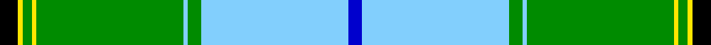

This page is one **sett** — a single exact thread-count. It belongs to the [tartan](/tartans/k4y1g2y1g32lb1g3lb32b3/)
(the same proportion at any scale), whose colour order is pattern [BWGWGYGYK](/stripes/bwgwgygyk/).

Sourced from register-of-tartans.  It is a [9 stripe tartan](/stripes/stripes9/).

Original link https://www.tartanregister.gov.uk/tartanDetails.aspx?ref=6016

## Register references

External register numbers recorded for this tartan.

- Scottish Register of Tartans: [6016](https://www.tartanregister.gov.uk/tartanDetails.aspx?ref=6016)
- Scottish Tartans Authority (ITI): 7912

## Thread count
K/8 Y2 G4 Y2 G64 LB2 G6 LB64 B/6

## Palette
Each colour and the base-6 reference it is a variant of.

| Colour | Shade | Base |
|---|---|---|
| B | <code style="background-color:#0000CD;">#0000CD</code> `oklch(38.3% 0.266 264.1)` <small>#0000CD</small> | B <code style="background-color:#2A418A;">#2A418A</code> |
| G | <code style="background-color:#008B00;">#008B00</code> `oklch(55.2% 0.188 142.5)` <small>#008B00</small> | G <code style="background-color:#006100;">#006100</code> |
| K | <code style="background-color:#000000;">#000000</code> `oklch(0.0% 0.000 0.0)` <small>#000000</small> | K <code style="background-color:#000000;">#000000</code> |
| LB | <code style="background-color:#82CFFD;">#82CFFD</code> `oklch(82.2% 0.100 236.0)` <small>#82CFFD</small> | W <code style="background-color:#F7F7F7;">#F7F7F7</code> |
| Y | <code style="background-color:#FFE600;">#FFE600</code> `oklch(91.7% 0.192 101.4)` <small>#FFE600</small> | Y <code style="background-color:#F2BF00;">#F2BF00</code> |

## Nearest tartans

The nearest existing variants by ΔTartan distance, with this tartan at the top so the swatches line up against it.

ΔTartan

Tartan

Sett

—

<a href="/ttd/edit/#slug=k4ly1g2ly1g32lt1g3lt32db3~x2">McClurg, William Thomas (Personal)</a> <a class="nn-out" href="/setts/s9/k4ly1g2ly1g32lt1g3lt32db3~x2/" title="open its dictionary page">↗</a>

1.30

<a href="/ttd/edit/#slug=lt2r2lt30dg20lt3dg7k2ly1~x2">L'Abeille du Cercle de Fermières Sainte-Geneviève-de-Sainte-Foy</a> <a class="nn-out" href="/setts/s8/lt2r2lt30dg20lt3dg7k2ly1~x2/" title="open its dictionary page">↗</a>

1.54

<a href="/ttd/edit/#slug=g42ly1w2ly1g5dg12w32g4~x2">Longniddry Green Error (Dance)</a> <a class="nn-out" href="/setts/s8/g42ly1w2ly1g5dg12w32g4~x2/" title="open its dictionary page">↗</a>

1.60

<a href="/ttd/edit/#slug=r2dg20ly1dg1k2lb1ly1lb22w1lb1w1~x4">Unidentified (Tony Murray Collection</a> <a class="nn-out" href="/setts/s11/r2dg20ly1dg1k2lb1ly1lb22w1lb1w1~x4/" title="open its dictionary page">↗</a>

1.63

<a href="/ttd/edit/#slug=g39r2w1r2db14w14g2g10~x2">Southwell (Australian) (Personal)</a> <a class="nn-out" href="/setts/s8/g39r2w1r2db14w14g2g10~x2/" title="open its dictionary page">↗</a>

1.65

<a href="/ttd/edit/#slug=w3k1r4g20k3b30w4r2~x2">Scottish Prison Service (Corporate)</a> <a class="nn-out" href="/setts/s8/w3k1r4g20k3b30w4r2~x2/" title="open its dictionary page">↗</a>

1.66

<a href="/ttd/edit/#slug=g42g2w2g2g5dt12w32g4~x2">Longniddry Green (Dance)</a> <a class="nn-out" href="/setts/s8/g42g2w2g2g5dt12w32g4~x2/" title="open its dictionary page">↗</a>

1.68

<a href="/ttd/edit/#slug=g42g2w2g2g5dg12w32g4~x2">Longniddry, Green</a> <a class="nn-out" href="/setts/s8/g42g2w2g2g5dg12w32g4~x2/" title="open its dictionary page">↗</a>

1.75

<a href="/ttd/edit/#slug=k1g23k1ly3k1w8r1t5k1~x2">Nor Westers</a> <a class="nn-out" href="/setts/s9/k1g23k1ly3k1w8r1t5k1~x2/" title="open its dictionary page">↗</a>

1.85

<a href="/ttd/edit/#slug=w4b30k3g20r4k1w3k1r4g20k3b30w4r2~x2">Scottish Prison Service</a> <a class="nn-out" href="/setts/s14/w4b30k3g20r4k1w3k1r4g20k3b30w4r2~x2/" title="open its dictionary page">↗</a>

1.88

<a href="/ttd/edit/#slug=ly3g2k1g30b24k2b2k2~x2">Johnston (Clan)</a> <a class="nn-out" href="/setts/s8/ly3g2k1g30b24k2b2k2~x2/" title="open its dictionary page">↗</a>

## Neighbour map

Every grey dot is one of 14299 variants placed by the first two principal components of the ΔTartan feature space (44% of its variance). Red is this tartan; blue dots are its nearest — click one to open its page.

<svg viewBox="0 0 640 380" role="img" style="max-width:100%;height:auto;border:1px solid #e0e0e0;border-radius:4px;display:block" xmlns="http://www.w3.org/2000/svg"><image href="/nn/cloud.v1.png" width="640" height="380"/><a href="/setts/s8/lt2r2lt30dg20lt3dg7k2ly1~x2/"><circle cx="298.1" cy="107.2" r="4" fill="#3465a4"><title>L'Abeille du Cercle de Fermières Sainte-Geneviève-de-Sainte-Foy</title></circle></a><a href="/setts/s8/g42ly1w2ly1g5dg12w32g4~x2/"><circle cx="303.8" cy="103.7" r="4" fill="#3465a4"><title>Longniddry Green Error (Dance)</title></circle></a><a href="/setts/s11/r2dg20ly1dg1k2lb1ly1lb22w1lb1w1~x4/"><circle cx="244.2" cy="68.3" r="4" fill="#3465a4"><title>Unidentified (Tony Murray Collection</title></circle></a><a href="/setts/s8/g39r2w1r2db14w14g2g10~x2/"><circle cx="253.6" cy="101.4" r="4" fill="#3465a4"><title>Southwell (Australian) (Personal)</title></circle></a><a href="/setts/s8/w3k1r4g20k3b30w4r2~x2/"><circle cx="252.5" cy="115.9" r="4" fill="#3465a4"><title>Scottish Prison Service (Corporate)</title></circle></a><a href="/setts/s8/g42g2w2g2g5dt12w32g4~x2/"><circle cx="266.5" cy="129.2" r="4" fill="#3465a4"><title>Longniddry Green (Dance)</title></circle></a><a href="/setts/s8/g42g2w2g2g5dg12w32g4~x2/"><circle cx="280.9" cy="138.8" r="4" fill="#3465a4"><title>Longniddry, Green</title></circle></a><a href="/setts/s9/k1g23k1ly3k1w8r1t5k1~x2/"><circle cx="242.1" cy="83.6" r="4" fill="#3465a4"><title>Nor Westers</title></circle></a><a href="/setts/s14/w4b30k3g20r4k1w3k1r4g20k3b30w4r2~x2/"><circle cx="252.0" cy="99.7" r="4" fill="#3465a4"><title>Scottish Prison Service</title></circle></a><a href="/setts/s8/ly3g2k1g30b24k2b2k2~x2/"><circle cx="331.3" cy="141.4" r="4" fill="#3465a4"><title>Johnston (Clan)</title></circle></a><circle cx="278.5" cy="91.1" r="5" fill="#c00000"/></svg>

ID: /setts/s9/k4ly1g2ly1g32lt1g3lt32db3~x2/
